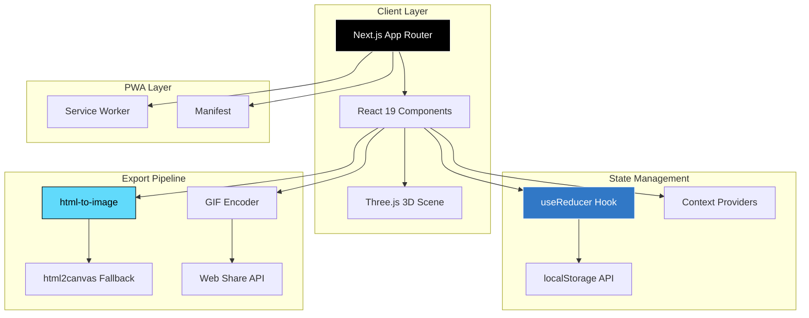
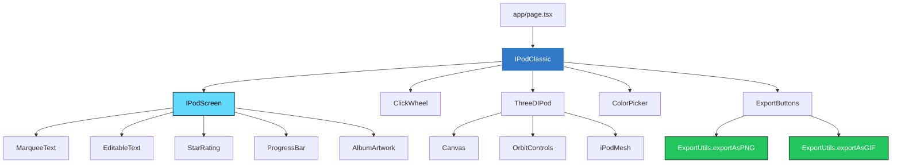
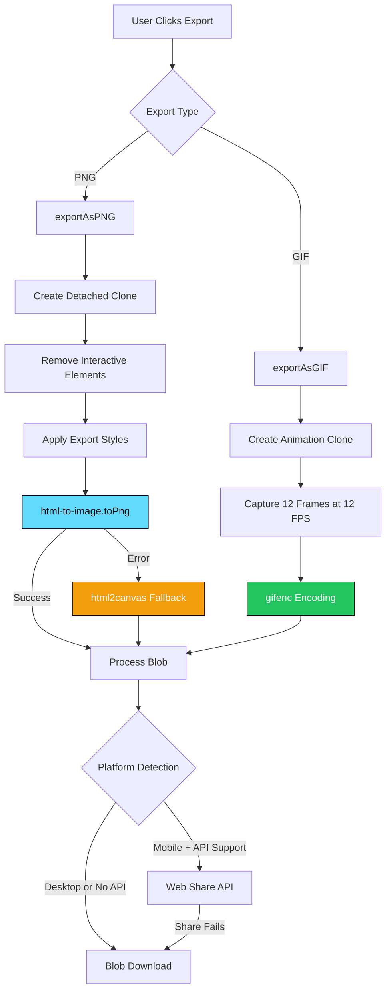
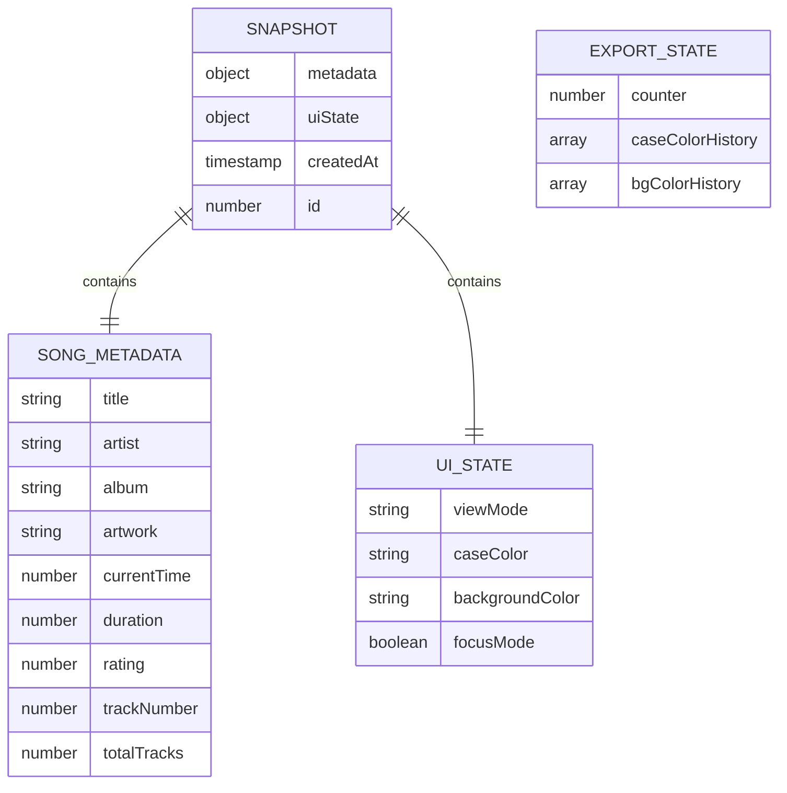
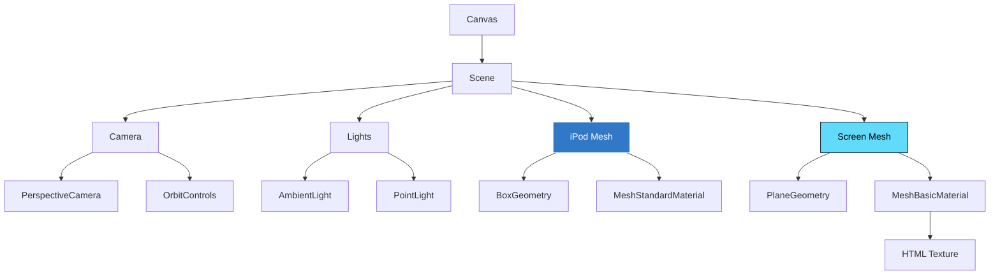
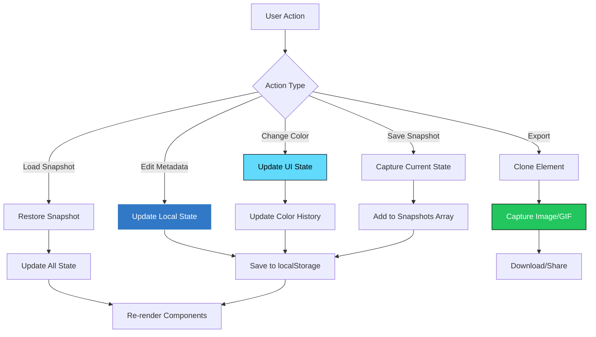
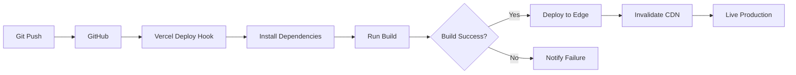

# 🏗️ Architecture Deep-Dive

This document provides a comprehensive technical overview of the v0-ipod project architecture, implementation details, and design decisions.

---

## 📋 Table of Contents

- [System Overview](#system-overview)
- [Component Hierarchy](#component-hierarchy)
- [Export System](#export-system)
- [Animation System](#animation-system)
- [Storage Schema](#storage-schema)
- [3D Rendering Pipeline](#3d-rendering-pipeline)
- [Performance Considerations](#performance-considerations)
- [State Management](#state-management)

---

## 🎯 System Overview



### Tech Stack Rationale

| Technology | Purpose | Why Chosen |
|------------|---------|------------|
| **Next.js 15** | Framework | App Router, Server Components, Image Optimization |
| **React 19** | UI Library | Latest features, improved performance, better DX |
| **TypeScript** | Type Safety | Catch errors at compile-time, better IDE support |
| **Three.js** | 3D Rendering | Industry-standard WebGL library, React Three Fiber integration |
| **Radix UI** | Component Library | Accessible, unstyled, composable primitives |
| **Tailwind CSS** | Styling | Utility-first, responsive, easy customization |
| **html-to-image** | Export Primary | Fast, reliable DOM-to-image conversion |
| **html2canvas** | Export Fallback | Broader browser compatibility |
| **gifenc** | GIF Encoding | Lightweight, pure JS, frame-by-frame control |
| **Playwright** | E2E Testing | Modern, reliable, cross-browser testing |

---

## 🧩 Component Hierarchy



### Component Breakdown

#### **IPodClassic** (`components/ipod/ipod-classic.tsx`)

**Responsibilities:**
- Main container component
- State management (metadata, UI state, export state)
- File upload handling (drag & drop + file input)
- View mode switching
- Color customization orchestration
- iPod OS menu navigation and screen routing

**iPod OS Interaction Flow:**

```
Menu Screen                          Now Playing Screen
┌─────────────────┐                 ┌─────────────────┐
│ Wheel: cycle     │──center click──▶│ Wheel: seek ±5s  │
│ Next/Prev: cycle │                 │ Next/Prev: seek  │
│ Play/Pause: →NP  │                 │ Center: toggle   │
│ Center: select   │◀──menu button──│   edit mode      │
└─────────────────┘                 └─────────────────┘
```

- Center button on Now Playing toggles `isOsNowPlayingEditable`
- Menu button resets edit state and returns to menu
- Edit mode enables inline editing of title, artist, album, rating, and time

**Key State:**

```typescript
interface IPodState {
  metadata: SongMetadata;
  uiState: UIState;
  exportState: ExportState;
}

interface SongMetadata {
  title: string;
  artist: string;
  album: string;
  artwork: string;
  currentTime: number;
  duration: number;
  rating: number;
  trackNumber: number;
  totalTracks: number;
}

interface UIState {
  viewMode: "edit" | "3d" | "preview" | "ascii" | "focus";
  caseColor: string;
  backgroundColor: string;
  focusMode: boolean;
}

interface ExportState {
  exportCounter: number;
  caseColorHistory: string[];
  bgColorHistory: string[];
}
```

**Props:**
None (root component)

**Ref:** `components/ipod/ipod-classic.tsx:1`

---

#### **IPodScreen** (`components/ipod/ipod-screen.tsx`)

**Responsibilities:**
- Render iPod screen UI
- Handle editable fields (inline editing)
- Display metadata with proper formatting
- Show progress bar and star rating
- Render marquee text animation

**Props:**

```typescript
interface IPodScreenProps {
  metadata: SongMetadata;
  isPreviewMode?: boolean;
  className?: string;
  onMetadataChange?: (key: keyof SongMetadata, value: any) => void;
}
```

**Key Features:**
- **Editable Text**: Click to edit title, artist, album
- **Star Rating**: Interactive 1-5 star rating
- **Progress Bar**: Visual track progress with time display
- **Marquee Text**: Scrolling text for long titles in preview mode

**Ref:** `components/ipod/ipod-screen.tsx:1`

---

#### **ThreeDIPod** (`components/three/three-d-ipod.tsx`)

**Responsibilities:**
- 3D iPod rendering with Three.js
- Camera controls and rotation
- Mesh geometry and materials
- Screen texture mapping

**Props:**

```typescript
interface ThreeDIPodProps {
  caseColor: string;
  screenContent: React.ReactNode;
}
```

**3D Scene Structure:**

```typescript
// Simplified representation
<Canvas camera={{ position: [0, 0, 5], fov: 45 }}>
  <ambientLight intensity={0.5} />
  <pointLight position={[10, 10, 10]} />
  <OrbitControls enableZoom={true} />
  <mesh>
    <boxGeometry args={[2, 3, 0.4]} />
    <meshStandardMaterial color={caseColor} />
  </mesh>
  <mesh position={[0, 0.5, 0.21]}>
    {/* Screen plane with HTML texture */}
  </mesh>
</Canvas>
```

**Ref:** `components/three/three-d-ipod.tsx:1`

---

#### **ASCIIIPod** (`components/ipod/ascii-ipod.tsx`)

**Responsibilities:**
- ASCII art representation of iPod
- Terminal-style text rendering
- Metadata formatting for monospace display

**Props:**

```typescript
interface ASCIIIPodProps {
  metadata: SongMetadata;
  caseColor: string;
}
```

**ASCII Template:**

```
┌─────────────────────────────┐
│ ┌───────────────────────┐   │
│ │                       │   │
│ │  [Title]              │   │
│ │  [Artist]             │   │
│ │  [Album]              │   │
│ │  ★★★☆☆                │   │
│ │  ▓▓▓▓▓▓░░░░░░░░░      │   │
│ │  1:23 / 3:45          │   │
│ │                       │   │
│ └───────────────────────┘   │
│         ○  ○  ○             │
│       ○         ○           │
│      ○     ●     ○          │
│       ○         ○           │
│         ○  ○  ○             │
└─────────────────────────────┘
```

**Ref:** `components/ipod/ascii-ipod.tsx:1`

---

## 📤 Export System

### High-Level Architecture



### PNG Export Implementation

**File:** `lib/export-utils.ts:exportAsPNG`

**Strategy:** Dual fallback for maximum reliability

#### Step 1: Create Detached Clone

```typescript
// Clone the target element
const clone = element.cloneNode(true) as HTMLElement;

// Remove from document flow
clone.style.position = "absolute";
clone.style.left = "-9999px";
clone.style.top = "-9999px";

// Remove interactive elements
clone.querySelectorAll("button, input, select").forEach((el) => el.remove());

// Append to body temporarily
document.body.appendChild(clone);
```

**Why?** Prevents interference from user interactions during capture.

#### Step 2: Apply Export Styles

```typescript
// 4x resolution for high quality
const scale = 4;
const width = 300;
const height = 400;

// Apply styles
clone.style.width = `${width}px`;
clone.style.height = `${height}px`;
clone.style.transform = "scale(1)";
clone.style.transformOrigin = "top left";
```

**Why?** 4x scale provides crisp images for social media and printing.

#### Step 3: Primary Export (html-to-image)

```typescript
import { toPng } from "html-to-image";

try {
  const dataUrl = await toPng(clone, {
    width: width * scale,
    height: height * scale,
    pixelRatio: scale,
    cacheBust: true,
  });

  const blob = await fetch(dataUrl).then((res) => res.blob());
  return blob;
} catch (error) {
  // Fall through to html2canvas
}
```

**Why html-to-image first?**
- Faster rendering
- Better quality
- More accurate CSS rendering

#### Step 4: Fallback (html2canvas)

```typescript
import html2canvas from "html2canvas";

try {
  const canvas = await html2canvas(clone, {
    scale: scale,
    useCORS: true,
    allowTaint: false,
  });

  return new Promise((resolve) => {
    canvas.toBlob((blob) => resolve(blob), "image/png");
  });
} catch (error) {
  throw new Error("Both export methods failed");
}
```

**Why html2canvas fallback?**
- Broader browser support
- More forgiving of CSS edge cases
- Handles some images html-to-image can't

#### Step 5: Cleanup

```typescript
finally {
  // Always remove clone
  document.body.removeChild(clone);
}
```

**Ref:** `lib/export-utils.ts:10-80`

---

### GIF Export Implementation

**File:** `lib/export-utils.ts:exportAsGIF`

**Strategy:** Frame-by-frame capture + gifenc encoding

#### Step 1: Create Animation Clone

```typescript
const clone = element.cloneNode(true) as HTMLElement;
clone.style.position = "absolute";
clone.style.left = "-9999px";
document.body.appendChild(clone);

// Enable marquee animation
const marqueeElement = clone.querySelector(".marquee-text");
if (marqueeElement) {
  marqueeElement.classList.add("animate");
}
```

#### Step 2: Capture Frames (12 FPS)

```typescript
import { GIFEncoder, quantize, applyPalette } from "gifenc";

const encoder = GIFEncoder();
const frameCount = 12;
const frameDuration = 1000 / 12; // ~83ms per frame

for (let i = 0; i < frameCount; i++) {
  // Wait for animation to progress
  await new Promise((resolve) => setTimeout(resolve, frameDuration));

  // Capture current frame
  const canvas = await html2canvas(clone, {
    width: 300,
    height: 400,
    scale: 2,
  });

  // Convert to indexed color
  const ctx = canvas.getContext("2d");
  const imageData = ctx.getImageData(0, 0, canvas.width, canvas.height);
  const { colors, indices } = quantize(imageData.data, 256);

  // Add frame to encoder
  encoder.writeFrame(indices, canvas.width, canvas.height, {
    palette: colors,
    delay: frameDuration,
  });
}
```

**Why 12 FPS?**
- Smooth enough for marquee animation
- File size remains reasonable (< 500KB typically)
- Matches perceptual smoothness threshold

#### Step 3: Encode GIF

```typescript
encoder.finish();
const buffer = encoder.bytes();
const blob = new Blob([buffer], { type: "image/gif" });
```

**Ref:** `lib/export-utils.ts:90-180`

---

### Platform Detection & Sharing

**File:** `lib/export-utils.ts:downloadBlob`

```typescript
function downloadBlob(blob: Blob, filename: string) {
  // Check for Web Share API (mobile)
  if (navigator.share && isMobileDevice()) {
    const file = new File([blob], filename, { type: blob.type });

    navigator
      .share({
        files: [file],
        title: "iPod Export",
      })
      .catch(() => {
        // Fallback to download if share fails
        triggerDownload(blob, filename);
      });
  } else {
    // Desktop: direct download
    triggerDownload(blob, filename);
  }
}

function triggerDownload(blob: Blob, filename: string) {
  const url = URL.createObjectURL(blob);
  const link = document.createElement("a");
  link.href = url;
  link.download = filename;
  link.click();
  URL.revokeObjectURL(url);
}
```

**Mobile Detection:**

```typescript
function isMobileDevice(): boolean {
  return /Android|webOS|iPhone|iPad|iPod/i.test(navigator.userAgent);
}
```

**Ref:** `lib/export-utils.ts:190-220`

---

## 🎬 Animation System

### Marquee Text Algorithm

**File:** `components/ipod/ipod-screen.tsx:MarqueeText`

**Goal:** Single-pass scrolling animation that loops seamlessly

#### Mathematical Model

```
Container Width: W
Text Width: T
Scroll Distance: D = T + W

Animation:
- Start: transform: translateX(W)
- End: transform: translateX(-T)
- Duration: calculated for constant speed
```

#### Implementation

```typescript
const MarqueeText = ({ text }: { text: string }) => {
  const containerRef = useRef<HTMLDivElement>(null);
  const textRef = useRef<HTMLSpanElement>(null);

  useEffect(() => {
    if (!containerRef.current || !textRef.current) return;

    const containerWidth = containerRef.current.offsetWidth;
    const textWidth = textRef.current.offsetWidth;

    // Calculate scroll distance
    const scrollDistance = textWidth + containerWidth;

    // Constant speed: 50px per second
    const speed = 50;
    const duration = scrollDistance / speed;

    // Apply CSS animation
    textRef.current.style.animation = `marquee ${duration}s linear infinite`;
  }, [text]);

  return (
    <div ref={containerRef} className="marquee-container overflow-hidden">
      <span ref={textRef} className="marquee-text inline-block">
        {text}
      </span>
    </div>
  );
};
```

#### CSS Animation

```css
@keyframes marquee {
  0% {
    transform: translateX(100%);
  }
  100% {
    transform: translateX(-100%);
  }
}

.marquee-text {
  white-space: nowrap;
  will-change: transform;
}
```

**Optimization:** `will-change: transform` promotes to GPU layer

**Ref:** `components/ipod/ipod-screen.tsx:120-160`

---

## 💾 Storage Schema

### Entity Relationship Diagram



### localStorage Keys

| Key | Type | Purpose |
|-----|------|---------|
| `ipod_metadata` | `SongMetadata` | Current song metadata |
| `ipod_ui_state` | `UIState` | Current UI configuration |
| `ipod_export_state` | `ExportState` | Export counter and history |
| `ipod_snapshots` | `Snapshot[]` | Saved snapshots (max 10) |

### Storage Implementation

**File:** `lib/storage.ts`

```typescript
const STORAGE_KEYS = {
  METADATA: "ipod_metadata",
  UI_STATE: "ipod_ui_state",
  EXPORT_STATE: "ipod_export_state",
  SNAPSHOTS: "ipod_snapshots",
} as const;

export const storage = {
  // Save metadata
  saveMetadata(metadata: SongMetadata): void {
    try {
      localStorage.setItem(
        STORAGE_KEYS.METADATA,
        JSON.stringify(metadata)
      );
    } catch (error) {
      console.error("Failed to save metadata:", error);
    }
  },

  // Load metadata
  loadMetadata(): SongMetadata | null {
    try {
      const data = localStorage.getItem(STORAGE_KEYS.METADATA);
      return data ? JSON.parse(data) : null;
    } catch (error) {
      console.error("Failed to load metadata:", error);
      return null;
    }
  },

  // Save snapshot
  saveSnapshot(snapshot: Snapshot): void {
    try {
      const snapshots = this.loadSnapshots();
      snapshots.unshift(snapshot);

      // Keep max 10 snapshots
      if (snapshots.length > 10) {
        snapshots.pop();
      }

      localStorage.setItem(
        STORAGE_KEYS.SNAPSHOTS,
        JSON.stringify(snapshots)
      );
    } catch (error) {
      console.error("Failed to save snapshot:", error);
    }
  },

  // Load snapshots
  loadSnapshots(): Snapshot[] {
    try {
      const data = localStorage.getItem(STORAGE_KEYS.SNAPSHOTS);
      return data ? JSON.parse(data) : [];
    } catch (error) {
      console.error("Failed to load snapshots:", error);
      return [];
    }
  },
};
```

**Ref:** `lib/storage.ts:1-100`

---

## 🎮 3D Rendering Pipeline

### Three.js Scene Graph



### Rendering Strategy

**File:** `components/three/three-d-ipod.tsx`

```typescript
import { Canvas } from "@react-three/fiber";
import { OrbitControls, Html } from "@react-three/drei";

export function ThreeDIPod({ caseColor, screenContent }: ThreeDIPodProps) {
  return (
    <Canvas
      camera={{ position: [0, 0, 5], fov: 45 }}
      gl={{ preserveDrawingBuffer: true }} // Required for exports
    >
      {/* Lighting */}
      <ambientLight intensity={0.5} />
      <pointLight position={[10, 10, 10]} intensity={0.8} />

      {/* Controls */}
      <OrbitControls
        enableZoom={true}
        minDistance={3}
        maxDistance={10}
        enablePan={false}
      />

      {/* iPod Body */}
      <mesh>
        <boxGeometry args={[2, 3, 0.4]} />
        <meshStandardMaterial
          color={caseColor}
          metalness={0.6}
          roughness={0.4}
        />
      </mesh>

      {/* Screen */}
      <mesh position={[0, 0.5, 0.21]}>
        <planeGeometry args={[1.6, 1.2]} />
        <meshBasicMaterial color="#000" />

        {/* HTML Content Overlay */}
        <Html
          transform
          distanceFactor={1.5}
          position={[0, 0, 0.01]}
          style={{ width: "200px", height: "150px" }}
        >
          {screenContent}
        </Html>
      </mesh>
    </Canvas>
  );
}
```

**Key Decisions:**

1. **`preserveDrawingBuffer: true`**: Enables canvas export for screenshots
2. **Metalness & Roughness**: Simulates aluminum iPod body
3. **HTML Transform**: Renders React components as 3D textures
4. **OrbitControls**: User can rotate and zoom the iPod

**Ref:** `components/three/three-d-ipod.tsx:1-80`

---

## ⚡ Performance Considerations

### 1. 3D Rendering Optimization

**Problem:** 3D scenes can be GPU-intensive on mobile devices

**Solutions:**

```typescript
// Limit frame rate on mobile
const isMobile = /iPhone|iPad|Android/i.test(navigator.userAgent);

<Canvas
  frameloop={isMobile ? "demand" : "always"}
  dpr={isMobile ? [1, 1.5] : [1, 2]}
>
```

- **`frameloop="demand"`**: Only render when camera moves (saves battery)
- **`dpr` (device pixel ratio)**: Lower resolution on mobile

### 2. GIF Export Memory Management

**Problem:** 12 frames × 2x scale = ~6MB memory during encoding

**Solutions:**

```typescript
// Clear previous frames from memory
encoder.writeFrame(indices, width, height, {
  palette: colors,
  delay: frameDuration,
  dispose: 2, // Restore to background (clears frame)
});

// Cleanup after encoding
encoder.finish();
const blob = new Blob([encoder.bytes()]);
encoder = null; // Allow GC
```

### 3. localStorage Limits

**Problem:** localStorage has ~5-10MB limit per origin

**Solutions:**

```typescript
// Compress artwork images
async function compressArtwork(dataUrl: string): Promise<string> {
  const img = new Image();
  img.src = dataUrl;
  await img.decode();

  const canvas = document.createElement("canvas");
  const maxDimension = 300;
  const scale = Math.min(1, maxDimension / Math.max(img.width, img.height));

  canvas.width = img.width * scale;
  canvas.height = img.height * scale;

  const ctx = canvas.getContext("2d");
  ctx.drawImage(img, 0, 0, canvas.width, canvas.height);

  return canvas.toDataURL("image/jpeg", 0.8); // 80% quality
}

// Limit snapshots to 10
const MAX_SNAPSHOTS = 10;
```

### 4. Mobile Responsiveness

**Tailwind Breakpoints:**

```typescript
// Mobile-first approach
<div className="text-sm md:text-base lg:text-lg">
  {/* Font scales with viewport */}
</div>

<div className="w-full md:w-3/4 lg:w-1/2">
  {/* Container width adapts */}
</div>
```

**Touch Interactions:**

```typescript
// Touch-friendly click targets (minimum 44×44px)
<button className="min-h-[44px] min-w-[44px] touch-manipulation">
  Export
</button>
```

---

## 🔄 State Management

### State Flow Diagram



### useReducer Pattern

**Why useReducer over useState?**

- Complex state with multiple sub-objects
- State transitions need to be atomic
- Easier to test state logic in isolation

**Implementation:**

```typescript
type Action =
  | { type: "UPDATE_METADATA"; key: keyof SongMetadata; value: any }
  | { type: "UPDATE_UI_STATE"; key: keyof UIState; value: any }
  | { type: "LOAD_SNAPSHOT"; snapshot: Snapshot }
  | { type: "INCREMENT_EXPORT_COUNTER" };

function ipodReducer(state: IPodState, action: Action): IPodState {
  switch (action.type) {
    case "UPDATE_METADATA":
      return {
        ...state,
        metadata: {
          ...state.metadata,
          [action.key]: action.value,
        },
      };

    case "UPDATE_UI_STATE":
      return {
        ...state,
        uiState: {
          ...state.uiState,
          [action.key]: action.value,
        },
      };

    case "LOAD_SNAPSHOT":
      return {
        ...state,
        metadata: action.snapshot.metadata,
        uiState: action.snapshot.uiState,
      };

    case "INCREMENT_EXPORT_COUNTER":
      return {
        ...state,
        exportState: {
          ...state.exportState,
          counter: state.exportState.counter + 1,
        },
      };

    default:
      return state;
  }
}
```

### Side Effects with useEffect

**Sync state to localStorage:**

```typescript
useEffect(() => {
  storage.saveMetadata(state.metadata);
}, [state.metadata]);

useEffect(() => {
  storage.saveUIState(state.uiState);
}, [state.uiState]);
```

**Load initial state from localStorage:**

```typescript
const [state, dispatch] = useReducer(ipodReducer, null, () => {
  const savedMetadata = storage.loadMetadata();
  const savedUIState = storage.loadUIState();
  const savedExportState = storage.loadExportState();

  return {
    metadata: savedMetadata || DEFAULT_METADATA,
    uiState: savedUIState || DEFAULT_UI_STATE,
    exportState: savedExportState || DEFAULT_EXPORT_STATE,
  };
});
```

**Ref:** `components/ipod/ipod-classic.tsx:30-120`

---

## 🔐 Security Considerations

### Input Sanitization

**Problem:** User-uploaded images could contain malicious data URLs

**Solution:** Validate image types and dimensions

```typescript
function validateImage(file: File): boolean {
  const validTypes = ["image/jpeg", "image/png", "image/gif", "image/webp"];
  if (!validTypes.includes(file.type)) {
    throw new Error("Invalid image type");
  }

  const maxSize = 5 * 1024 * 1024; // 5MB
  if (file.size > maxSize) {
    throw new Error("Image too large");
  }

  return true;
}
```

### XSS Prevention

**Problem:** User-provided text could contain malicious scripts

**Solution:** React automatically escapes text content

```typescript
// Safe - React escapes HTML entities
<div>{metadata.title}</div>

// Dangerous - Never use dangerouslySetInnerHTML with user input
<div dangerouslySetInnerHTML={{ __html: metadata.title }} />
```

---

## 📊 Analytics & Monitoring

### Vercel Analytics

**File:** `app/layout.tsx`

```typescript
import { Analytics } from "@vercel/analytics/react";

export default function RootLayout({ children }) {
  return (
    <html>
      <body>
        {children}
        <Analytics />
      </body>
    </html>
  );
}
```

**Tracked Events:**

- Page views
- Export button clicks (automatic)
- Error boundaries (custom)

---

## 🚀 Deployment Pipeline



### Build Configuration

**File:** `next.config.js`

```javascript
const withPWA = require("@ducanh2912/next-pwa").default({
  dest: "public",
  disable: process.env.NODE_ENV === "development",
});

module.exports = withPWA({
  reactStrictMode: true,
  images: {
    domains: [],
  },
  experimental: {
    optimizeCss: true,
  },
});
```

---

## 🔍 Debugging Tips

### Common Issues

**1. Export not working:**

```typescript
// Check if element exists
if (!document.getElementById("ipod-screen")) {
  console.error("Element not found");
  return;
}

// Check for CORS issues with images
img.crossOrigin = "anonymous";
```

**2. 3D scene not rendering:**

```typescript
// Check WebGL support
const canvas = document.createElement("canvas");
const gl = canvas.getContext("webgl") || canvas.getContext("experimental-webgl");
if (!gl) {
  alert("WebGL not supported");
}
```

**3. localStorage full:**

```typescript
try {
  localStorage.setItem(key, value);
} catch (e) {
  if (e.name === "QuotaExceededError") {
    // Clear old snapshots
    storage.clearOldSnapshots();
  }
}
```

---

## 📚 Further Reading

- **Next.js App Router**: [nextjs.org/docs/app](https://nextjs.org/docs/app)
- **React Three Fiber**: [docs.pmnd.rs/react-three-fiber](https://docs.pmnd.rs/react-three-fiber)
- **html-to-image**: [github.com/bubkoo/html-to-image](https://github.com/bubkoo/html-to-image)
- **gifenc**: [github.com/mattdesl/gifenc](https://github.com/mattdesl/gifenc)
- **Playwright**: [playwright.dev/docs/intro](https://playwright.dev/docs/intro)

---

<div align="center">

**Questions? Open an issue or discussion on GitHub!**

[⬆️ Back to Top](#-architecture-deep-dive)

</div>
