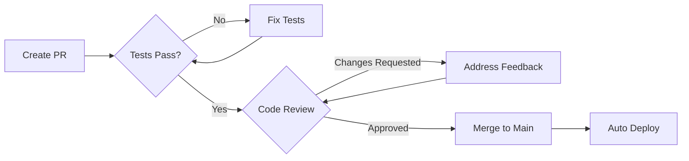

# 🤝 Contributing to v0-ipod

Thank you for your interest in contributing to the iPod Digital Clone project! This guide will help you get started with our development workflow and conventions.

---

## 📋 Table of Contents

- [Semantic Commit Conventions](#semantic-commit-conventions)
- [Development Workflow](#development-workflow)
- [Code Style Guidelines](#code-style-guidelines)
- [Testing](#testing)
- [Pull Request Process](#pull-request-process)
- [Project Structure](#project-structure)

---

## 🎯 Semantic Commit Conventions

We use **Conventional Commits** format for all commits to enable automated versioning and changelog generation.

### Format

```
<type>(<scope>): <subject>

<body>

<footer>
```

### Commit Types

| Type | Description | Version Bump |
|------|-------------|--------------|
| `feat` | New feature | Minor (0.x.0) |
| `fix` | Bug fix | Patch (0.0.x) |
| `docs` | Documentation only | None |
| `style` | Code style (formatting, no logic change) | None |
| `refactor` | Code restructuring (no feature/fix) | None |
| `perf` | Performance improvement | Patch |
| `test` | Add/update tests | None |
| `chore` | Build, tooling, dependencies | None |
| `ci` | CI/CD changes | None |

### Breaking Changes

Add `BREAKING CHANGE:` in the footer or append `!` after the type/scope:

```
feat(export)!: change PNG export to return WebP format

BREAKING CHANGE: PNG export now returns WebP format by default.
Use the new `format` option to request PNG explicitly.
```

### Examples

#### ✅ Good Examples

```bash
# Feature addition
feat(export): add WebP format support for PNG exports

Implements WebP encoding alongside PNG with quality slider.
Adds format selection radio buttons in export dialog.

Closes #123

---

# Bug fix
fix(marquee): prevent text overflow in ASCII mode

The marquee calculation didn't account for terminal width
constraints, causing wrapped text artifacts.

---

# Documentation
docs(readme): add Mermaid architecture diagrams

Visualize export pipeline and component hierarchy for
easier onboarding.

---

# Performance improvement
perf(gif): optimize frame capture with RAF batching

Reduces GIF export time by ~40% through requestAnimationFrame
batching instead of sequential captures.

Benchmark results:
- Before: 2.8s average
- After: 1.7s average
- Improvement: 39.3%

---

# Refactoring
refactor(storage): extract localStorage logic to dedicated module

Separates concerns and improves testability. No functional changes.

---

# Multiple scopes
feat(ipod,export): add snapshot export capability

Allows exporting saved snapshots directly without loading.
Updates export utilities to accept pre-serialized state.

---

# Breaking change
feat(colors)!: migrate to OKLCH color space

BREAKING CHANGE: Color values now use OKLCH instead of RGB.
Existing saved colors will be automatically converted on first load.
```

#### ❌ Bad Examples

```bash
# Too vague
fix: bug fix

# No type
add marquee preview

# Wrong scope format
feat(Export Utils): add webp

# Non-imperative mood
feat(export): added WebP support
feat(export): adds WebP support

# Mixing concerns without explanation
feat: add webp and fix marquee bug
```

### Scope Guidelines

Common scopes in this project:

- `ipod`: Main iPod component and screen
- `export`: Export utilities (PNG/GIF)
- `storage`: localStorage persistence
- `colors`: Color system and theming
- `marquee`: Marquee text animation
- `3d`: Three.js 3D rendering
- `ui`: UI components (buttons, inputs, etc.)
- `tests`: Test files
- `deps`: Dependency updates
- `config`: Configuration files

---

## 🔄 Development Workflow

### 1. Fork and Clone

```bash
# Fork the repo on GitHub, then:
git clone https://github.com/YOUR_USERNAME/v0-ipod.git
cd v0-ipod
```

### 2. Create a Feature Branch

```bash
# Branch naming convention: <type>/<description>
git checkout -b feat/webp-export
git checkout -b fix/marquee-overflow
git checkout -b docs/architecture-diagrams
```

### 3. Install Dependencies

```bash
npm install
# or: bun install
# or: pnpm install
```

### 4. Make Changes

- Write code following our [Code Style Guidelines](#code-style-guidelines)
- Use semantic commits for each logical change
- Add tests for new features or bug fixes

### 5. Run Validation

```bash
# Run all validation checks
npm run validate

# Or run individually:
npm run lint           # Check for linting errors
npm run lint:fix       # Auto-fix linting errors
npm run format:check   # Check code formatting
npm run format         # Auto-format code
npm run type-check     # TypeScript type checking
npm test              # Run Playwright tests
```

### 6. Commit Changes

```bash
# Stage your changes
git add .

# Commit with semantic message
git commit -m "feat(export): add WebP format support"

# Or use interactive commit for detailed message:
git commit
```

### 7. Push and Create PR

```bash
# Push to your fork
git push origin feat/webp-export

# Create a pull request on GitHub
# Use our PR template (auto-populated)
```

---

## 🎨 Code Style Guidelines

### TypeScript

- **Strict mode**: All TypeScript strict checks enabled
- **Type safety**: Avoid `any`, use proper types or `unknown`
- **Interfaces over types**: Prefer `interface` for object shapes
- **Explicit return types**: For public functions and exports

```typescript
// ✅ Good
interface SongMetadata {
  title: string;
  artist: string;
  duration: number;
}

function formatDuration(seconds: number): string {
  // Implementation
}

// ❌ Bad
type SongMetadata = {
  title: any;
  artist: any;
}

function formatDuration(seconds) {
  // Implementation
}
```

### Component Structure

```typescript
// 1. Imports (grouped and sorted)
import { useState, useEffect } from "react";
import { Button } from "@/components/ui/button";
import { formatDuration } from "@/lib/utils";

// 2. Types/Interfaces
interface IPodScreenProps {
  metadata: SongMetadata;
  onEdit: (key: string, value: string) => void;
}

// 3. Component
export function IPodScreen({ metadata, onEdit }: IPodScreenProps) {
  // 3a. Hooks
  const [isEditing, setIsEditing] = useState(false);

  // 3b. Derived state
  const formattedDuration = formatDuration(metadata.duration);

  // 3c. Event handlers
  const handleEdit = (key: string, value: string) => {
    onEdit(key, value);
    setIsEditing(false);
  };

  // 3d. Effects
  useEffect(() => {
    // Side effects
  }, [metadata]);

  // 3e. Render
  return (
    <div className="ipod-screen">
      {/* JSX */}
    </div>
  );
}
```

### Naming Conventions

- **Components**: PascalCase (`IPodScreen`, `ClickWheel`)
- **Functions**: camelCase (`formatDuration`, `exportAsPNG`)
- **Constants**: UPPER_SNAKE_CASE (`MAX_SNAPSHOT_COUNT`)
- **Files**: kebab-case (`ipod-screen.tsx`, `export-utils.ts`)
- **CSS Classes**: kebab-case with BEM (`.ipod-screen__title`)

### Formatting

We use **Prettier** with the following configuration:

```json
{
  "semi": true,
  "trailingComma": "es5",
  "singleQuote": false,
  "tabWidth": 2,
  "printWidth": 80
}
```

**Auto-format before committing:**

```bash
npm run format
```

### ESLint Rules

Key rules enforced:

- No unused variables
- No console.log in production code (use console.error for errors)
- Prefer const over let
- No var declarations
- Async functions must await or return Promise

---

## 🧪 Testing

### Running Tests

```bash
# Run all tests
npm test

# Run with UI
npm run test:ui

# Debug mode
npm run test:debug

# Specific test file
npx playwright test tests/interactions.spec.ts

# Specific test by name
npx playwright test -g "should export PNG"
```

### Writing Tests

We use **Playwright** for end-to-end testing.

#### Test Structure

```typescript
import { test, expect } from "@playwright/test";

test.describe("Feature Name", () => {
  test.beforeEach(async ({ page }) => {
    await page.goto("http://localhost:4001");
  });

  test("should do something specific", async ({ page }) => {
    // Arrange: Set up test conditions
    const button = page.getByRole("button", { name: "Export PNG" });

    // Act: Perform action
    await button.click();

    // Assert: Verify outcome
    await expect(page.getByText("Export successful")).toBeVisible();
  });
});
```

#### Test Coverage Expectations

When adding new features:

- ✅ **Happy path**: Normal user flow works
- ✅ **Edge cases**: Empty states, max values, invalid input
- ✅ **Error handling**: Failed API calls, network errors
- ✅ **Mobile**: Touch interactions work on mobile viewports

#### Example Test

```typescript
test("should save and restore snapshot", async ({ page }) => {
  // Edit metadata
  await page.getByLabel("Title").fill("Test Song");
  await page.getByLabel("Artist").fill("Test Artist");

  // Save snapshot
  await page.getByRole("button", { name: "Save Snapshot" }).click();
  await expect(page.getByText("Snapshot saved")).toBeVisible();

  // Modify metadata
  await page.getByLabel("Title").fill("Different Song");

  // Restore snapshot
  await page.getByRole("button", { name: "Load Snapshot" }).click();

  // Verify restoration
  await expect(page.getByLabel("Title")).toHaveValue("Test Song");
  await expect(page.getByLabel("Artist")).toHaveValue("Test Artist");
});
```

---

## 🔍 Pull Request Process



### PR Checklist

Before submitting a PR, ensure:

- [ ] **Semantic commits**: All commits follow conventional format
- [ ] **Tests pass**: `npm test` succeeds
- [ ] **Linting**: `npm run lint` has no errors
- [ ] **Formatting**: `npm run format:check` passes
- [ ] **Type checking**: `npm run type-check` succeeds
- [ ] **Documentation**: Updated relevant docs (README, docs/DOCS.md, ARCHITECTURE, etc.)
- [ ] **Testing**: Added/updated tests for changes
- [ ] **Mobile tested**: Verified on mobile viewport (if UI change)
- [ ] **No breaking changes**: Or clearly marked with `!` and `BREAKING CHANGE:`

### PR Template

Our PR template will guide you through:

1. **Type of change** (feat, fix, docs, etc.)
2. **Description** of changes
3. **Related issues** (Closes #123)
4. **Checklist** verification

### Review Process

1. **Automated checks**: GitHub Actions runs lint, type-check, and tests
2. **Code review**: Maintainer reviews code quality and design
3. **Feedback**: Requested changes or approval
4. **Merge**: Squash and merge with semantic commit message
5. **Deploy**: Automatic deployment to Vercel

### Getting Help

If you're stuck or have questions:

- 💬 **GitHub Discussions**: Ask questions or share ideas
- 🐛 **GitHub Issues**: Report bugs or request features
- 📧 **Email**: Contact maintainers directly

---

## 📂 Project Structure

### Key Directories

```
v0-ipod/
├── app/                  # Next.js app directory (routing)
├── components/
│   ├── ipod/            # iPod-specific components
│   ├── three/           # Three.js 3D components
│   └── ui/              # Reusable UI components (Radix)
├── lib/
│   ├── export-utils.ts  # Export pipeline logic
│   ├── storage.ts       # localStorage wrapper
│   └── utils.ts         # General utilities
├── tests/               # Playwright E2E tests
└── public/              # Static assets
```

### Adding New Features

When adding a new feature:

1. **Create component** in appropriate directory
2. **Add types** in component file or `lib/types.ts`
3. **Implement logic** following existing patterns
4. **Add tests** in `tests/` directory
5. **Update docs** in README.md and docs/docs/ARCHITECTURE.md
6. **Export utilities** from index files when applicable

---

## 🎓 Learning Resources

### Technologies Used

- **React 19**: [react.dev](https://react.dev)
- **Next.js 15**: [nextjs.org](https://nextjs.org)
- **TypeScript**: [typescriptlang.org](https://www.typescriptlang.org/)
- **Three.js**: [threejs.org](https://threejs.org)
- **Playwright**: [playwright.dev](https://playwright.dev)
- **Tailwind CSS**: [tailwindcss.com](https://tailwindcss.com)

### Conventional Commits

- **Specification**: [conventionalcommits.org](https://www.conventionalcommits.org/)
- **Examples**: [github.com/conventional-changelog](https://github.com/conventional-changelog/conventional-changelog)

---

## 🙏 Thank You!

Your contributions make this project better for everyone. We appreciate your time and effort!

<div align="center">

**Happy coding! 🎵**

[⬆️ Back to Top](#-contributing-to-v0-ipod)

</div>