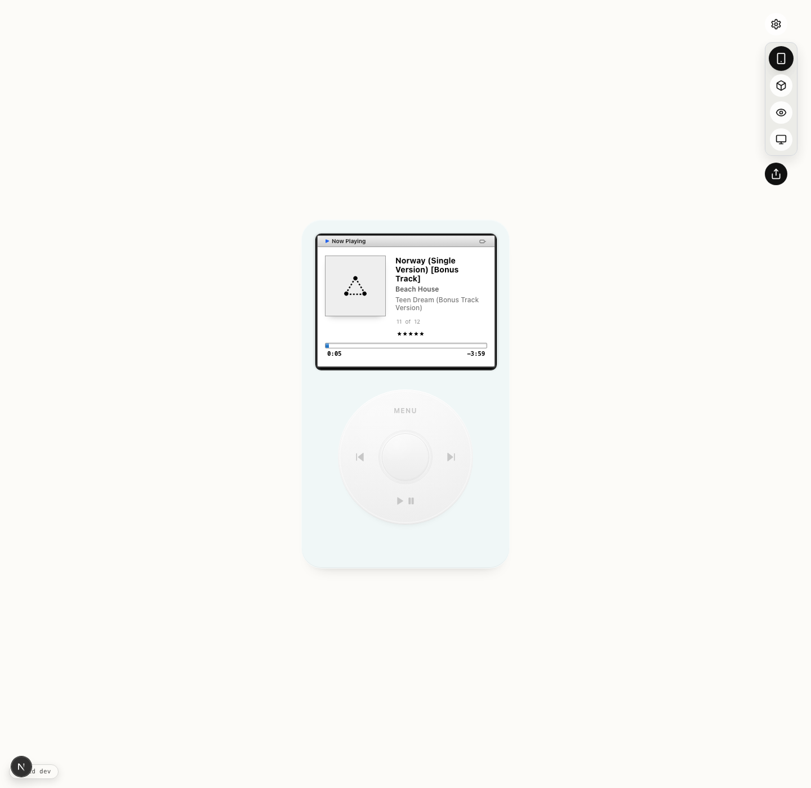
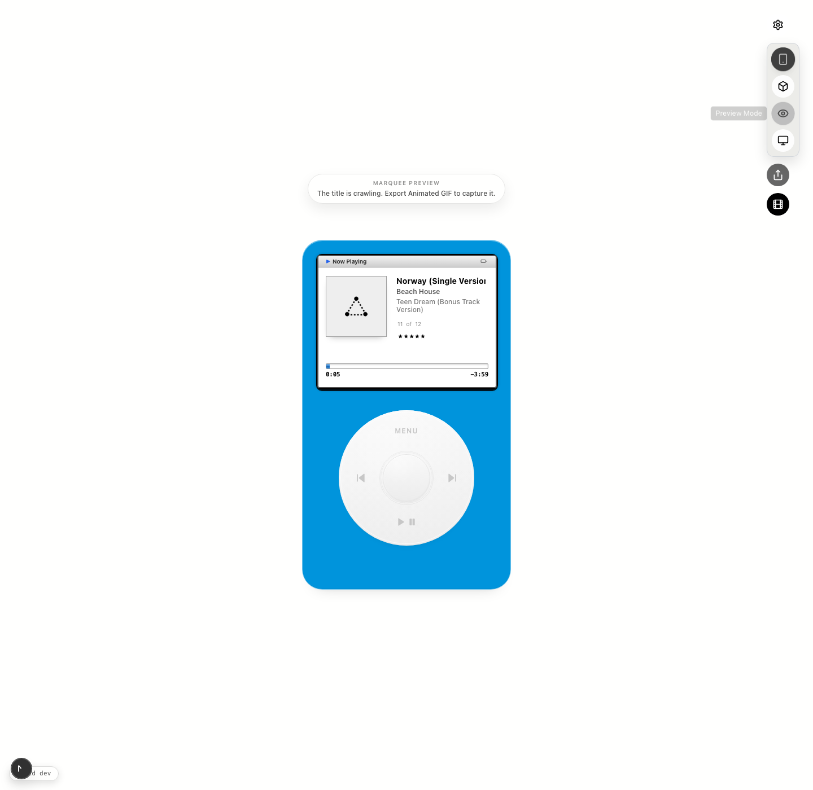
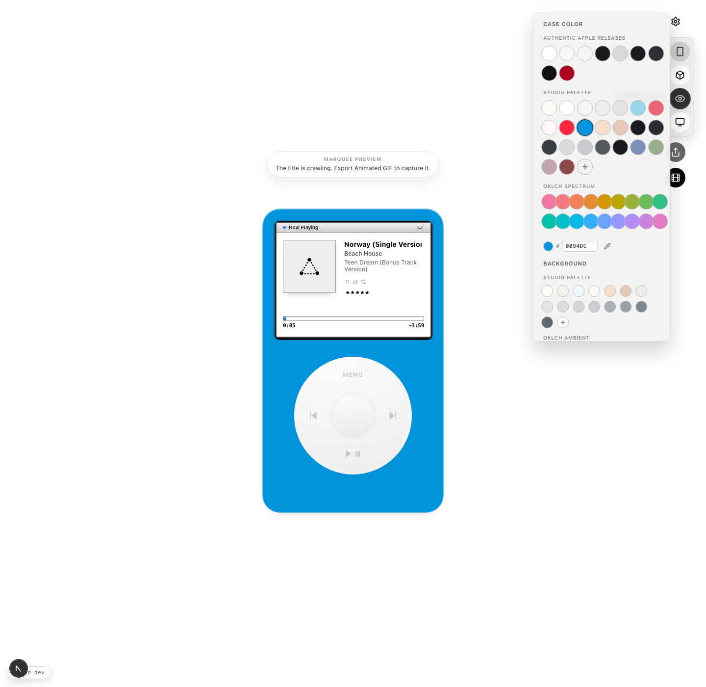

# iPod Snapshot

Create an iPod-style music frame, tune the shell/background palette, and export either a flat PNG or a marquee-ready animated GIF.

[Production](https://ipod-music.vercel.app)

## Screenshots







## Local Development

```bash
npm install
npm run dev
```

Default local URL: `http://localhost:4001`

Override the port when needed:

```bash
PORT=4010 npm run dev
PORT=4010 npm run start
```

## Export Notes

- Flat export produces a WYSIWYG PNG from the same live shell styling you see on screen.
- Preview export captures the title marquee as an animated GIF.
- On supported mobile browsers, export prefers the native share sheet.
- On supported Chromium browsers, desktop export prefers the native save picker and suggests Downloads.
- The studio palette includes the added reference whites, cyans, reds, peach tones, and lighter background washes from the latest direction.

## Deploy

This repo is deployed with Vercel under the `v0-i-pod-project-bx8feebd81r` project.

```bash
vercel link --yes --scope senik --project v0-i-pod-project-bx8feebd81r
vercel --prod --yes --scope senik
```

## Troubleshooting

If `npm run dev` appears to open the wrong app on `localhost:4000`, another local service is already using that port. This repo defaults to `4001` to avoid that conflict, but `PORT` can be set explicitly when you need a different local port.
