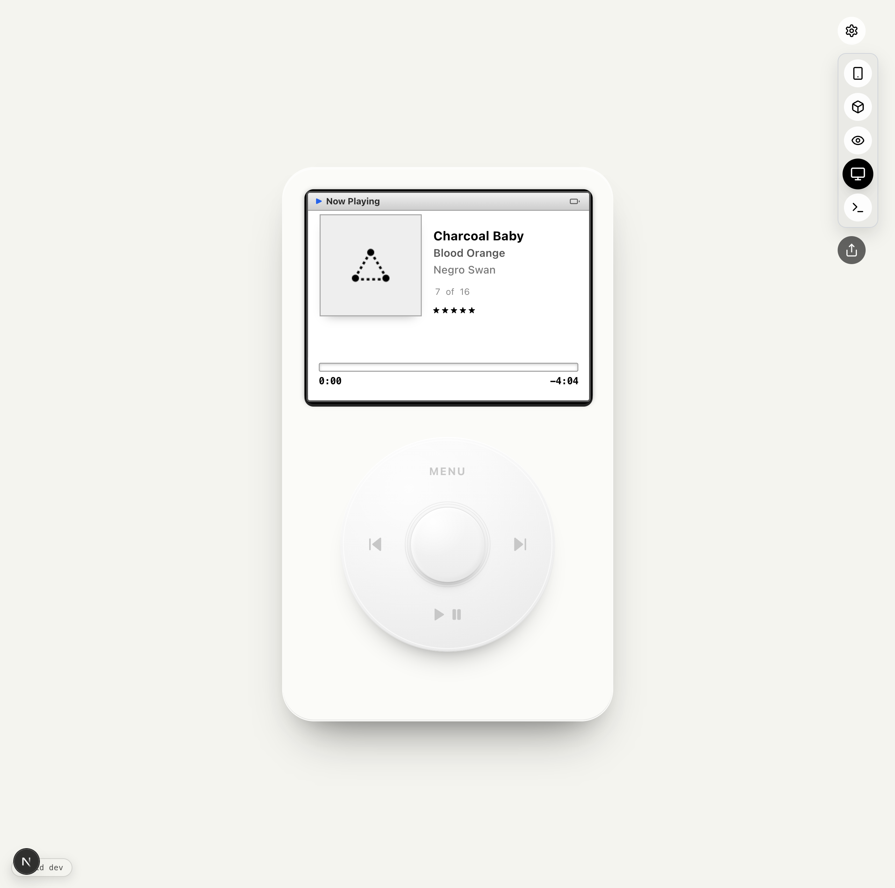
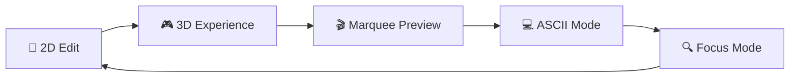
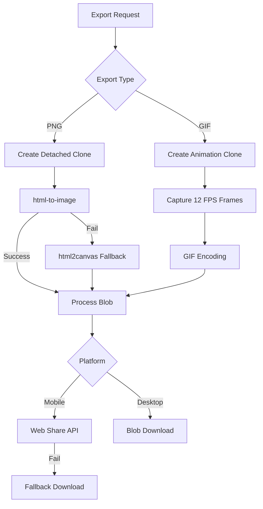
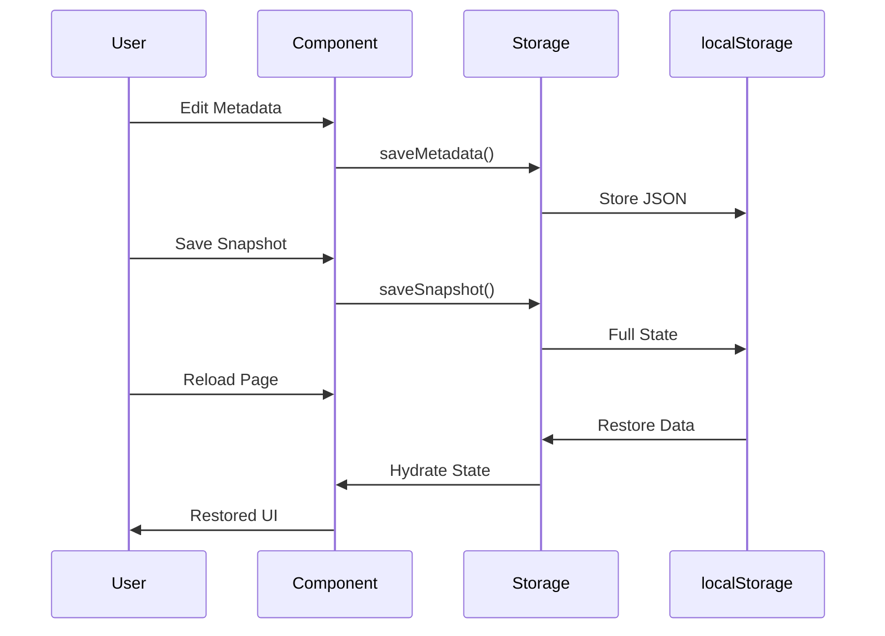
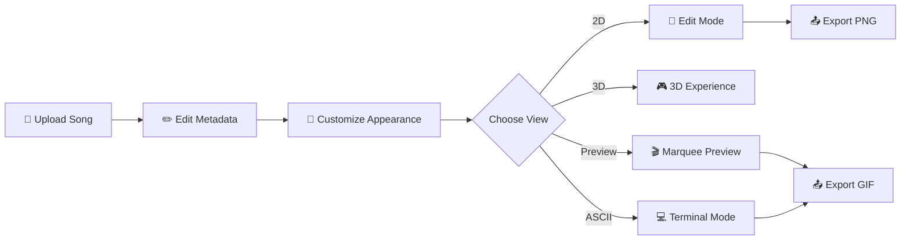
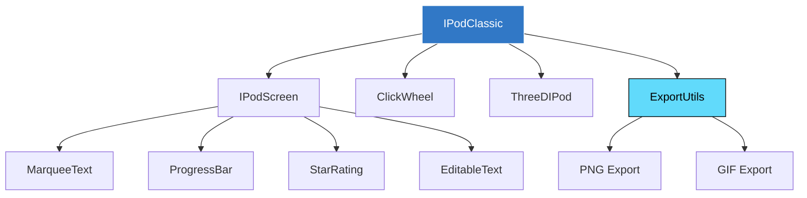

```
   ___      __   ____         ____  _       _ __        __
  / (_     / /  / __ \       / __ \(_)___ _(_) /_____ _/ /
 / / __ __/ /  / / / /_____/ / / / / __ `/ / __/ __ `/ /
/ / / // / /  / /_/ /_____/ /_/ / / /_/ / / /_/ /_/ / /
\_\ \_,_/_/  /_____/     /_____/_/\__, /_/\__/\__,_/_/
                                  /____/
                    iPod Classic Digital Clone
```

<div align="center">


**[🎵 Live Demo](https://v0-i-pod-project-bx8feebd81r.vercel.app)** • **[📖 Docs](#documentation)** • **[🤝 Contributing](./CONTRIBUTING.md)** • **[🏗️ Architecture](./ARCHITECTURE.md)**

*Drag & drop your song and create an iPod-like digital footprint*



</div>

---

## ✨ Features


### 🎵 **iPod Classic Simulation**
- **Metadata Editing**: Title, artist, album, artwork, rating (1-5 stars)
- **Click Wheel Navigation**: Authentic iPod controls simulation
- **Progress Seeking**: Scrub through your track with visual feedback
- **Track Numbers**: Full album context with track X of Y

### 🕹️ **Interaction Modes**

| Control | Menu Screen | Now Playing Screen |
|---------|------------|-------------------|
| **Wheel rotation** | Scroll through menu items | Seek through track |
| **Center button** | Select highlighted item | Toggle edit mode |
| **Menu button** | — | Return to menu |
| **Play/Pause** | Jump to Now Playing | Visual feedback |
| **Prev / Next** | Cycle menu items | Seek -5s / +5s |

- **iPod OS Mode** (default): Full menu navigation with 9 items (Music, Videos, Photos, Podcasts, Extras, Settings, Shuffle Songs, Now Playing, About)
- **Center button on Now Playing**: Toggles edit mode — tap to make title, artist, album, rating, and time editable, tap again to lock

### 🎨 **View Modes**


- **2D Edit Mode**: Full metadata editing interface
- **3D iPod Classic**: Interactive 3D rendering with Three.js
- **Marquee Preview**: Animated scrolling text simulation
- **ASCII Mode**: Terminal-style text representation
- **Focus Mode**: Minimal, distraction-free view

### 📤 **Export Capabilities**



- **PNG Export**: 4x resolution (1200×1600px) with dual fallback strategy
- **Animated GIF**: 12 FPS marquee animation with `gifenc` encoding
- **Platform Detection**: Web Share API for mobile, download for desktop
- **Automatic Fallback**: Graceful degradation if primary method fails

### 🎨 **Customization**

- **138+ Grey Tones**: 6 undertone families (Neutral, Warm, Cool, Greige, Sage, Lavender) × 23 perceptual lightness stops + OKLCH spectrum picker
- **9 Apple Colors**: Classic iPod finishes from graphite to starlight
- **Dual Theming**: iPod case color + Background color independent control
- **Color History**: Track and revisit recent color choices
- **Live Preview**: Real-time updates across all view modes

### 💾 **Snapshot System**



- **Auto-save**: Metadata and UI state persist automatically
- **Manual Snapshots**: Save complete state snapshots
- **Quick Restore**: One-click restoration of saved snapshots
- **localStorage**: Client-side persistence, no backend required

### 📱 **PWA Support**

- Installable as Progressive Web App
- Offline-capable with service worker caching
- Mobile-optimized responsive design
- Touch-friendly interface

---

## 🚀 Quick Start

### Prerequisites

- **[Bun](https://bun.sh)** 1.1+
- **Git** for cloning the repository

### Installation

```bash
# Clone the repository
git clone https://github.com/stussysenik/v0-ipod.git
cd v0-ipod

# Install dependencies
bun install

# Start development server
bun run dev
```

The app will be available at **`http://localhost:4001`**

> **💡 Tip**: Override the port if needed:
> ```bash
> PORT=4010 bun run dev
> PORT=4010 bun run start
> ```

### Build for Production

```bash
bun run build
bun run start
```

---

## 🎯 User Workflow



---

## 📦 Project Structure

```
v0-ipod/
├── app/                      # Next.js 15 app directory
│   ├── layout.tsx           # Root layout with PWA manifest
│   └── page.tsx             # Main iPod component page
├── components/
│   ├── ipod/
│   │   ├── ipod-classic.tsx        # Main iPod container
│   │   ├── ipod-screen.tsx         # Screen display logic
│   │   ├── ascii-ipod.tsx          # ASCII mode renderer
│   │   ├── grey-palette-picker.tsx # OKLCH grey palette picker
│   │   └── click-wheel.tsx         # Navigation controls
│   ├── three/
│   │   └── three-d-ipod.tsx        # 3D iPod with Three.js
│   └── ui/                          # Radix UI components
├── lib/
│   ├── export-utils.ts              # PNG/GIF export pipeline
│   ├── storage.ts                   # localStorage persistence
│   └── utils.ts                     # Utility functions
├── tests/
│   ├── interactions.spec.ts         # E2E interaction tests
│   └── mobile-usability.spec.ts     # Mobile responsiveness tests
└── public/
    └── manifest.json                # PWA manifest
```

---

## 🏗️ Component Architecture



---

## 🛠️ Tech Stack

| Layer | Technology |
|-------|-----------|
| **Framework** | Next.js 15 (React 19) |
| **Language** | TypeScript (strict mode) |
| **3D Rendering** | Three.js + React Three Fiber |
| **UI Components** | Radix UI + Tailwind CSS |
| **Export Pipeline** | html-to-image + html2canvas + gifenc |
| **State Management** | React useReducer + Context |
| **Storage** | localStorage API |
| **Testing** | Playwright (E2E) |
| **PWA** | @ducanh2912/next-pwa |
| **Deployment** | Vercel |

---

## 🧪 Testing

```bash
# Run all tests
bun run test

# Run tests with UI mode
bun run test:ui

# Run tests in debug mode
bun run test:debug

# Run specific test file
bunx playwright test tests/interactions.spec.ts
```

### Test Coverage

- ✅ Metadata editing and persistence
- ✅ View mode switching (2D, 3D, Preview, ASCII, Focus)
- ✅ Color customization and history tracking
- ✅ Export functionality (PNG and GIF)
- ✅ Snapshot save/restore
- ✅ Mobile responsiveness
- ✅ Touch interactions

---

## 📜 Available Scripts

| Script | Description |
|--------|-------------|
| `bun run dev` | Start development server on port 4001 |
| `bun run build` | Build production bundle |
| `bun run start` | Start production server |
| `bun run lint` | Run OXC (`oxlint`) |
| `bun run lint:fix` | Auto-fix OXC lint issues |
| `bun run lint:eslint` | Run the legacy Next/ESLint ruleset |
| `bun run format` | Format code with Prettier |
| `bun run format:check` | Check formatting without changes |
| `bun run type-check` | Run TypeScript type checking |
| `bun run validate` | Run lint + format check + type check |
| `bun run test` | Run Playwright tests |
| `bun run test:ui` | Run tests with UI |
| `bun run test:debug` | Run tests in debug mode |

---

## 🎨 Color Palette

### Apple Colors
`graphite` • `silver` • `starlight` • `midnight` • `blue` • `pink` • `purple` • `red` • `green`

### OKLCH Grey Palette
6 undertone families — Neutral, Warm, Cool, Greige, Sage, Lavender — each with 23 perceptually-spaced lightness stops. Hex deduplication ensures unique swatches. Gradient preview bar, curated favorites, and undertone tab persistence via localStorage.

### OKLCH Spectrum
Full spectrum color picker with infinite color possibilities

---

## 📖 Documentation

- **[Contributing Guide](./CONTRIBUTING.md)**: Learn about semantic commits and development workflow
- **[Architecture Deep-Dive](./ARCHITECTURE.md)**: Technical implementation details and system design
- **[Pull Request Template](./.github/PULL_REQUEST_TEMPLATE.md)**: Contribution guidelines

---

## 🤝 Contributing

We welcome contributions! Please follow these steps:

1. **Fork the repository**
2. **Create a feature branch**: `git checkout -b feat/your-feature`
3. **Make your changes** using [semantic commits](./CONTRIBUTING.md#semantic-commits)
4. **Run validation**: `bun run validate`
5. **Push and create a PR**

See **[CONTRIBUTING.md](./CONTRIBUTING.md)** for detailed guidelines including:
- Semantic commit conventions
- Code style guidelines
- Testing requirements
- PR review process

---

## 🐛 Troubleshooting

### Port Already in Use

If `bun run dev` fails because port 4001 is occupied:

```bash
PORT=4010 bun run dev
```

### Export Not Working on Mobile

The app uses the Web Share API on mobile devices. If your browser doesn't support it, the export will automatically fall back to direct download.

### 3D View Performance Issues

If you experience performance issues with the 3D view:
- Try switching to 2D edit mode
- Close other browser tabs
- Update your graphics drivers
- Use a modern browser (Chrome, Edge, Safari)

---

## 📄 License

MIT License - see [LICENSE](./LICENSE) for details

---

## 🙏 Acknowledgments

- Inspired by the iconic **iPod Classic** design
- Built with modern web technologies
- Export pipeline leverages multiple fallback strategies for reliability
- Testing ensures cross-platform compatibility

---

<div align="center">

**Made with ❤️ for music lovers**

[⬆️ Back to Top](#)

</div>
