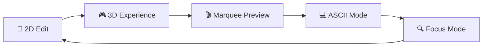
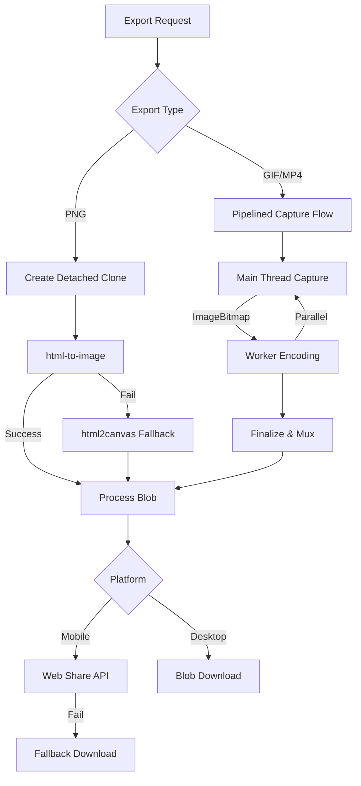
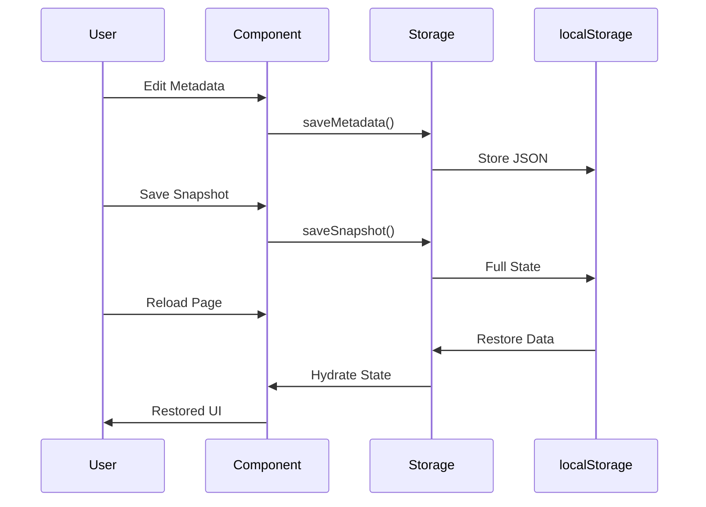
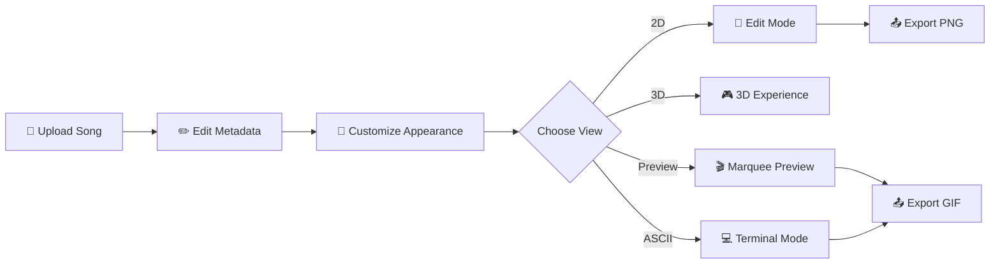
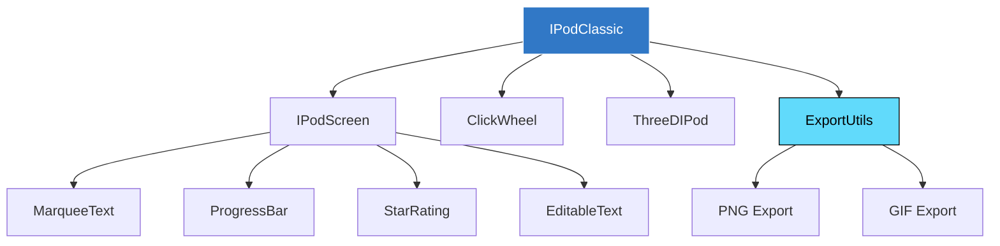

```
   ___      __   ____         ____  _       _ __        __
  / (_     / /  / __ \       / __ \(_)___ _(_) /_____ _/ /
 / / __ __/ /  / / / /_____/ / / / / __ `/ / __/ __ `/ /
/ / / // / /  / /_/ /_____/ /_/ / / /_/ / / /_/ /_/ / /
\_\ \_,_/_/  /_____/     /_____/_/\__, /_/\__/\__,_/_/
                                  /____/
                    iPod Classic Digital Clone
```

<div align="center">


**[🎵 Live Demo](https://v0-i-pod-project-bx8feebd81r.vercel.app)** • **[📖 Docs](#documentation)** • **[🤝 Contributing](./docs/CONTRIBUTING.md)** • **[🏗️ Architecture](./docs/ARCHITECTURE.md)**

*Drag & drop your song and create an iPod-like digital footprint*


</div>

---

## ✨ Features


### 🎵 **iPod Classic Simulation**
- **Metadata Editing**: Title, artist, album, artwork, rating (1-5 stars)
- **Click Wheel Navigation**: Authentic iPod controls simulation
- **Progress Seeking**: Scrub through your track with visual feedback
- **Track Numbers**: Full album context with track X of Y
- **Authentic Battery Logic**: Natural discharging cycle that drains slowly while the app is active

### 🕹️ **Interaction Modes**

| Control | Menu Screen | Now Playing Screen |
|---------|------------|-------------------|
| **Wheel rotation** | Scroll through menu items | Seek through track |
| **Center button** | Select highlighted item | Toggle edit mode |
| **Menu button** | — | Return to menu |
| **Play/Pause** | Jump to Now Playing | Visual feedback |
| **Prev / Next** | Cycle menu items | Seek -5s / +5s |

- **iPod OS Mode** (default): Full menu navigation with 9 items (Music, Videos, Photos, Podcasts, Extras, Settings, Shuffle Songs, Now Playing, About)
- **Center button on Now Playing**: Toggles edit mode — tap to make title, artist, album, rating, and time editable, tap again to lock

### 🎨 **View Modes**


- **2D Edit Mode**: Full metadata editing interface
- **3D iPod Classic**: Interactive 3D rendering with Three.js
- **Marquee Preview**: Animated scrolling text simulation
- **ASCII Mode**: Terminal-style text representation
- **Focus Mode**: Minimal, distraction-free view

### 📤 **Export Capabilities**



- **PNG Export**: 4x resolution (1200×1600px) with dual fallback strategy
- **Animated GIF**: 12 FPS marquee animation with `gifenc` encoding
- **MP4 Export**: H.264 video with 12Mbps bitrate for high-quality motion capture
- **Pipelined Architecture**: Concurrent capture and encoding using Web Workers and `ImageBitmap` for zero-jank UI during export
- **Real-time ETA**: Live estimation of remaining export time based on frame capture velocity
- **Smart Animation Capture**: 
  - **Marquee**: Automatically scrolls for long titles (overflow-based)
  - **Song Progress**: Progress bar and timestamps are automatically animated to reflect the export duration
  - **Consistency**: The export preview dialog provides a 1:1 simulation of the final rendered file
- **Platform Detection**: Web Share API for mobile, download for desktop
- **Automatic Fallback**: Graceful degradation if primary method fails

### 🎨 **Customization**

- **138+ Grey Tones**: 6 undertone families (Neutral, Warm, Cool, Greige, Sage, Lavender) × 23 perceptual lightness stops + OKLCH spectrum picker
- **9 Apple Colors**: Classic iPod finishes from graphite to starlight
- **Dual Theming**: iPod case color + Background color independent control
- **Color History**: Track and revisit recent color choices
- **Live Preview**: Real-time updates across all view modes

### 💾 **Snapshot System**



- **Auto-save**: Metadata and UI state persist automatically
- **Manual Snapshots**: Save complete state snapshots
- **Quick Restore**: One-click restoration of saved snapshots
- **localStorage**: Client-side persistence, no backend required

### 📱 **PWA Support**

- Installable as Progressive Web App
- Offline-capable with service worker caching
- Mobile-optimized responsive design
- Touch-friendly interface

---

## 🚀 Quick Start

### Prerequisites

- **[pnpm](https://pnpm.io)** 10+
- **Git** for cloning the repository

### Shell Productivity Tools

This project ships with shell helpers for faster git workflows:

| Tool | What It Does |
|------|-------------|
| **[forgit](https://github.com/wfxr/forgit)** | Interactive git (add, log, diff, checkout…) via fzf |
| **[gh-repo-fzf](https://github.com/kavinvalli/gh-repo-fzf)** | Fuzzy-find and clone GitHub repos |

**To enable forgit aliases (`ga`, `glo`, `gcb`, `gd`…) in this directory:**

#### Option A: direnv (recommended, auto-activates on `cd`)
```bash
brew install direnv          # one-time
echo 'eval "$(direnv hook zsh)"' >> ~/.zshrc
direnv allow                 # inside this project
```

#### Option B: Manual
```bash
source /opt/homebrew/opt/forgit/share/forgit/forgit.plugin.zsh
```

**To use gh-repo-fzf:**
```bash
gh repo-fzf    # fuzzy-find repos from your GitHub
```

> Both for `forgit` aliases and `gh repo-fzf` require `fzf` and `gh` to be installed:
> `brew install fzf gh forgit && gh extension install kavinvalli/gh-repo-fzf`

### Installation

```bash
# Clone the repository
git clone https://github.com/stussysenik/v0-ipod.git
cd v0-ipod

# Install dependencies
pnpm install

# Start development server
pnpm dev
```

The app will be available at **`http://localhost:4001`**

### Cursor Harness

This repo also includes a small local Cursor SDK harness based on the official
`cursor/cookbook` quickstart example.

```bash
# add your Cursor API key to .env.local or export it in your shell
echo 'CURSOR_API_KEY="crsr_..."' >> .env.local

# ask Cursor to inspect this workspace
pnpm cursor:harness -- "Summarize the export pipeline in this repo"
```

Optional flags:

- `--model composer-2`
- `--cwd /absolute/path/to/workspace`
- `--force` to allow local execution with uncommitted changes

> **💡 Tip**: Override the port if needed:
> ```bash
> PORT=4010 pnpm dev
> PORT=4010 pnpm start
> ```

### Build for Production

```bash
pnpm build
pnpm start
```

---

## 🧭 Design Workflow

This repository now uses **Storybook as the default review surface** for shared
UI, tokens, and the physical iPod assembly.

Use the **app page** when you need full integration behavior:

- metadata editing flow
- persistence and snapshot behavior
- export behavior
- broader UX validation across the whole workbench

Use **Storybook** when you want to change a visual system input or a component
and inspect it in isolation first.

### What Is A Story?

A **story** is a small isolated example of a component or visual surface.

Examples:

- an `IconButton` in default, hover, focus, and disabled states
- the iPod status bar by itself
- the full physical iPod assembly with real screen and click-wheel parts
- a token manifest board that lets you inspect source values before changing
  component code

Stories are not the app. They are focused review fixtures for one component,
one assembly, or one source-of-truth surface at a time.

### Storybook Commands

```bash
# Run Storybook locally for day-to-day work
pnpm storybook

# Build the static Storybook site
pnpm build-storybook

# Run Storybook-linked tests
pnpm storybook:test

# Run build + Storybook tests together
pnpm storybook:validate
```

How to use them:

- Use `pnpm storybook` while actively designing or refactoring.
- Use `pnpm build-storybook` to make sure the Storybook site compiles cleanly.
- Use `pnpm storybook:test` to verify story interactions and test coverage.
- Use `pnpm storybook:validate` before landing larger Storybook-related changes.

`pnpm build-storybook` is **not** the main daily command. It is the static
verification/build command. The main interactive command is `pnpm storybook`.

### Source Of Truth Map

There are three main design ownership layers in this repo:

1. `tokens/*`
   Shared reusable UI tokens.
   Today this is mainly `tokens/shared-ui.json`.

2. `scripts/*.json`
   Product-owned iPod manifests.
   These are not shared design-system primitives. They hold iPod-specific color,
   finish, chrome, and surface data.

3. `components/*`
   The actual implementation layer.
   `components/ui/*` is shared UI.
   `components/ipod/*` is product-owned iPod assembly code.

### Practical Loop

If you want to change a shared primitive:

1. Edit `tokens/shared-ui.json` if the styling change is semantic and reusable.
2. Open `tokens/shared-ui/Manifest` in Storybook.
3. Open the affected `components/ui/*` story, for example `components/ui/IconButton`.
4. Adjust the component only if the token change is not enough.
5. Run `pnpm build-storybook` when the change is ready to verify.

If you want to change the physical iPod finish, screen chrome, or wheel:

1. Edit the owning product source:
   `scripts/color-manifest.json`, `scripts/design-system.json`, or a
   `components/ipod/*` file.
2. Open the matching Storybook entry first:
   `scripts/color-manifest/ProductFinishes`,
   `components/ipod/display/IpodStatusBar`,
   `components/ipod/display/IpodScreen`,
   `components/ipod/controls/IpodClickWheel`,
   `components/ipod/device/PhysicalIpod`.
3. Review the isolated element first, then the full physical assembly story.
4. Open the app workbench only after the Storybook pass looks right.

### Storybook Sidebar Shape

The Storybook tree mirrors repository ownership on purpose:

- `Foundations/*`
- `tokens/*`
- `components/ui/*`
- `components/ipod/*`
- `scripts/*`

That means you should be able to move from a Storybook entry to the owning file
without translation.

Recommended first-read order inside Storybook:

1. `Foundations/Start Here`
2. `tokens/shared-ui/Manifest`
3. `components/ipod/device/PhysicalIpod`
4. the relevant isolated component story
5. `scripts/color-manifest/ProductFinishes` when tuning finish direction

Important:

- changing Storybook controls does **not** persist anything globally
- changing the real source file does

If you tweak a color in Storybook controls, you are only previewing a temporary
runtime state for that story. If you edit `tokens/shared-ui.json`,
`scripts/color-manifest.json`, `scripts/design-system.json`, or the owning
`components/*` file, every consumer of that source updates globally.

### Figma / Tokens Studio

If design work happens in Figma:

- shared primitive changes still start in repository token files
- Storybook is used to review the result in code
- Tokens Studio syncs to the repository JSON

The repository stays authoritative. Figma sync is downstream collaboration, not
a parallel source of truth.

---

## 📐 Design Fidelity: Click Wheel Label Positioning

The click wheel labels (MENU, ▶⏸, ⏮, ⏭) are positioned using a
**source-truth proportion system** derived from the official Wikipedia SVG
diagram of the iPod click wheel.

### Method

The Wikipedia SVG provides precise coordinate data:

| Element | Outer Circle | Center Button | Ring Width |
|---------|-------------|---------------|------------|
| Radius  | 245 units    | 90 units      | 155 units  |

Label positions were measured from raw SVG coordinates:

| Label     | Distance from outer edge | % of ring width |
|-----------|-------------------------|-----------------|
| MENU      | 25 units                | 16.1%           |
| Play/Pause| 26 units                | 16.8%           |
| Prev/Next | 28 units                | 18.1%           |

### The Inequality

The constraint that keeps labels true to the original hardware:

```
0.12 ≤ (inset_px / ring_width) ≤ 0.20
```

Where `ring_width = (wheel_size - center_size) / 2` and `inset_px = inset_% × wheel_size`.

### Applying to Presets

Each preset is checked against the inequality by solving for the percentage
that places labels at ~15–18% of the ring from the outer edge:

```
inset_% ≈ 0.15 × ring_width / wheel_size
```

| Preset | Old inset | Ring position | New inset | Ring position |
|--------|-----------|---------------|-----------|---------------|
| 2007   | 10.5%     | 33% ❌        | 5%        | 16% ✓         |
| 2008   | 2%        | 6% ✓          | unchanged | —             |
| 2009   | 10%       | 30% ❌        | 5%        | 15% ✓         |

This ensures no preset places labels closer to the center button than to the
outer edge — matching the visual balance of the original hardware.

---

## 🎯 User Workflow



---

## 📦 Project Structure

```
v0-ipod/
├── app/                      # Next.js 15 app directory
│   ├── layout.tsx           # Root layout with PWA manifest
│   └── page.tsx             # Main iPod component page
├── components/
│   ├── ipod/
│   │   ├── ipod-classic.tsx        # Main iPod container
│   │   ├── ipod-screen.tsx         # Screen display logic
│   │   ├── ascii-ipod.tsx          # ASCII mode renderer
│   │   ├── grey-palette-picker.tsx # OKLCH grey palette picker
│   │   └── click-wheel.tsx         # Navigation controls
│   ├── three/
│   │   └── three-d-ipod.tsx        # 3D iPod with Three.js
│   └── ui/                          # Radix UI components
├── lib/
│   ├── export-utils.ts              # PNG/GIF export pipeline
│   ├── storage.ts                   # localStorage persistence
│   └── utils.ts                     # Utility functions
└── public/
    └── manifest.json                # PWA manifest
```

---

## 🏗️ Component Architecture



---

## 🛠️ Tech Stack

| Layer | Technology |
|-------|-----------|
| **Framework** | Next.js 15 (React 19) |
| **Language** | TypeScript (strict mode) |
| **3D Rendering** | Three.js + React Three Fiber |
| **UI Components** | Radix UI + Tailwind CSS |
| **Export Pipeline** | html-to-image + html2canvas + gifenc |
| **State Management** | React useReducer + Context |
| **Storage** | localStorage API |
| **PWA** | @ducanh2912/next-pwa |
| **Deployment** | Vercel |

---

## 🔎 Verification

This repository currently does not ship with a committed automated test suite.
Use the existing quality gates plus focused manual checks while rebuilding test
ownership:

```bash
pnpm lint
pnpm type-check
pnpm build
```

---

## 📜 Available Scripts

| Script | Description |
|--------|-------------|
| `pnpm dev` | Start development server on port 4001 |
| `pnpm build` | Build production bundle |
| `pnpm start` | Start production server |
| `pnpm clean:next` | Remove `.next` if a stale local build causes runtime issues |
| `pnpm lint` | Run OXC (`oxlint`) |
| `pnpm lint:fix` | Auto-fix OXC lint issues |
| `pnpm lint:eslint` | Run the legacy Next/ESLint ruleset |
| `pnpm type-check` | Run TypeScript type checking |
| `pnpm validate` | Run lint + type check |
| `pnpm storybook` | Start Storybook locally on port 6006 |
| `pnpm build-storybook` | Build the static Storybook site |
| `pnpm storybook:test` | Run Storybook-linked Vitest coverage |
| `pnpm storybook:validate` | Run Storybook build + Storybook tests |

---

## 🎨 Color Palette

### Apple Colors
`graphite` • `silver` • `starlight` • `midnight` • `blue` • `pink` • `purple` • `red` • `green`

### OKLCH Grey Palette
6 undertone families — Neutral, Warm, Cool, Greige, Sage, Lavender — each with 23 perceptually-spaced lightness stops. Hex deduplication ensures unique swatches. Gradient preview bar, curated favorites, and undertone tab persistence via localStorage.

### OKLCH Spectrum
Full spectrum color picker with infinite color possibilities

### CIEDE2000 Color Proximity

Shades and palette matches are driven by perceptually uniform color math, not
naive RGB interpolation:

```
hex → RGB → CIEXYZ → CIELAB → ΔE 2000
```

| Step | Formula | Purpose |
|------|---------|---------|
| `hex → RGB` | sRGB transfer | Linearize gamma-compressed values |
| `RGB → XYZ` | CIE 1931 matrix | Device-independent tristimulus |
| `XYZ → LAB` | CIE 1976 | Perceptually uniform opponent space |
| `LAB → ΔE` | CIEDE2000 | Industry-standard color difference |

**ΔE 2000** corrects the remaining non-uniformities in CIELAB:
- **Hue weighting** (`t`): blue region has smaller tolerance than yellow
- **Lightness compensation** (`sl`): dark colors have smaller JND
- **Chroma compensation** (`sc`): low-saturation colors behave differently
- **Hue-chroma rotation** (`rt`): elliptical tolerance in blue region

Shades are displayed only when `ΔE ≤ 15` — beyond that a color is no longer
meaningfully "a shade of" the target. A ΔE of ~2.3 is JND (just noticeable
difference); ~1.0 is barely perceptible.

The same pipeline also derives the screen gasket color from the case skin,
keeping the physical gap cohesive on every theme.

---

## 📖 Documentation

This README is the central starting point. Use the documents below for deeper
detail:

- **[Design-System Foundation](./docs/DESIGN-SYSTEM-FOUNDATION.md)**: component ownership, token boundaries, Storybook workflow
- **[Architecture](./docs/ARCHITECTURE.md)**: system structure and implementation detail
- **[Contributing](./docs/CONTRIBUTING.md)**: contribution workflow and expectations
- **[Docs Index](./docs/DOCS.md)**: entry point to the rest of the repository docs
- **[Vision](./docs/VISION.md)**: product direction and intent
- **[Roadmap](./docs/ROADMAP.md)**: planned work
- **[Tech Stack](./docs/TECHSTACK.md)**: stack overview
- **[iPod Assembly Notes](./docs/IPOD-ASSEMBLY.md)**: product-specific assembly context
- **[Pull Request Template](./.github/PULL_REQUEST_TEMPLATE.md)**: contribution guidelines

---

## 🗓️ Build Log

A dated record of what actually shipped, oldest first. **This section is
append-only** — never rewrite or delete a past entry, even when a later date
reverses the decision. A reversal is itself a fact worth recording, and the
value of this log is that it stays honest about the path rather than tidying
it into a story that was never true.

**Convention for new entries:** add a `### YYYY-MM-DD` heading at the bottom of
the current month, one line naming the theme, then bullets for the substantive
work. Cosmetic churn can be summarized in aggregate; anything that changed
behavior, deleted a capability, or reversed an earlier decision gets its own
bullet.

`246 commits · 2026-01-05 → 2026-07-18`

---

### January 2026 — the 2D device

**2026-01-05** — Repository initialized; the 2D iPod reaches a finished state.
Draft passes on the shell, plus the dash detail on song length.

**2026-01-17** — Editable track number, and the first E2E testing infrastructure.

**2026-01-18** — First pass at export.

**2026-01-19** — PWA support for home-screen installation; visual pass.

**2026-01-20** — Export becomes predictable: context-aware button labels, and the
3D model resets to front-facing before capture so exports stop depending on
whatever angle the user happened to leave behind.

---

### February 2026 — export stops lying

The month export went from "usually works" to deterministic. Most of the 23
commits on the 18th are one problem: the exported image did not match the screen.

**2026-02-18** — Mobile-first interaction and export flow stabilized; E2E coverage
across desktop and mobile. Then the export campaign:
- Blank-export detection with an `html2canvas` fallback.
- Deterministic detached capture with export-safe shadows.
- Three compositing artifacts chased in sequence — border-radius on the wrapper,
  unbaked `bgColor`, and reduced export shadows — each fixed independently.
- Stale deployed artwork traced to cache behavior; `vercel.json` plus
  cache-busting headers and a forced clean `.next` build per deploy.
- iOS Safari stopped opening a dead popup tab.
- Tooling: ESLint flat config, Prettier, and a `ui/ipod/three` component split.
- Hydration-safe `localStorage` persistence for song metadata.

**2026-02-20** — Cross-platform editing input unified; collapsible mobile toolbox;
export frame constrained; incremental export IDs.

---

### March 2026 — motion formats

**2026-03-03** — Professional README with badges.

**2026-03-09** — Color picker refactored to inline native inputs, hex editor, and
an eyedropper.

**2026-03-10** — Editing flow and test tooling updated.

**2026-03-11** — Marquee preview and GIF export land.

**2026-03-12** — Unified export preview with a recording fallback.

**2026-03-13** — npm lockfile removed to stop Next.js corruption; marquee
converted to single-pass scrolling.

**2026-03-14** — OKLCH grey palette, ASCII mode, and GIF export merged to main.

---

### April 2026 — the engineering foundation

**2026-04-01** — Demo GIF added and embedded.

**2026-04-03** — iPod Classic preset state and export fidelity.

**2026-04-04** — Codebase structure reorganized.

**2026-04-05** — RE:MIX polish and iPod-OS fidelity spec written, then rewritten
using the agent-skills frameworks. Center-button click fixed; edit toggle on Now
Playing.

**2026-04-10** — Menu button behavior unified across interaction models; museum
fidelity mode added.

**2026-04-13** — Portless dev by default, with an auto free-port probe.

**2026-04-14** — The full design-engineering stack: Storybook, Figma bridge,
tokens, CI, hooks — plus the C1 research and spec for atomic foundations.

**2026-04-15** — Ten commits paying down the CI the previous day created: ESLint 10
crash, test-runner confusion, TruffleHog `BASE==HEAD`, full-history fetch for
secret scanning, Storybook built and served for E2E smoke tests, and E2E failures
resolved across suites. `semantic-release` added with changelog and GitHub
release plugins.

**2026-04-22** — iPod OS Original option in the UI; stray shadow and text-bubble
opacity cleanup.

**2026-04-29** — Sixteen commits consolidating the architecture. Bun and oxlint
adopted as defaults; the workbench split into assembly state modules; a local
design-system foundation established; component taxonomy finalized; the committed
Playwright harness removed as a breaking change; two long-lived branches
(`classic-museum-fidelity`, upstream `main`) reconciled.

**2026-04-30** — Extra progress handle removed.

---

### May 2026 — hardware fidelity, to the millimeter

The month the device stopped looking like a drawing of an iPod.

**2026-05-01 – 05-02** — Animated export workflow; pipelined optimization; battery
discharge cycle integrated into the state orchestrator.

**2026-05-08** — Archive backup before desktop cleanup.

**2026-05-09** — Organic seamless marquee with staggered registration and
high-fidelity edge fade. Export extended to 60s and tuned for Instagram
(30FPS, 24Mbps, 1080p). Quality and layout choices added to the export dialog.
Device form realism and hardware proportions refined.

**2026-05-10** — Shell chamfer, artwork reflection, click-wheel material system
with case-coherent lighting. Wheel labels repositioned toward the outer radius to
match original proportions — the methodology written up in this README. Package
manager migrated bun → pnpm. Nix dev shell repaired; `forgit` and `gh-repo-fzf`
added. Precise 3D glass battery geometry.

**2026-05-11** — Twenty-one commits of sub-pixel calibration. Authentic 6th-gen
proportions restored via a mathematical radius relationship. The dent design
system finalized (concave center button, flat display frame, stripped wheel
overlays) with shadow ratios proportional to `centerSize` so it scales across
presets. Progress-bar alignment iterated to symmetric padding. Cold digital
blacks replaced with warm organic darks. Optional UI gated behind feature flags,
keeping only 6th-gen Black as default.

**2026-05-15** — Inner ring color control; snapshot UI cleanup; hex input
click-to-focus.

**2026-05-18** — Adaptive gasket, product-angle export camera, responsive lock,
and **CIEDE2000 shade proximity** — the first appearance of the perceptual color
metric this project keeps returning to. Assembly clipping on small viewports
fixed by aligning scale reserve with container constraints.

**2026-05-24** — Architecture evolution: UnoCSS, XState, CVA, Vanilla Extract,
Effect.ts.

**2026-05-25** — Mobile export routed through a prompt overlay for Cloudflare
tunnel compatibility.

---

### June 2026 — the 3D studio

**2026-06-06** — `/3d` ships: a focused R3F iPod render with CNC-correct geometry,
black anodized aluminum material, and true click-wheel topology.

**2026-06-07** — Export-pop studio scene, hero framing, lockable perspective, and
the portfolio surface.

**2026-06-08** — Eleven commits building the studio. WYSIWYG exports with absolute
color fidelity; a framework-free studio lighting data model; the lighting cockpit;
owned-finish guaranteeing clean exports across colour × motion, with a
keyframe-diff harness pinning its invariants; curated looks and a
compatible-shades randomizer; boomerang, speed, and motion-free Hold export.

**2026-06-09** — Eleven commits on export correctness and IA. The export song clock
driven by clip-time, then every export loop unified onto **one bake-time
clip-clock**. Now Playing animates during clip exports. SSR hydration mismatch
killed by rendering the studio client-only. Cockpits numbered and reordered into a
shoot-pipeline IA; Lighting and Export decluttered via progressive disclosure.
Multi-format colour input, combinations strip, independent edge colour. Mobile
on-canvas touch camera controls. MKBHD-style robotic crane motion preset.

**2026-06-10** — XState export machine landed with reliability and responsive
guards; screen bakes guarded against blank `foreignObject` rasterizations;
export-debugging session lessons captured.

**2026-06-12** — Architecture-evolution conflicts resolved; portfolio, studio
themes, and 3D stage refinements.

**2026-06-13** — Ten commits. Face geometry **derived from Apple's mm drawing**
with dimensional QC tests; wheel labels seated on the machined annulus midline
with light-evidence QC; headphone jack, hold switch, and 30-pin dock modeled flush
from the drawing. Theatre.js keyframe engine, with a pure sampler driving export
as a parity oracle. Content-addressed proof cache and debounced editors. Stale
E2E retargeted to current UI truth.

**2026-06-16 – 06-17** — Floating tool panels and the ⌘K command palette, with
mobile responsive stability. Colors and device Settings migrated into store-backed
floating panels. Two-tier palette triage with a navigate action.

**2026-06-24** — Center button reworked twice — first to read as a concave seat
rather than a raised dome, then as a flat face cut by a recessed groove. Live
self-discharging battery, and boot to the Shuffle Songs menu.

**2026-06-26** — Eight commits: iPod feed browser, whitelabel embed, and the
`/3d-portfolio` page; feed schema, nav state machine, and layout keepout zones;
the portfolio feed surface and data layer; web-component package scaffold.

**2026-06-27** — Range/selection invariant enforced at load and reset boundaries —
two paths (`loadUiState`, `RESET_MODEL`) were bypassing normalization, letting a
stale range resurrect after a hard refresh.

**2026-06-29** — Styling engine migrated Tailwind → UnoCSS. Native canvas camera
gestures with zoom-out default. **`deriveOwnedRig` removed**: studio lighting
becomes a pure function of the rig dials, never reshaped by device or stage
colours, so the export fingerprint fully determines the rig. Deterministic studio
control language, plus a hydration-race desync fix — restore moved to a pre-paint
isomorphic layout effect so edits landing during the restore window are no longer
wiped.

---

### July 2026 — reachability, colour authority, and the spec ledger

**2026-07-03** — PostHog provider with semantic 3D events; opt-in `?perf` StatsGl
HUD. Finish-customizer-experience proposed.

**2026-07-14** — Fourteen commits, and the month's most consequential finding.
The app shipped with **exactly two navigation edges** (`/ ⇄ /3d`): `/portfolio`,
`/3d-portfolio`, and `/whitelabel` had no inbound link and no way back. Every
per-page test had passed the whole time — they are structurally blind to the
difference between a page that renders and a page a visitor can *find*. The fix
made the graph data (`SURFACE_EDGES` in `lib/nav/routes.ts`) so a BFS test could
assert reachability; reverted against the old graph it fails naming both orphans.
Also: the eleven canonical works derived from `data.ts` (they had linked
nowhere); the device-is-product cut removing chrome around the device; unified
camera pose model with six angle presets; machined corner radius replacing
stadium pills; "one tap back to factory" made testable; the unfurl card became a
render rather than a screenshot; and the deployed app was caught calling the
visitor's own localhost.

**2026-07-17** — The Khronos **Neutral display transform** ported as the shared
colour authority (§0.1).

**2026-07-18** — Twenty commits across render fidelity, export reliability, and
spec hygiene.
- **Colour:** CPU Neutral port pinned against three.js GLSL as the parity anchor
  (§0.2a). Device-chrome hex routed through the manifest (§0.3) — five genuine
  survivors promoted to `device.*` tokens, with the true-`#000000`/`#ffffff`
  WYSIWYG sentinels deliberately left literal.
- **Finish:** finish-aware material table so black stops reading as a void
  (§3.1), then wired into the lit materials (§3.2) — touch ring, select button,
  anodized face.
- **Lighting:** per-pose light compositions as pure data (§4.1), surfaced in the
  cockpit with a reset-to-composition action (§4.3).
- **Export reliability:** mobile delivery routed through the app's iOS-aware
  channel (§7.1); still capture clamped to device GPU/memory with context-loss
  guards (§7.2–7.3); a clip codec fallback ladder stepping down resolution and
  profile so phones degrade instead of hard-failing (§7.4).
- **Screen:** pure camera→glass-sweep function so the DOM screen reads glazed
  (§2.1).
- **OpenSpec:** `openspec archive` run for the first time in the repo's history —
  17 completed changes folded into `specs/`, bootstrapping 21 capability specs as
  the source of truth, with `Purpose` backfilled for all 21. Active changes
  triaged 31 → 18 → 7. Checkbox drift resolved on the theme-toggle ledger
  (5/24 → 22/24), each tick re-verified against source with a file:line citation
  and two items annotated `SUPERSEDED` rather than silently ticked.
- **Theme:** luminance-adaptive `IconButton` chrome — pure core with tests, then
  wired into the toolbar.
- Proposed `add-color-fidelity-verification`: the ΔE2000 gate behind the
  product's central colour promise. The spec has required exported colour to
  match live colour since §0.1, but nothing tests it — no assertion that an
  exported pixel equals a token colour, and a full CIEDE2000 implementation
  shipping at `lib/color-proximity.ts:122` with zero direct coverage.

**State at this entry:** lint 0 errors · type-check clean · 601/601 unit tests
green · production live on `3008f92`. Eight OpenSpec changes remain active and
incomplete — see `openspec/changes/` for the live ledger, which is the
authoritative backlog; this log records what shipped, not what is planned.

---

## 🤝 Contributing

We welcome contributions! Please follow these steps:

1. **Fork the repository**
2. **Create a feature branch**: `git checkout -b feat/your-feature`
3. **Make your changes** using [semantic commits](./docs/CONTRIBUTING.md#semantic-commits)
4. **Run validation**: `pnpm validate`
5. **Push and create a PR**

See **[CONTRIBUTING.md](./CONTRIBUTING.md)** for detailed guidelines including:
- Semantic commit conventions
- Code style guidelines
- Testing requirements
- PR review process

---

## 🐛 Troubleshooting

### Port Already in Use

If `pnpm dev` fails because port 4001 is occupied:

```bash
PORT=4010 pnpm dev
```

### Export Not Working on Mobile

The app uses the Web Share API on mobile devices. If your browser doesn't support it, the export will automatically fall back to direct download.

### 3D View Performance Issues

If you experience performance issues with the 3D view:
- Try switching to 2D edit mode
- Close other browser tabs
- Update your graphics drivers
- Use a modern browser (Chrome, Edge, Safari)

---

## 📄 License

MIT License - see [LICENSE](./LICENSE) for details

---

## 🙏 Acknowledgments

- Inspired by the iconic **iPod Classic** design
- Built with modern web technologies
- Export pipeline leverages multiple fallback strategies for reliability
- Testing ensures cross-platform compatibility

---

<div align="center">

**Made with ❤️ for music lovers**

[⬆️ Back to Top](#)

</div>
