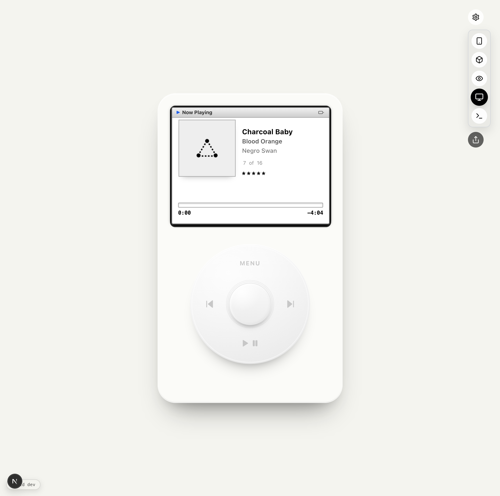

```
   ___      __   ____         ____  _       _ __        __
  / (_     / /  / __ \       / __ \(_)___ _(_) /_____ _/ /
 / / __ __/ /  / / / /_____/ / / / / __ `/ / __/ __ `/ /
/ / / // / /  / /_/ /_____/ /_/ / / /_/ / / /_/ /_/ / /
\_\ \_,_/_/  /_____/     /_____/_/\__, /_/\__/\__,_/_/
                                  /____/
                    iPod Classic Digital Clone
```

<div align="center">


**[🎵 Live Demo](https://v0-i-pod-project-bx8feebd81r.vercel.app)**



</div>

---

## Documentation

| File | What it covers |
|---|---|
| [`docs/ARCHITECTURE.md`](./docs/ARCHITECTURE.md) | System design, component tree, data flow |
| [`docs/CONTRIBUTING.md`](./docs/CONTRIBUTING.md) | Contributing guidelines, commit conventions |
| [`docs/DECISIONS.md`](./docs/DECISIONS.md) | Decision ledger (architecture and design rulings) |
| [`docs/DESIGN.md`](./docs/DESIGN.md) | Design decisions and rationale |
| [`docs/DESIGN-SYSTEM-FOUNDATION.md`](./docs/DESIGN-SYSTEM-FOUNDATION.md) | Design tokens, typography, spacing |
| [`docs/FACTORY.md`](./docs/FACTORY.md) | Development factory operating manual |
| [`docs/IR.md`](./docs/IR.md) | Intermediate representation notes |
| [`docs/SETUP.md`](./docs/SETUP.md) | Development environment setup |
| [`docs/STANDARDS.md`](./docs/STANDARDS.md) | Code standards and conventions |
| [`docs/TECHSTACK.md`](./docs/TECHSTACK.md) | Technology choices and rationale |
| [`docs/VISION.md`](./docs/VISION.md) | Product vision and direction |
| [`docs/3d-studio-system.md`](./docs/3d-studio-system.md) | 3D studio system documentation |
| [`docs/ENGINEERING_SETUP.md`](./docs/ENGINEERING_SETUP.md) | Engineering-specific setup details |
| [`docs/IPOD-ASSEMBLY.md`](./docs/IPOD-ASSEMBLY.md) | iPod 3D assembly notes |

### Quick Start

```bash
git clone https://github.com/<user>/v0-ipod
npm install
npm run dev
```

### Available Scripts

| Script | Description |
|---|---|
| `npm run dev` | Development server (with portless — `https://ipod.localhost`) |
| `npm run dev:raw` | Development server (`http://localhost:3000`) |
| `npm run build` | Production build |
| `npm run validate` | Full validation (board check + lint + type-check) |
| `npm run test` | Run all tests |
| `npm run lint` | Lint with oxlint |
| `npm run type-check` | TypeScript type check |
| `npm run storybook` | Run Storybook locally |
---

## License

MIT
