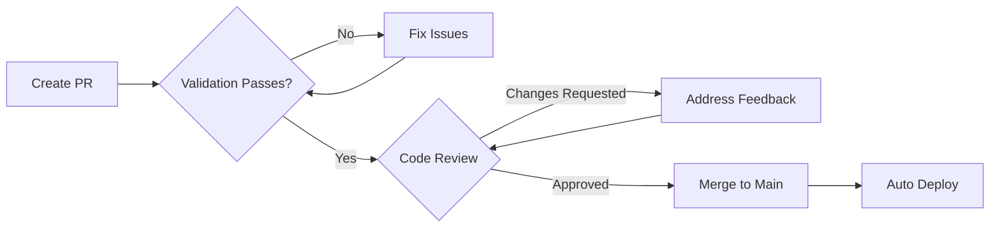

# Contributing to iPod Snapshot

> "Talk is cheap. Show me the code." - Linus Torvalds

This document outlines the contribution guidelines for the iPod Snapshot project. We follow principles inspired by the Linux kernel development process, adapted for modern AI-assisted development workflows.

## Quick Reference

- [Semantic Commit Conventions](#semantic-commit-conventions)
- [Development Workflow](#development-workflow)
- [Code Style Guidelines](#code-style-guidelines)
- [Verification](#verification)
- [Pull Request Process](#pull-request-process)
- [Project Structure](#project-structure)

## Core Principles

### IPO-Ready from Day One
We write production-grade code that could withstand public scrutiny:
- Zero tolerance for technical debt
- Explicit over implicit
- Fail fast, fail loud
- Optimize for reading, not writing

## Philosophy

### 1. Code Quality Over Everything

We don't merge broken code. Period. Every contribution must:
- Pass all static analysis checks
- Follow type safety strictly (no `any` types)
- Maintain test coverage
- Not introduce new warnings

### 2. AI-Assisted, Human-Verified

This project embraces AI-assisted development but requires human judgment:
- AI generates, humans review
- Every line must be understood by a human
- No blind copy-pasting from AI outputs
- "Grill me" mode encouraged for critical review

### 3. Small, Atomic Commits

Large changes are the enemy of review:
- One logical change per commit
- Maximum ~200 lines per commit (soft limit)
- Commit messages explain the *why*, not the *what*

## Development Workflow

### Prerequisites

We use **Nix** for reproducible development environments:

```bash
# Enter development shell
nix develop

# Or with legacy nix-shell
nix-shell

# Or with direnv (recommended)
direnv allow
```

No Docker required. No "works on my machine".

### Setup

```bash
# Clone and enter
git clone <repo-url>
cd ipod-snapshot

# Install dependencies
bun install

# Wrong scope format
feat(Export Utils): add webp

# Non-imperative mood
feat(export): added WebP support
feat(export): adds WebP support

# Mixing concerns without explanation
feat: add webp and fix marquee bug
```

### Scope Guidelines

Common scopes in this project:

- `ipod`: Main iPod component and screen
- `export`: Export utilities (PNG/GIF)
- `storage`: localStorage persistence
- `colors`: Color system and theming
- `marquee`: Marquee text animation
- `3d`: Three.js 3D rendering
- `ui`: UI components (buttons, inputs, etc.)
- `validation`: Verification and quality-gate work
- `deps`: Dependency updates
- `config`: Configuration files

---

## 🔄 Development Workflow

### 1. Fork and Clone

```bash
# Fork the repo on GitHub, then:
git clone https://github.com/YOUR_USERNAME/v0-ipod.git
cd v0-ipod
```

### 2. Create a Feature Branch

```bash
# Branch naming convention: <type>/<description>
git checkout -b feat/webp-export
git checkout -b fix/marquee-overflow
git checkout -b docs/architecture-diagrams
```

### 3. Install Dependencies

```bash
bun install
```

### 4. Make Changes

- Write code following our [Code Style Guidelines](#code-style-guidelines)
- Use semantic commits for each logical change
- Record the manual and automated validation you ran

### 5. Run Validation

```bash
# Run all validation checks
bun run validate

# Or run individually:
bun run lint           # Check OXC lint errors
bun run lint:fix       # Auto-fix OXC lint errors
bun run lint:eslint    # Run the legacy Next/ESLint ruleset
bun run format:check   # Check code formatting
bun run format         # Auto-format code
bun run type-check     # TypeScript type checking
bun run build          # Verify the production build
```

### Making Changes

1. **Create a branch**
   ```bash
   git checkout -b feature/your-feature-name
   ```

2. **Make your changes**
   - Follow the code style (enforced by Prettier/ESLint)
   - Add tests if applicable
   - Update documentation

3. **Run validation**
   ```bash
   npm run validate
   ```
   This runs: lint + format-check + type-check

4. **Commit with meaningful messages**
   ```bash
   git commit -m "component: Brief description
   
   Explain the problem this solves and the approach taken.
   Reference any related issues."
   ```

### Commit Message Format

```
component: Brief summary (50 chars or less)

More detailed explanation if needed. Wrap at 72 characters.
Explain the problem and solution approach.

- Bullet points for multiple changes
- Keep each line under 72 characters

Fixes #123
References #456
```

**Components:**
- `ipod:` - iPod component changes
- `3d:` - Three.js/3D related
- `ui:` - General UI components
- `lib:` - Utility functions
- `config:` - Configuration changes
- `docs:` - Documentation
- `test:` - Test additions/changes
- `style:` - Code style changes (formatting)
- `refactor:` - Refactoring without behavior changes
- `perf:` - Performance improvements
- `fix:` - Bug fixes
- `feat:` - New features

## Code Standards

### TypeScript Strictness

We enable all strict TypeScript options:
- `noUnusedLocals` - Clean up dead code
- `noUncheckedIndexedAccess` - Handle undefined in index access
- `exactOptionalPropertyTypes` - Distinguish undefined from missing
- `verbatimModuleSyntax` - Explicit type imports

**No `any` types allowed.** Use `unknown` and type guards instead.

### Static Analysis

ESLint configuration enforces:
- All unused variables must be prefixed with `_`
- Consistent type imports (`import type { ... }`)
- Prefer `const` over `let`
- No `var` declarations
- Prefer template literals over string concatenation
- Import ordering and grouping
- Unicorn rules for modern JavaScript

### Code Style

Enforced by Prettier and EditorConfig:
- 2 spaces indentation
- Double quotes for strings
- Trailing commas
- 90 character line width
- LF line endings
- Final newline

### File Naming

- Components: `kebab-case.tsx` (e.g., `ipod-classic.tsx`)
- Utilities: `kebab-case.ts` (e.g., `color-manifest.ts`)
- Tests: `*.spec.ts` or `*.test.ts`
- Styles: `*.css` or `*.module.css`

## AI-Assisted Development Guidelines

### When Using AI Tools

1. **Review every suggestion**
   - AI makes mistakes. It's your job to catch them.
   - Don't accept changes you don't understand.

2. **Use "Grill Me" mode**
   - Activate critical review: "grill me on this approach"
   - Challenge assumptions the AI makes
   - Ask for alternatives

3. **Validate AI output**
   - Run the type checker
   - Run the linter
   - Run tests
   - Test manually in browser

4. **Maintain authorship**
   - You're responsible for code you commit
   - AI is a tool, not a substitute for understanding

### AI Skill References

This project uses several AI skills:
- `aiden-react` - React performance (Million.js patterns)
- `vercel-react-best-practices` - Vercel's React rules
- `emil-design-eng` - UI/animation quality
- `impeccable` - Design excellence commands
- `grill-me` - Critical review mode

Reference these when working with AI assistants.

## Design Guidelines

### UI/UX Standards

Follow the Impeccable skill guidelines:
- Use `/audit` for accessibility checks
- Use `/polish` for final passes
- Use `/typeset` for typography fixes
- Avoid "AI slop" aesthetics
- Maintain consistent spacing
- Support reduced motion

### Performance Requirements

- First Contentful Paint: < 1.5s
- No layout shifts during load
- 60fps for animations
- Properly optimized images
- Minimal JavaScript for initial load

```bash
bun run format
```

### Lint Rules

Key rules enforced:

- No unused variables
- No console.log in production code (use console.error for errors)
- Prefer const over let
- No var declarations
- Async functions must await or return Promise

---

## 🔎 Verification

This repository currently does not ship with a committed automated test suite.
Until a new harness is introduced, validate changes with the existing quality
gates and focused manual checks:

```bash
bun run lint
bun run format:check
bun run type-check
bun run build
```

For UI-heavy changes, verify the affected flows manually in desktop and mobile
viewports before opening a PR.

---

> "Given enough eyeballs, all bugs are shallow." - Linus's Law



### PR Checklist

Before submitting a PR, ensure:

- [ ] **Semantic commits**: All commits follow conventional format
- [ ] **Linting**: `bun run lint` has no errors
- [ ] **Formatting**: `bun run format:check` passes
- [ ] **Type checking**: `bun run type-check` succeeds
- [ ] **Production build**: `bun run build` succeeds
- [ ] **Documentation**: Updated relevant docs (README, ARCHITECTURE, etc.)
- [ ] **Mobile tested**: Verified on mobile viewport (if UI change)
- [ ] **No breaking changes**: Or clearly marked with `!` and `BREAKING CHANGE:`

### PR Template

Our PR template will guide you through:

1. **Type of change** (feat, fix, docs, etc.)
2. **Description** of changes
3. **Related issues** (Closes #123)
4. **Checklist** verification

### Review Process

1. **Validation**: Run the repository quality gates locally
2. **Code review**: Maintainer reviews code quality and design
3. **Feedback**: Requested changes or approval
4. **Merge**: Squash and merge with semantic commit message
5. **Deploy**: Automatic deployment to Vercel

### Getting Help

If you're stuck or have questions:

- 💬 **GitHub Discussions**: Ask questions or share ideas
- 🐛 **GitHub Issues**: Report bugs or request features
- 📧 **Email**: Contact maintainers directly

---

## 📂 Project Structure

### Key Directories

```
v0-ipod/
├── app/                  # Next.js app directory (routing)
├── components/
│   ├── ipod/            # iPod-specific components
│   ├── three/           # Three.js 3D components
│   └── ui/              # Reusable UI components (Radix)
├── lib/
│   ├── export-utils.ts  # Export pipeline logic
│   ├── storage.ts       # localStorage wrapper
│   └── utils.ts         # General utilities
└── public/              # Static assets
```

### Adding New Features

When adding a new feature:

1. **Create component** in appropriate directory
2. **Add types** in component file or `lib/types.ts`
3. **Implement logic** following existing patterns
4. **Update docs** in README.md and ARCHITECTURE.md
5. **Export utilities** from index files when applicable

---

## 🎓 Learning Resources

### Technologies Used

- **React 19**: [react.dev](https://react.dev)
- **Next.js 15**: [nextjs.org](https://nextjs.org)
- **TypeScript**: [typescriptlang.org](https://www.typescriptlang.org/)
- **Three.js**: [threejs.org](https://threejs.org)
- **Tailwind CSS**: [tailwindcss.com](https://tailwindcss.com)

### Conventional Commits

- **Specification**: [conventionalcommits.org](https://www.conventionalcommits.org/)
- **Examples**: [github.com/conventional-changelog](https://github.com/conventional-changelog/conventional-changelog)

---

## 🙏 Thank You!

Your contributions make this project better for everyone. We appreciate your time and effort!

<div align="center">

**Happy coding! 🎵**

[⬆️ Back to Top](#-contributing-to-v0-ipod)

</div>
