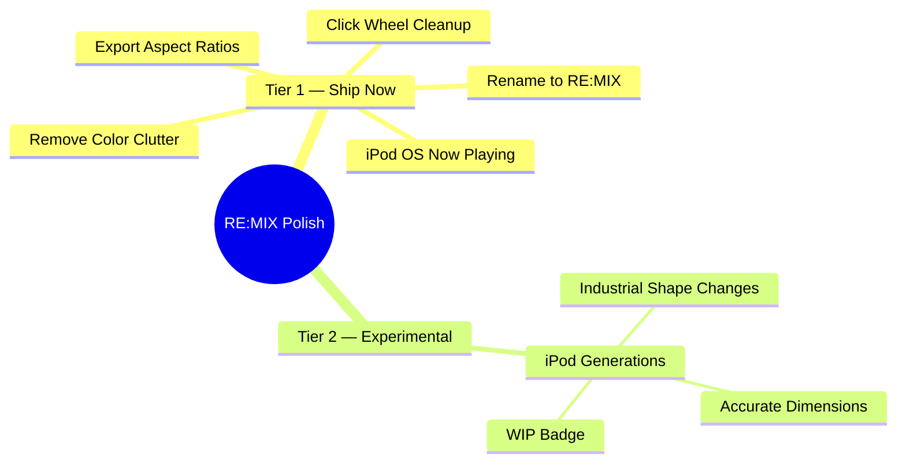

# RE:MIX Polish & iPod OS Fidelity — Design Spec

**Date:** 2026-04-05
**Author:** Stussy Senik + Claude
**Status:** Approved, ready for implementation

---

## Context

RE:MIX is an iPod Classic simulator built in Next.js/React that lets users customize and export stylized iPod screenshots. The current build has solid bones but several areas need polish:

1. The click wheel has too many fake 3D CSS layers — reads as "vibe-coded"
2. iPod OS mode can't navigate to an authentic Now Playing screen
3. The settings panel has too many color sections (OKLCH Ambient, OKLCH Spectrum) that clutter the UI
4. The project name needs standardization to "RE:MIX"
5. Export needs aspect ratio options for social media
6. The preset selector only covers 3 Classic variants — should expand to full iPod lineage (experimental)



## Design Principles

- **Dieter Rams, not decoration** — form follows function. If it looks "coded," it's wrong.
- **Single source of truth** — song metadata is shared between Direct Edit and iPod OS modes. Toggle between views, same data.
- **Minimalism in design language, not in scope** — build it out fully, don't cut corners.
- **Evidence before assertions** — verify visually before declaring done.

## Agent-Skills Integration

This spec is designed to be executed using Addy Osmani's `agent-skills` plugin workflows. Each tier maps to specific skills:

| Skill | Where It Applies |
|-------|-----------------|
| `code-simplification` | Click wheel cleanup — strip decorative layers while preserving behavior |
| `frontend-ui-engineering` | iPod OS Now Playing screen — component architecture, accessibility |
| `incremental-implementation` | Thin vertical slices — each section is independently shippable |
| `test-driven-development` | Write tests for Now Playing state transitions before implementation |
| `browser-testing-with-devtools` | Visual verification of click wheel rendering, export output |
| `performance-optimization` | Export pipeline aspect ratio changes — measure capture performance |

### Execution Approach

Use `incremental-implementation` as the orchestrating skill:
1. Each section below is one **vertical slice** — independently deployable
2. Apply `code-simplification` specifically to Section 2 (click wheel)
3. Apply `frontend-ui-engineering` specifically to Section 3 (Now Playing screen)
4. Apply `test-driven-development` for Section 3's state machine (menu → now-playing transitions)
5. Use `browser-testing-with-devtools` for visual verification after each slice

---

## Tier 1 — Ship Now

### Section 1: Rename to "RE:MIX"

**Scope:** Text-only change across all UI surfaces.

**Files affected:**
- `components/ipod/ipod-screen.tsx:188` — status bar label `"Re:mix"` → `"RE:MIX"`
- `components/ipod/ipod-screen.tsx:231` — About panel title `"Re:mix"` → `"RE:MIX"`
- Any other string references to "Re:mix" in the codebase

**Acceptance criteria:**
- All visible instances of "Re:mix" are now "RE:MIX"
- Export filenames, snapshots, and metadata reflect the new name where applicable

---

### Section 2: Click Wheel — Dieter Rams Treatment

**Scope:** Strip all decorative CSS layers from the click wheel. Replace with minimal, functional styling.

**Reference skill:** `code-simplification` — reduce complexity while preserving exact behavior.

**Current state** (`click-wheel.tsx`):

The wheel surface has 4 decorative layers on top of the base gradient:
1. **Lines 151-156:** Radial gradient specular highlight at 34% 22% — fake light spot
2. **Line 157:** Inner white border ring (`border-white/45`)
3. **Lines 158-164:** Bottom gradient shadow strip at bottom 11%
4. **Lines 43-48:** Multi-layer box-shadow stack (6+ shadow values)

The center button has 3 decorative layers:
1. **Lines 291-299:** "Convex dome highlight" radial gradient — fake bubble effect
2. **Lines 300-303:** Inner border ring (`rgba(120,126,134,0.12)`)
3. **Lines 305-314:** Bottom depth radial gradient + inset shadow combo

**Target state:**

Wheel surface:
- **Keep:** Single top-to-bottom linear gradient (from → via → to). This is how real plastic reads light.
- **Keep:** Outer border (single `borderColor`)
- **Replace shadows with:** `"0 0 0 1px rgba(0,0,0,0.06)"` (just edge definition)
- **Remove:** All 3 decorative overlay divs (lines 150-164)

Center button:
- **Keep:** Single top-to-bottom linear gradient (from → via → to)
- **Keep:** Outer border
- **Replace shadows with:** `"0 0 0 1px rgba(0,0,0,0.04)"` (lighter edge)
- **Remove:** All 3 decorative overlay divs (lines 291-314)
- **Keep:** `active:scale-[0.96]` press feedback — this is functional, not decorative

Export-safe shadows:
- Wheel: `"0 0 0 1px rgba(0,0,0,0.06)"` (same as live — consistency)
- Center: `"0 0 0 1px rgba(0,0,0,0.04)"` (same as live)

**The test:** Screenshot before and after. The wheel should look like clean plastic — you notice the shape, not the effects. If you can count the CSS layers by looking at it, it's still wrong.

**Acceptance criteria:**
- Zero radial gradients on wheel or center button
- Zero inner border rings
- Zero bottom shadow strips
- One linear gradient + one border + one shadow per element
- Visual diff shows a cleaner, more restrained wheel
- Dark case colors still derive correctly via `deriveWheelColors()`
- All wheel interactions (scroll, click, press) still work

---

### Section 3: iPod OS Now Playing

**Scope:** When in iPod OS mode, selecting "Now Playing" from the menu transitions to an authentic, read-only Now Playing screen matching the real iPod Classic layout.

**Reference skill:** `frontend-ui-engineering` — component architecture, state management.

**Reference image:** iPod Classic showing Beck "Gamma Ray" — this is THE canonical layout:
- Status bar: "Now Playing" + blue play indicator + battery
- Content area: album art (left column) + metadata (right column)
  - Song title (bold)
  - Artist name
  - Album name
  - Star rating (5 stars)
  - Track count ("2 of 10")
- Progress area: elapsed time + progress bar + remaining time

**Current behavior:**
- `ipod-screen.tsx:84` — `showOsMenu` only true when `interactionModel === "ipod-os" && osScreen === "menu"`
- When `osScreen === "now-playing"` in iPod OS mode, it falls through to the same view as Direct Edit
- The view is editable (click-to-edit fields) even in iPod OS mode
- `ipod-classic.tsx:892-911` — `handleOsMenuSelect` already handles `"now-playing"` → `setOsScreen("now-playing")`

**Target behavior:**

1. **Read-only in iPod OS mode:** When `interactionModel === "ipod-os"` and `osScreen === "now-playing"`, the Now Playing screen should be **non-editable**. No click-to-edit on title/artist/album, no draggable progress bar, no image upload click handler.

2. **Same layout, same data:** The visual layout is identical to the existing Now Playing screen — same grid, same fonts, same progress bar. The only difference is `isEditable = false`. The song metadata is the single source of truth (`SongMetadata` state) — editing in Direct Edit mode updates what iPod OS Now Playing displays.

3. **Wheel controls in Now Playing:**
   - **Menu button** → back to menu (`setOsScreen("menu")`) — already works at `ipod-classic.tsx:913-916`
   - **Scroll wheel** → scrub through progress bar (adjust `currentTime`) — already works via `handleSeek`
   - **Previous/Next** → adjust track number or show soft notice — already works at `ipod-classic.tsx:918-932`
   - **Play/Pause** → show soft notice — already works at `ipod-classic.tsx:934-940`
   - **Center button** → no-op in Now Playing (or toggle play state in future)

4. **Transition animation:** Use existing `animate-in slide-in-from-right-2` when entering Now Playing from menu, and `slide-in-from-left-2` when going back to menu.

**Implementation approach:**

The key change is in `ipod-screen.tsx`. Currently `isEditable` is passed as a prop. The fix:

```typescript
// In ipod-classic.tsx, when passing to IpodScreen:
isEditable={interactionModel === "direct"}
```

This single line change makes all fields read-only in iPod OS mode while keeping the exact same visual layout. The existing `disabled` props on `EditableText`, `EditableTime`, `StarRating`, `ImageUpload`, and `ProgressBar` already handle the non-interactive state.

**Acceptance criteria:**
- In iPod OS → "Now Playing" menu item → center click → shows Now Playing screen
- All fields are non-editable (no hover states, no click handlers)
- Song data matches what's set in Direct Edit mode
- Menu button returns to menu
- Scroll wheel scrubs time
- Transition animations work in both directions
- Status bar shows "Now Playing" with play indicator

---

### Section 4: Color Panel Cleanup

**Scope:** Remove OKLCH Ambient, OKLCH Spectrum, and simplify the Studio Palette.

**Files affected:**
- `components/ipod/ipod-classic.tsx:1286-1312` — Remove OKLCH Spectrum section (Case Color)
- `components/ipod/ipod-classic.tsx:1374-1396` — Remove OKLCH Ambient section (Background)
- `components/ipod/grey-palette-picker.tsx` — Reduce lightness stops for more noticeable swatches
- `lib/color-manifest.ts:68-69` — OKLCH config exports can stay (used internally) but UI sections removed
- `scripts/color-manifest.json` — `oklchPalettes` data stays (no breaking changes to manifest)

**OKLCH Spectrum removal** (`ipod-classic.tsx:1286-1312`):
Remove the entire conditional block:
```tsx
{oklchReady && oklchCasePalette.length > 0 && (
  <div className="mb-4">
    <h4>OKLCH Spectrum</h4>
    ...
  </div>
)}
```

**OKLCH Ambient removal** (`ipod-classic.tsx:1374-1396`):
Remove the entire conditional block:
```tsx
{oklchReady && oklchBgPalette.length > 0 && (
  <div className="mb-3">
    <h4>OKLCH Ambient</h4>
    ...
  </div>
)}
```

**Studio Palette simplification:**
The current `greyLightnessStops` has 23 perceptually-spaced values. The user feedback is "too many — you can't notice the change." Reduce to ~12 stops with more visible jumps between adjacent swatches.

Current 23 stops in `color-manifest.json`:
```json
"greyLightnessStops": [0.98, 0.96, 0.94, 0.92, 0.89, 0.86, 0.82, 0.78, 0.73, 0.68, 0.62, 0.56, 0.50, 0.44, 0.38, 0.33, 0.28, 0.24, 0.20, 0.17, 0.14, 0.11, 0.08]
```

Proposed ~12 stops (every-other with minor adjustments for perceptual evenness):
```json
"greyLightnessStops": [0.97, 0.92, 0.86, 0.78, 0.68, 0.56, 0.44, 0.33, 0.24, 0.17, 0.11, 0.06]
```

**Dead code cleanup:**
After removing the OKLCH UI sections, these become unused in the component:
- `oklchCasePalette` / `oklchBgPalette` state variables
- `OKLCH_CASE_STEPS` / `OKLCH_BG_STEPS` constants
- Related `buildOklchPalette` calls

Verify with grep before removing — they may be used elsewhere.

**Acceptance criteria:**
- No OKLCH Spectrum section visible in Case Color settings
- No OKLCH Ambient section visible in Background settings
- Studio Palette shows ~12 stops instead of 23 — visible difference between adjacent swatches
- Authentic Apple Releases, Recent Custom, Hex Input, and Eye Dropper all still work
- Grey family tabs (Neutral, Warm, Cool, Greige, Sage, Lavender) still work
- No runtime errors from removed OKLCH references

---

### Section 5: Export Aspect Ratios

**Scope:** Enable the desktop/monitor icon button and add aspect ratio options for export.

**Current state:**
- `ipod-classic.tsx` — The `Monitor` icon is imported (line 8) and likely rendered as a WIP button
- Export currently captures at a fixed aspect ratio matching the iPod shell dimensions
- `export-utils.ts` — Uses `SHELL_WIDTH` (370) x `SHELL_HEIGHT` (620) + padding

**Target aspect ratios:**

| Ratio | Dimensions | Use Case |
|-------|-----------|----------|
| Original | 466 x 716 (current shell+padding) | Default, matches iPod proportions |
| 1:1 | 716 x 716 | Instagram post, Twitter |
| 9:16 | 716 x 1272 | Instagram Story, TikTok, Reels |

**Implementation approach:**

1. Add `ExportAspectRatio` type:
```typescript
type ExportAspectRatio = "original" | "1:1" | "9:16";
```

2. Add state for selected aspect ratio in `ipod-classic.tsx`.

3. When exporting, wrap the iPod capture in a container sized to the target aspect ratio, with the iPod centered. The background color fills the extra space.

4. Enable the Monitor icon button to open an aspect ratio selector (small popover or toggle group, similar to the Interaction toggle).

5. The export pipeline in `export-utils.ts` receives the target dimensions. The capture element is already wrapped in a padded container — just resize the outer container.

**Acceptance criteria:**
- Monitor icon button is enabled (no WIP badge)
- Clicking it reveals aspect ratio options: Original, 1:1, 9:16
- Export PNG/GIF respects selected aspect ratio
- iPod is centered within the export frame
- Background color fills the extra space
- Share sheet (if available) works with all ratios

---

## Tier 2 — Experimental (WIP)

### Section 6: iPod Generations — Industrial Shape Expansion

**Scope:** Expand the preset selector from 3 Classic variants to the full click-wheel iPod lineage, with distinct industrial design shapes per generation.

**Status:** Experimental. Marked with WIP badge in UI.

**Reference skill:** `frontend-ui-engineering` — component architecture for the preset system.

**Target generations:**

| ID | Label | Era | Key Shape Differences |
|----|-------|-----|----------------------|
| `ipod-1g` | 1st Gen (2001) | Scroll wheel | Thicker body, mechanical scroll wheel, larger corner radius, FireWire-era proportions |
| `ipod-3g` | 3rd Gen (2003) | Touch wheel | Thinner, touch-sensitive buttons above wheel, slimmer profile |
| `ipod-4g` | 4th Gen / Photo (2004) | Click wheel | Click wheel introduced, color screen option, slightly wider body |
| `ipod-5g` | 5th Gen / Video (2005) | Video | Wider screen (2.5"), thinner body, screen-to-body ratio shift |
| `classic-6g` | Classic 6th Gen (2007) | Classic | All-metal, current default proportions |
| `classic-7g` | Classic 7th Gen (2009) | Classic | Thinnest Classic, tighter wheel |

**What changes per generation:**
- `ShellPresetTokens` — body radius, padding, proportions (the industrial shape)
- `ScreenPresetTokens` — screen size, aspect ratio, position within body
- `WheelPresetTokens` — wheel size, center size, label positioning
- `defaultShellColor` — era-appropriate default (white plastic for early gens, aluminum for later)
- Visual treatment — early gens were plastic + chrome, later gens were anodized aluminum

**Implementation notes:**
- The existing `IpodClassicPresetDefinition` interface is flexible enough — no schema changes needed
- `IpodHardwarePresetId` type in `ipod-state.ts` needs to expand to include new IDs
- The preset selector UI in `ipod-classic.tsx:1195-1219` needs to handle more entries (scrollable list or categorized groups)
- Each preset needs researched dimensions from reference photos and Apple specs
- Mark all non-Classic presets with a "WIP" or "Experimental" badge in the selector

**Research needed:**
- Accurate physical dimensions (mm) for each generation, converted to proportional px values
- Screen resolution and aspect ratio per generation (160x128 for early gens, 320x240 for later)
- Wheel size ratio relative to body width
- Corner radius progression across generations
- Material/finish differences (polished plastic → brushed metal → anodized aluminum)

**Acceptance criteria:**
- Preset selector shows all 6+ generations
- Selecting a generation visibly changes the iPod's physical shape
- Non-Classic presets have WIP/Experimental badge
- Classic 6th/7th Gen presets remain unchanged (regression-safe)
- Each generation has a researched, defensible set of proportions
- Screen content adapts to different screen sizes without layout breaks

---

## State Architecture

The truth table for state synchronization:

```
Direct Edit mode:
  - SongMetadata: editable (click fields, upload art, drag progress)
  - IpodUiState: editable (change colors, presets, etc.)
  - Screen: Now Playing view (always)

iPod OS mode:
  - SongMetadata: read-only display (same data as Direct Edit)
  - IpodUiState: editable via settings panel (same controls)
  - Screen: Menu view OR Now Playing view (navigated via wheel)

Switching modes:
  - Direct → iPod OS: screen goes to Menu, data preserved
  - iPod OS → Direct: screen goes to Now Playing, data preserved
  - No data loss, no reset — pure view toggle
```

Both modes read from and write to the same `SongMetadata` and `IpodUiState` state. The interaction model only controls:
1. Whether fields are editable
2. Whether the menu is shown
3. How wheel inputs are routed

---

## File Impact Summary

| File | Changes |
|------|---------|
| `components/ipod/ipod-screen.tsx` | Rename "Re:mix" → "RE:MIX" (2 locations) |
| `components/ipod/click-wheel.tsx` | Remove 6 decorative overlay divs, simplify shadows |
| `components/ipod/ipod-classic.tsx` | Remove OKLCH sections, update isEditable logic, enable Monitor button, add aspect ratio state |
| `lib/ipod-classic-presets.ts` | Add new generation presets (Tier 2) |
| `types/ipod-state.ts` | Add ExportAspectRatio type, expand IpodHardwarePresetId (Tier 2) |
| `scripts/color-manifest.json` | Reduce greyLightnessStops from 23 → 12 |
| `lib/export-utils.ts` | Support variable aspect ratio in capture pipeline |

---

## Implementation Order

Execute as vertical slices, each independently deployable:

1. **Section 1: Rename** — 5 min, zero risk
2. **Section 2: Click Wheel** — apply `code-simplification` skill, visual verification required
3. **Section 4: Color Cleanup** — remove OKLCH sections, reduce stops, dead code cleanup
4. **Section 3: iPod OS Now Playing** — apply `frontend-ui-engineering` + `test-driven-development`
5. **Section 5: Export Aspect Ratios** — apply `browser-testing-with-devtools` for visual verification
6. **Section 6: Generations** — apply `incremental-implementation`, mark experimental

Sections 1-3 can be parallelized via `superpowers:dispatching-parallel-agents` if using worktree isolation.

---

## Verification Plan

After each section, verify:
- `npx tsc --noEmit` — type safety
- Visual screenshot comparison (before/after)
- iPod OS navigation flow (menu → now playing → menu)
- Export pipeline (PNG at each aspect ratio)
- Dark case color derivation still works
- Snapshot save/load round-trips correctly
