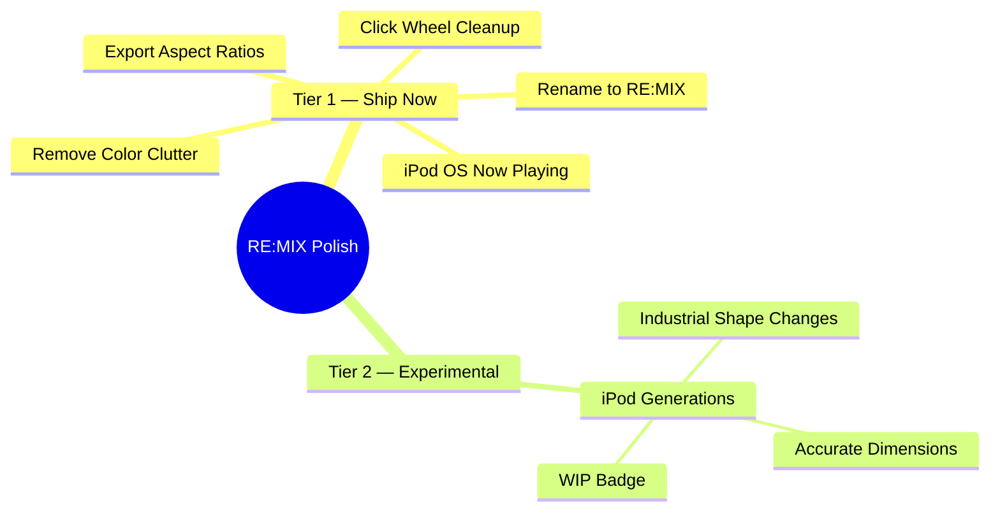

# Spec: RE:MIX Polish & iPod OS Fidelity

**Date:** 2026-04-05
**Author:** Stussy Senik + Claude
**Status:** Approved, ready for implementation

---

## Objective

RE:MIX is an iPod Classic simulator that lets users customize and export stylized iPod screenshots. This spec covers a polish pass that addresses visual fidelity issues, interaction completeness, and export flexibility. The target user is a design-conscious creator who wants museum-quality iPod renders for social media.

**Success looks like:** The iPod feels like a real physical object, not a CSS demo. The iPod OS mode is a complete interaction loop. Exports target real social media formats.

## Assumptions

```
ASSUMPTIONS I'M MAKING:
1. This is a Next.js web application (confirmed from codebase)
2. No backend — all state is client-side with localStorage persistence
3. The existing component architecture stays — no rewrite
4. The click wheel interaction model (pointer tracking) is correct and stays
5. Song metadata is the single source of truth across both interaction modes
6. Tier 2 (iPod Generations) is experimental and behind a WIP badge
→ Correct me now or I'll proceed with these.
```

## Commands

```
Build: npm run build
Dev:   npm run dev
Type:  npx tsc --noEmit
Lint:  npm run lint
Test:  npx vitest (if configured) or manual visual verification
```

## Project Structure

```
components/ipod/     → iPod UI components (screen, wheel, shell, classic)
components/three/    → Three.js 3D renderer
components/ui/       → Shared UI primitives
lib/                 → Color manifest, presets, export utils, state, time utils
types/               → TypeScript interfaces (ipod.ts, ipod-state.ts)
scripts/             → Color manifest JSON data
public/              → Static assets (placeholder logo, sounds)
```

## Code Style

Follow existing patterns — the codebase uses:
- Functional React components with hooks
- Tailwind CSS for styling with inline `style` for computed values
- `useCallback`/`useMemo` for memoization
- Lucide icons for UI chrome, hand-crafted SVGs for iPod-authentic icons
- Named exports, no default exports
- OKLCH color science for palette generation

## Testing Strategy

- **Primary:** Visual verification via browser (screenshot before/after)
- **Type safety:** `npx tsc --noEmit` after every change
- **Build:** `npm run build` must succeed
- **Interaction:** Manual test of wheel controls, menu navigation, export pipeline
- **Regression:** Dark case color derivation, snapshot save/load round-trips

## Boundaries

- **Always do:** Run type check before committing, preserve all wheel interactions, maintain snapshot backward compatibility
- **Ask first:** Changing the preset data schema, modifying the export pipeline signature, adding dependencies
- **Never do:** Remove wheel interaction handlers, break snapshot loading, change color derivation logic without visual verification

---



## Design Principles

- **Dieter Rams, not decoration** — form follows function. If it looks "coded," it's wrong.
- **Single source of truth** — song metadata is shared between Direct Edit and iPod OS modes.
- **Minimalism in design language, not in scope** — build it out fully, don't cut corners.
- **Evidence before assertions** — verify visually before declaring done.

---

## Dependency Graph

```
Section 1 (Rename)          → No dependencies, zero risk
Section 2 (Click Wheel)     → No dependencies, visual-only
Section 4 (Color Cleanup)   → No dependencies, removal-only
Section 3 (Now Playing)     → No dependencies, but test after Section 1 (status bar text)
Section 5 (Export Ratios)   → Benefits from Section 4 being done (cleaner panel)
Section 6 (Generations)     → Depends on Sections 1-5 being stable, marked experimental
```

Sections 1, 2, and 4 are fully independent — safe to parallelize.
Section 3 is independent but should verify against Section 1's rename.
Section 5 is independent but logically follows the panel cleanup.
Section 6 is sequential — last.

---

## Task List

### Phase 1: Foundation (Parallel-Safe)

## Task 1: Rename to "RE:MIX"

**Description:** Replace all visible instances of "Re:mix" with "RE:MIX" across UI surfaces.

**Acceptance criteria:**
- [ ] Status bar label reads "RE:MIX" (not "Re:mix")
- [ ] About panel title reads "RE:MIX"
- [ ] No other visible "Re:mix" strings remain in the codebase
- [ ] Export filenames reflect the new name where applicable

**Verification:**
- [ ] `grep -ri "Re:mix" components/ lib/ types/` returns zero hits (case-sensitive)
- [ ] Build succeeds: `npm run build`
- [ ] Visual: status bar and About panel show "RE:MIX"

**Dependencies:** None

**Files likely touched:**
- `components/ipod/ipod-screen.tsx` (lines 188, 231)

**Estimated scope:** XS (1 file, 2 string replacements)

---

## Task 2: Click Wheel — Dieter Rams Treatment

**Description:** Strip all decorative CSS layers from the click wheel and center button. Apply `code-simplification` methodology: understand why each layer exists (Chesterton's Fence), then remove only the decorative ones while preserving functional behavior exactly.

**Chesterton's Fence analysis:**

| Layer | Why It Exists | Verdict |
|-------|--------------|---------|
| Linear gradient (wheel) | Simulates how light falls on a convex plastic surface | **Keep** — this is how real plastic reads |
| Radial specular highlight (wheel, lines 151-156) | Fake light spot to simulate a point light source | **Remove** — real iPod wheels don't have a visible highlight spot |
| Inner white border ring (wheel, line 157) | Simulates a beveled edge catch-light | **Remove** — adds visual noise, not present on real hardware |
| Bottom gradient strip (wheel, lines 158-164) | Simulates shadow at bottom of concave dish | **Remove** — too subtle to read, just adds layer count |
| Multi-shadow stack (wheel, lines 43-45) | Depth, edge definition, catch-lights | **Simplify** — reduce to single edge-definition shadow |
| Dome highlight (center, lines 291-299) | "Convex bubble" feel on center button | **Remove** — the real center button is flat/slightly concave |
| Inner border ring (center, lines 300-303) | Secondary edge definition | **Remove** — redundant with outer border |
| Bottom depth shadow (center, lines 305-314) | 3D depth illusion | **Remove** — excessive for a flat button |
| Linear gradient (center) | Same light-fall simulation as wheel | **Keep** |
| `active:scale-[0.96]` (center) | Press feedback | **Keep** — functional, not decorative |

**Target state:**

Wheel surface — 1 gradient + 1 border + 1 shadow:
```tsx
// Wheel: clean plastic surface
<div
  className="absolute inset-0 rounded-full border"
  style={{
    borderColor: wheelBorder,
    backgroundImage: `linear-gradient(180deg, ${wheelGradientFrom}, ${wheelGradientVia}, ${wheelGradientTo})`,
    boxShadow: "0 0 0 1px rgba(0,0,0,0.06)",
  }}
>
  {/* Button labels only — zero decorative overlays */}
</div>
```

Center button — 1 gradient + 1 border + 1 shadow:
```tsx
// Center: clean plastic button
<div
  style={{
    borderColor: wheelCenterBorder,
    backgroundImage: `linear-gradient(180deg, ${wheelCenterFrom}, ${wheelCenterVia}, ${wheelCenterTo})`,
    boxShadow: "0 0 0 1px rgba(0,0,0,0.04)",
  }}
>
  {/* Zero decorative overlays */}
</div>
```

**Acceptance criteria:**
- [ ] Zero `radial-gradient` on wheel or center button
- [ ] Zero inner border ring divs
- [ ] Zero bottom shadow strip divs
- [ ] Exactly one `linear-gradient` + one `border` + one `boxShadow` per element
- [ ] Dark case colors still derive correctly via `deriveWheelColors()`
- [ ] All wheel interactions work (scroll, click, press, pointer capture)
- [ ] Visual diff: cleaner, reads as physical object not CSS demo

**Verification:**
- [ ] Type check: `npx tsc --noEmit`
- [ ] Build succeeds: `npm run build`
- [ ] Screenshot comparison: before/after with light case, dark case, mid-dark case
- [ ] Manual test: scroll wheel, click center, click menu/prev/next/play-pause

**Dependencies:** None

**Files likely touched:**
- `components/ipod/click-wheel.tsx`

**Estimated scope:** S (1 file, removing ~30 lines of decorative JSX)

---

## Task 3: Color Panel Cleanup

**Description:** Remove OKLCH Ambient and OKLCH Spectrum UI sections. Reduce Studio Palette grey lightness stops from 23 to ~12 for more noticeable differences. Clean up dead code.

**Acceptance criteria:**
- [ ] No "OKLCH Spectrum" section visible in Case Color settings
- [ ] No "OKLCH Ambient" section visible in Background settings
- [ ] Studio Palette shows ~12 stops instead of 23
- [ ] Visible difference between adjacent swatches (not 0.02 lightness apart)
- [ ] Authentic Apple Releases, Recent Custom, Hex Input, Eye Dropper all work
- [ ] Grey family tabs (Neutral, Warm, Cool, Greige, Sage, Lavender) all work
- [ ] No runtime errors from removed references
- [ ] Dead code from OKLCH UI removed (unused state vars, constants, palette calls)

**Verification:**
- [ ] Type check: `npx tsc --noEmit`
- [ ] Build succeeds: `npm run build`
- [ ] `grep -n "OKLCH_CASE_STEPS\|OKLCH_BG_STEPS\|oklchCasePalette\|oklchBgPalette" components/` confirms dead code removed
- [ ] Visual: settings panel is cleaner, swatches are distinguishable

**Dependencies:** None

**Files likely touched:**
- `components/ipod/ipod-classic.tsx` (remove OKLCH sections ~lines 1286-1312, 1374-1396; remove dead state/constants)
- `scripts/color-manifest.json` (reduce `greyLightnessStops` array)

**Estimated scope:** S (2 files, removal + array edit)

---

### Checkpoint: Foundation

- [ ] All three tasks above pass type check and build
- [ ] Visual inspection: wheel is clean, panel is decluttered, name is correct
- [ ] No regressions in color derivation, wheel interactions, or snapshot loading

---

### Phase 2: Core Feature

## Task 4: iPod OS Now Playing

**Description:** Make iPod OS mode's Now Playing screen authentic and read-only. When the user navigates to "Now Playing" from the OS menu, the screen transitions to the standard Now Playing layout showing the same song data — but non-editable. Apply `frontend-ui-engineering` methodology: proper state management, accessibility, no AI aesthetic.

**Reference image:** iPod Classic showing Beck "Gamma Ray" — canonical Now Playing layout.

**State management approach** (per `frontend-ui-engineering`):
- `SongMetadata` = shared state (lifted, already exists)
- `isEditable` = derived from `interactionModel` (simplest approach — `useState` tier)
- No new state needed — this is a view-mode toggle on existing data

**Current behavior analysis:**
- `ipod-screen.tsx:84` — `showOsMenu = interactionModel === "ipod-os" && osScreen === "menu"`
- When `osScreen === "now-playing"` in iPod OS, it falls through to the same editable view
- `ipod-classic.tsx:892-901` — `handleOsMenuSelect` already routes "now-playing" → `setOsScreen("now-playing")`
- Wheel controls (menu back, scroll scrub, prev/next, play/pause) already handle iPod OS now-playing state

**The key change:**
```typescript
// ipod-classic.tsx — change isEditable prop passed to IpodScreen:
// FROM:  isEditable={!isAuthenticInteraction || osScreen === "now-playing"}
// TO:    isEditable={interactionModel === "direct"}
```

This single prop change makes all fields read-only in iPod OS mode. The existing `disabled` props on `EditableText`, `EditableTime`, `StarRating`, `ImageUpload`, and `ProgressBar` already handle the non-interactive rendering.

**Accessibility check** (per `frontend-ui-engineering` WCAG 2.1 AA):
- [ ] Keyboard navigation still works in iPod OS mode (tab through wheel buttons)
- [ ] Screen reader announces "Now Playing" in status bar
- [ ] Non-editable fields don't trap focus or show misleading hover states

**Acceptance criteria:**
- [ ] iPod OS → select "Now Playing" → center click → shows Now Playing screen (read-only)
- [ ] All text fields are non-editable (no hover states, no click-to-edit)
- [ ] Song data matches what's set in Direct Edit mode (single source of truth)
- [ ] Menu button returns to OS menu
- [ ] Scroll wheel scrubs progress bar time
- [ ] Transition animation: `slide-in-from-right-2` entering, `slide-in-from-left-2` returning
- [ ] Status bar shows "Now Playing" with blue play indicator
- [ ] Switching Direct Edit ↔ iPod OS preserves all data (no reset)

**Verification:**
- [ ] Type check: `npx tsc --noEmit`
- [ ] Build succeeds: `npm run build`
- [ ] Manual flow: Direct Edit → set title/artist → switch to iPod OS → navigate to Now Playing → verify same data → menu back → switch to Direct Edit → data intact
- [ ] Visual match against Beck "Gamma Ray" reference layout

**Dependencies:** Task 1 (status bar shows "RE:MIX" in menu, "Now Playing" in now-playing)

**Files likely touched:**
- `components/ipod/ipod-classic.tsx` (1 line: isEditable prop)

**Estimated scope:** XS (1 file, 1 line change)

---

### Checkpoint: Core Feature

- [ ] Full interaction loop: Direct Edit → set song → iPod OS → menu → Now Playing → menu back → Direct Edit
- [ ] All data preserved across mode switches
- [ ] Type check and build pass

---

### Phase 3: Export

## Task 5: Export Aspect Ratios

**Description:** Enable the Monitor icon button in the toolbar and add aspect ratio selection for exports. Support Original (iPod proportions), 1:1 (Instagram post), and 9:16 (Instagram Story).

**Target aspect ratios:**

| Ratio | Dimensions | Use Case |
|-------|-----------|----------|
| Original | 466 x 716 (current) | Default, matches iPod proportions |
| 1:1 | 716 x 716 | Instagram post, Twitter/X |
| 9:16 | 716 x 1272 | Instagram Story, TikTok, Reels |

**Implementation approach** (per `incremental-implementation` — vertical slice):

Slice 5a: Add `ExportAspectRatio` type + state
```typescript
// types/ipod-state.ts
type ExportAspectRatio = "original" | "1:1" | "9:16";
```

Slice 5b: Enable Monitor icon → aspect ratio toggle UI
- Small toggle group (similar to Interaction toggle)
- Three options: Original, 1:1, 9:16

Slice 5c: Export pipeline receives target dimensions
- Wrap capture element in container sized to target aspect ratio
- iPod centered, background color fills extra space
- Both PNG and GIF exports respect selected ratio

**Acceptance criteria:**
- [ ] Monitor icon button is enabled (no WIP badge)
- [ ] Clicking reveals aspect ratio options: Original, 1:1, 9:16
- [ ] Export PNG respects selected aspect ratio
- [ ] Export GIF respects selected aspect ratio
- [ ] iPod is centered within the export frame
- [ ] Background color fills the extra space correctly
- [ ] Share sheet works with all ratios
- [ ] Aspect ratio persists in snapshot save/load

**Verification:**
- [ ] Type check: `npx tsc --noEmit`
- [ ] Build succeeds: `npm run build`
- [ ] Export PNG at each ratio — verify dimensions in image viewer
- [ ] Export GIF at each ratio — verify dimensions
- [ ] Visual: iPod centered, no clipping, background fills correctly

**Dependencies:** None (but logically follows Task 3's cleaner panel)

**Files likely touched:**
- `types/ipod-state.ts` (add `ExportAspectRatio` type)
- `components/ipod/ipod-classic.tsx` (enable Monitor button, add ratio state, pass to export)
- `lib/export-utils.ts` (accept target dimensions in capture pipeline)

**Estimated scope:** M (3 files)

---

### Checkpoint: Export

- [ ] All three export ratios produce correct dimensions
- [ ] Full pipeline works: set song → choose ratio → export PNG/GIF → verify output
- [ ] Type check and build pass

---

### Phase 4: Experimental

## Task 6: iPod Generations — Industrial Shape Expansion

**Description:** Expand the preset selector from 3 Classic variants to 6+ generations covering the full click-wheel iPod lineage. Each generation changes the actual industrial shape — body proportions, corner radii, screen-to-body ratio, wheel placement. Mark all non-Classic presets with WIP badge. Apply `incremental-implementation` with feature flag approach.

**Status:** Experimental. Gated behind WIP badge in UI.

**Target generations:**

| ID | Label | Era | Key Shape Differences |
|----|-------|-----|----------------------|
| `ipod-1g` | 1st Gen (2001) | Scroll wheel | Thicker body, mechanical scroll wheel, larger corner radius, FireWire-era proportions |
| `ipod-3g` | 3rd Gen (2003) | Touch wheel | Thinner, touch-sensitive buttons above wheel, slimmer profile |
| `ipod-4g` | 4th Gen / Photo (2004) | Click wheel | Click wheel introduced, color screen, slightly wider body |
| `ipod-5g` | 5th Gen / Video (2005) | Video | Wider screen (2.5"), thinner body, screen-to-body ratio shift |
| `classic-6g` | Classic 6th Gen (2007) | Classic | All-metal, current default proportions (existing preset) |
| `classic-7g` | Classic 7th Gen (2009) | Classic | Thinnest Classic, tighter wheel (existing preset) |

**What changes per generation:**
- `ShellPresetTokens` — body radius, padding, proportions (the industrial shape)
- `ScreenPresetTokens` — screen size, aspect ratio, position within body
- `WheelPresetTokens` — wheel size, center size, label positioning
- `defaultShellColor` — era-appropriate (white plastic for early gens, aluminum for later)

**Implementation slices** (per `incremental-implementation`):

Slice 6a: Expand `IpodHardwarePresetId` type, add 1-2 new presets with researched dimensions
Slice 6b: Update preset selector UI to handle more entries (scrollable or categorized)
Slice 6c: Add remaining presets
Slice 6d: Add WIP badge to non-Classic presets

**Research needed:**
- Accurate physical dimensions (mm) for each generation → proportional px values
- Screen resolution/aspect ratio per generation (160x128 early, 320x240 later)
- Wheel-to-body size ratio per generation
- Corner radius progression (rounder early → tighter later)
- Material/finish (polished plastic → brushed metal → anodized aluminum)

**Acceptance criteria:**
- [ ] Preset selector shows 6+ generations
- [ ] Selecting a generation visibly changes the iPod's physical shape
- [ ] Non-Classic presets show WIP/Experimental badge
- [ ] Classic 6th/7th Gen presets remain unchanged (regression-safe)
- [ ] Each generation has researched, defensible proportions
- [ ] Screen content adapts to different screen sizes without layout breaks
- [ ] Snapshot save/load handles new preset IDs gracefully (fallback to default)

**Verification:**
- [ ] Type check: `npx tsc --noEmit`
- [ ] Build succeeds: `npm run build`
- [ ] Visual: each generation looks visibly different
- [ ] Regression: Classic presets unchanged from before
- [ ] Edge case: loading a snapshot with unknown preset ID falls back gracefully

**Dependencies:** Tasks 1-5 stable

**Files likely touched:**
- `types/ipod-state.ts` (expand `IpodHardwarePresetId` union)
- `lib/ipod-classic-presets.ts` (add new preset definitions)
- `components/ipod/ipod-classic.tsx` (update selector UI, add WIP badges)

**Estimated scope:** L (3 files, significant research + data entry)

---

### Checkpoint: Complete

- [ ] All 6 tasks implemented
- [ ] Type check passes: `npx tsc --noEmit`
- [ ] Build clean: `npm run build`
- [ ] Full interaction loop works in both modes
- [ ] Export works at all three aspect ratios
- [ ] iPod generations show distinct industrial shapes
- [ ] Snapshot save/load round-trips correctly with all new state

---

## State Architecture

Truth table for state synchronization:

```
Direct Edit mode:
  - SongMetadata: editable (click fields, upload art, drag progress)
  - IpodUiState: editable (colors, presets, aspect ratio)
  - Screen: Now Playing view (always)

iPod OS mode:
  - SongMetadata: read-only display (same data as Direct Edit)
  - IpodUiState: editable via settings panel (same controls)
  - Screen: Menu view OR Now Playing view (navigated via wheel)

Switching modes:
  - Direct → iPod OS: screen goes to Menu, data preserved
  - iPod OS → Direct: screen goes to Now Playing, data preserved
  - No data loss, no reset — pure view toggle
```

## Risks and Mitigations

| Risk | Impact | Mitigation |
|------|--------|------------|
| Click wheel cleanup removes something functional | High | Chesterton's Fence analysis done above; test all interactions after removal |
| iPod Generations research is inaccurate | Med | Mark experimental, use WIP badge, iterate from reference photos |
| Export aspect ratio breaks GIF encoding | Med | Test GIF at each ratio; the encoder already handles arbitrary dimensions |
| OKLCH removal breaks color picker state | Low | OKLCH data stays in manifest; only UI sections removed |
| Dead code cleanup removes something still referenced | Low | Grep verification before removal |

## Not Doing (and Why)

- **Audio playback** — this is a visual tool, not a music player. Playback state is cosmetic.
- **iPod Nano/Shuffle/Touch form factors** — different interaction paradigms (touch screen, no screen). Out of scope.
- **Multi-song library** — single song metadata is the right abstraction for a screenshot tool.
- **Animated transitions between generations** — unnecessary complexity. Hard cut is fine.
- **Custom wheel physics** — the current 15-degree threshold works. No need to simulate inertia.

## Open Questions

- **Grey stop reduction:** Proposed 12 stops — should we tune these after visual testing, or commit to 12?
- **Generation dimensions:** Need primary research from Apple specs and reference photos. Should this block Tier 1 shipping?
- **Export 9:16 centering:** Should the iPod be vertically centered, or positioned in the upper third (more Instagram-native)?

## Parallelization Opportunities

- **Safe to parallelize:** Tasks 1, 2, 3 (zero shared state, independent files)
- **Must be sequential:** Task 6 after Tasks 1-5 (needs stable foundation)
- **Needs coordination:** Task 5 slices (5a type → 5b UI → 5c pipeline) are sequential within the task

## File Impact Summary

| File | Tasks | Changes |
|------|-------|---------|
| `components/ipod/ipod-screen.tsx` | 1 | Rename "Re:mix" → "RE:MIX" (2 locations) |
| `components/ipod/click-wheel.tsx` | 2 | Remove 6 decorative overlay divs, simplify shadows |
| `components/ipod/ipod-classic.tsx` | 3, 4, 5, 6 | Remove OKLCH sections, update isEditable, enable Monitor button, add aspect ratio state, update preset selector |
| `types/ipod-state.ts` | 5, 6 | Add ExportAspectRatio type, expand IpodHardwarePresetId |
| `lib/ipod-classic-presets.ts` | 6 | Add new generation presets |
| `scripts/color-manifest.json` | 3 | Reduce greyLightnessStops from 23 → 12 |
| `lib/export-utils.ts` | 5 | Support variable aspect ratio in capture pipeline |

## Success Criteria

- [ ] The click wheel looks like clean plastic, not a CSS demo
- [ ] iPod OS mode provides a complete interaction loop (menu → now playing → menu)
- [ ] The settings panel has fewer, more meaningful color options
- [ ] Exports target real social media formats (1:1, 9:16)
- [ ] Each iPod generation has a visibly distinct industrial shape (experimental)
- [ ] A design-conscious user would screenshot this and post it unironically
