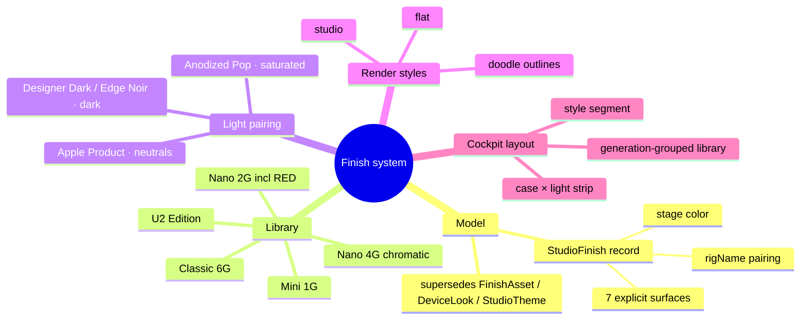

## Context

The /3d studio renders a physically-accurate iPod Classic whose painted shells are dyed metal (metalness ≈ 1.0): perceived color = albedo × environment. Three separate UI concepts (preloaded finishes, curated combinations, saved themes) all try to express "a complete look", but only themes bind the lighting rig, and only some bind every surface. The user has ratified a single mental model: **Finish = the complete combination**, and the case-color ↔ lighting pairing is the primary creative decision the layout must foreground.



## Goals / Non-Goals

- Goals: one canonical finish record; zero fallback gaps (edges always explicit); factory-accurate named Apple colors; every finish paired with a rig that makes its color *read correctly* on metal (reds stay red); doodle style with clear part separation; cockpit layout that puts case and light against each other; share-ready exports (stage included by default).
- Non-Goals: per-finish camera moves; new hardware geometries (mini/nano *proportions* are out of scope — these are colorways on the Classic body); user-editable rigs inside a finish (rigs stay named presets, themes keep referencing by name).

## Decisions

- **Decision: `StudioFinish` is the single record; saved themes are user finishes.**
  ```ts
  interface StudioFinish {
    id: string;
    label: string;            // "Nano 4G · Orange"
    family: "classic" | "mini" | "nano" | "special" | "custom";
    yearLabel?: string;       // "2008"
    colors: {                 // ALL explicit — applying a finish fully determines the object
      case: string; ring: string; center: string;
      back: string; edge: string; bezel: string; stage: string;
    };
    rigName: string;          // pairing into RIG_PRESETS, Designer Dark fallback
    builtIn?: boolean;
  }
  ```
  Alternatives considered: keeping `StudioTheme` as the canonical name (rejected — "theme" suggests UI chrome, the object is a *finish*); deriving wheel/edge at apply-time (rejected — derivation gaps are exactly the "I can't be fixing edges" failure; curation happens at library-authoring time, `deriveWheelColors` remains an authoring helper).
- **Decision: rig pairing by luminance/chroma class, plus one new rig.** `ANODIZED_POP_RIG`: achromatic key/fill/rim (warm tints hue-shift saturated anodization — red drifts orange under the Apple rig's #FFF5E0 key), env intensity ≈ 1.35 so chroma stays lit without clipping, white-neutral softboxes, one black contrast panel for edge definition. Dark finishes pair with Designer Dark/Edge Noir; light neutrals with Apple Product.
- **Decision: `renderStyle` union replaces `technicalFlat`.** Storage sanitizer maps legacy `{ technicalFlat: true }` → `"flat"`; reducer action `SET_RENDER_STYLE` replaces `SET_TECHNICAL_FLAT`. Doodle = the flat unlit-albedo path **plus** black inverted-hull outlines (drei `<Outlines>`, thickness in device units, `toneMapped: false`) on case, back, edge band, wheel ring, center, bezel — each part outlined separately so adjacent same-hue parts still separate ("extra black lines, clear distinction").
- **Decision: cockpit pairing strip.** Top of the Color cockpit shows `[case swatch] × [rig chips]` as one row — tapping a rig chip relights the current finish; tapping a finish applies colors+rig together. Lighting cockpit remains for deep tuning; the strip is the everyday surface.

## Risks / Trade-offs

- Persisted-state migration (`technicalFlat`) → tolerant sanitizer with explicit legacy mapping; corrupt blobs heal to `"studio"`.
- Hex accuracy of historical colors → research-grounded values, but anodization varies by photo; values are tuned against the PBR pipeline (mid-tone albedo readings) and visually verified per finish on stage before done.
- `<Outlines>` inverted hull on rounded-box geometry can self-intersect at high thickness → keep thickness ≤ 0.035 device units and verify each part.
- Superseding `add-3d-color-combinations` pending change → this change absorbs its intent; archive note added there at implementation time.

## Migration Plan

1. Land `lib/studio-finishes.ts` + new rig (additive).
2. Switch cockpit to the library; delete `FinishAsset`/`CURATED_LOOKS` in the same commit (no dual-source window).
3. `renderStyle` migration in `storage.ts` sanitize; legacy key read once, never written back.
4. Rollback: revert commit; saved themes parse unchanged (shape is a superset).

## Open Questions

- None blocking. Hex fine-tuning happens in visual verification with the live PBR pipeline.
