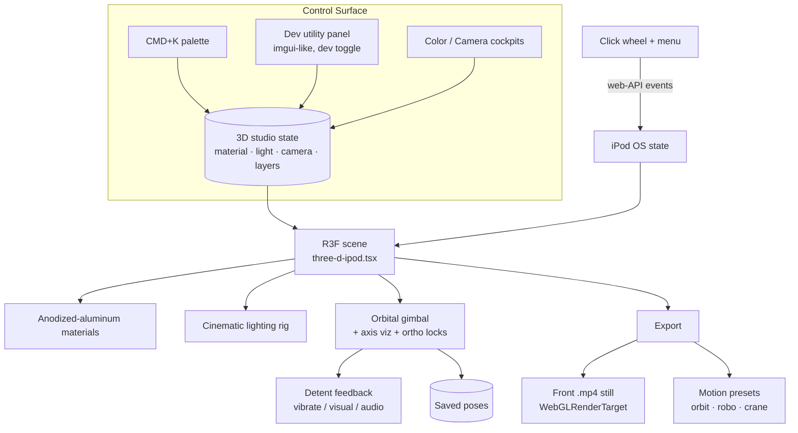

# Design: 3D Studio Control Suite

## Context

This change consolidates a session's worth of direction into one coherent program. The
through-line: **reliable artifact → controllable studio → cinematic output.** It spans
rendering (PBR materials, lighting), interaction (gimbal, click wheel), tooling (CMD+K,
dev control panel), and output (static + motion export). A `design.md` is warranted
because the pieces share a control/state backbone and must be sequenced.

## Architecture

## Key Decisions

### D1 — Material model: anodized aluminum is dyed METAL
Render the front face at `metalness: 1.0`, satin `roughness ≈ 0.52`, env-driven
(`envMapIntensity ≈ 1.0`), albedo only tints the reflection. This is the documented
correct PBR for anodized aluminum and the fix for the blown-out "doodle" look (a matte
dielectric white under a punchy key light clips to flat white). Rejected: mid-metalness
(0.4–0.6), which reads muddy/wrong. **Already implemented as the baseline bugfix.**

### D2 — Lighting math: env-first, conservative key
Brightness comes from a calibrated studio env map; direct lights add soft shaping, not
clipping. Baseline already drops the key from 240 → 90 and lifts env intensity. Default
must be a deliberate, named "Apple product" setup (broad soft key, cool fill, gentle
separation rim, neutral env), informed by cinematic product-lighting practice. Lighting
is then exposed as live-tunable parameters (D5) so the default can be re-grounded
empirically rather than guessed.

### D3 — One coordinate system everywhere
The gimbal, the XYZ axis viz (origin triad + corner ViewCube), the pose HUD, ortho
snaps, and saved poses all read/write the existing **studio coordinates**
(`azimuth / elevation / reach / target`, `lib/studio-camera.ts`). The axis viz is a
*view* of that state, never a parallel system — this is the literal "see in the same
coordinates" requirement. Integration risk: drei `GizmoHelper` expects drei
`OrbitControls`; the scene uses a custom `OrbitRig`, so the cube either binds to the
rig or is a lightweight custom cube driven by `getCameraPose()`.

### D4 — Additive, moldable layers with provenance
Control changes (color, material, light, camera) are modeled as **composable layers**
with provenance, so any change is attributable and revertible and good-vs-bad edits can
be compared (the "find the binary value of good/bad changes, provision ourselves"
intent). Concretely: a layered studio-state store where each adjustment records its
source (preset / dev panel / cockpit / palette) and can be toggled or reverted
independently. Kept minimal first (flat overrides + reset/provenance), deepened only as
needed.

### D5 — Control surface: CMD+K + a tiny imgui-like dev utility behind a dev toggle
- **CMD+K command palette** is the central, discoverable entry point to *everything*
  (apply finish, snap to view, toggle axis viz, switch motion preset, run export,
  open dev panel, toggle dev mode).
- **Dev utility**: adopt a tiny, battle-tested R3F-native control lib — **leva**
  (pmndrs, same authors as fiber/drei) is the recommended Dear-ImGui-style choice;
  tweakpane is the alternative. Bound to material/lighting/camera params, hidden unless
  the **dev toggle** is on. Winners get baked back into the well-defined defaults.
- **Aesthetic**: clean minimalism — translucent, layered panels (light-on-light, not
  heavy opaque boxes), industrial hairlines, Persona-5-inspired HUD energy executed
  with restraint. Tighter-bound the UI as more options appear.

### D6 — Export: static front first, motion additive
The single-position front `.mp4` reuses the proven offscreen `WebGLRenderTarget` render
path (the still PNG pipeline) to guarantee fidelity and avoid the live-canvas aspect
race, then encodes N identical frames (or a 1-frame-loop) through the existing WebCodecs
`mp4-muxer` encoder. Motion presets (orbit / robo / turntable / sweep + new
MKBHD-style robotic crane) remain additive and toggleable, never replacing each other.

### D7 — Functional click wheel fires web-API events
Wheel controls (Menu / ‹‹ / ›› / play-pause / center) drive the same OS reducer the 2D
surface uses and dispatch real DOM/web-API interaction events (pointer/keyboard
semantics), so menu navigation and edits behave identically to 2D inside the 3D stage.

### D8 — UI choreography + on-screen HUD verification utilities
Now-playing UI elements (the draggable `NOW_PLAYING_LAYOUT_ELEMENT_IDS`) get keyframed
position transitions that animate **into** the now-playing screen. The choreography is
serialized to a **human- and machine-readable format** (readable, diffable JSON/YAML
with named keyframes) that round-trips: export → edit/inspect → re-import reproduces the
same animation. Alongside, a set of **on-screen, game-dev / early-internet HUD-style
utilities** (live readouts, toggleable overlays, frame/state inspectors) make it
possible to *see* and *prove* that state and transitions work — an interactive
verification surface rather than console logging. These HUD utilities share the
control-surface aesthetic and live behind the dev toggle / CMD+K.

### D9 — One keyframe engine for camera + UI (Blender-like, leva-driven)
Both the camera moves (D6/motion-presets) and the now-playing UI choreography (D8) are
expressions of the *same* primitive: **a timeline of eased keyframes**. So instead of
two bespoke animation systems we build one `lib/studio-timeline.ts` keyframe engine:
- A *track* is an ordered list of keyframes `{ t, value, easing }`; `value` is a
  `StudioPose` for the camera track and a position map for UI element tracks.
- Sampling reuses the existing `easeInOut` and `poseToPosition`, so authored curves get
  the same cinebot accel/decel as the built-in moves.
- The built-in moves (orbit/robo/turntable/sweep/crane) remain code generators and double
  as **preset curves** that can be dropped onto the timeline and then hand-edited — this
  is the "define motion like Blender" affordance: scrub, set keyframes, retime, preview.
- **leva** drives it: live pose dials (azimuth/elevation/reach/target) plus a scrubber and
  keyframe add/remove, all in the dev panel. leva is confirmed as the control lib (D5).
- The whole timeline serializes to the human+machine-readable document the choreography
  spec already requires (named keyframes, diffable), so camera moves and UI choreography
  share **one round-trippable format**. This unifies phases 4 and 7 and gives the camera
  Blender-grade authoring without a second system.
Kept minimal first: linear/eased interpolation between pose keyframes; spline/bezier
handles only if authoring demands it.

### D10 — WYSIWYG export via a color-resolve pass *(landed this session)*
Root cause of "exports look darker": three r152+ renders to a non-XR `WebGLRenderTarget`
with `NoToneMapping` and `LinearSRGBColorSpace` (it *ignores* `texture.colorSpace`), so the
read-back was raw linear (~2.2 gamma dark) and skipped the live composer's tail. The live
`@react-three/postprocessing` `EffectComposer` actually forces `renderer.toneMapping =
NoToneMapping` and ends with vignette + linear→sRGB — so there is no tone-map to match, only
**vignette + sRGB encode**. Fix (`lib/three-color-resolve.ts`): a fullscreen `ColorResolvePass`
that samples the linear scene RT, applies the exact DEFAULT-technique vignette (0.18/0.32)
then the sRGB OETF in a raw `ShaderMaterial` (three appends no colorspace conversion to raw
shaders), renders to a byte RT, and reads those already-encoded bytes. Both still + clip
paths route through it. Verified: export PNG now matches the live exposure.

### D11 — Responsive, modular control surface *(partially landed this session)*
One DOM tree, two layouts via `lg:contents`: on `<lg` the wrapper IS a bottom sheet (panels
stack + scroll, dismissible via a Controls toggle); on `≥lg` `lg:contents` dissolves the
wrapper so the two groups position absolutely as a floating corner HUD — no duplication. Panels
are fluid (`w-full`, constrained by the container). The OrbitRig gained **aspect-aware fit**:
it computes the minimum reach that keeps the device's width+height in frame for the current
viewport aspect (width is the binding constraint when tall-and-narrow) and floors the goal
reach to it, so portrait no longer crops the device. Each control is a standalone module
(`ipod-3d-*-cockpit.tsx`) so `/portfolio` can mount them à la carte. Battery cockpit added for
device-state parity. Still TODO: CMD+K, leva dev panel, provenance layers, HUD inspectors, and
folding the cockpits into the unified clean-minimal HUD.

### D12 — Personalization + single-source storage
The back engraving becomes signature, not stock: carrot 🥕 for the Apple logo, "Designed by
Stüssy Senik", "Manufactured in Czech Republic", keeping the recessed laser-etch look (edit
`IpodBack` in `three-d-ipod.tsx`). Storage (GB) must be one source of truth read by both the
screen UI and the engraving's capacity line so they can never disagree — trace `capacityLabel`
back to the preset and ensure the on-screen capacity uses the same value.

### D13 — Export that "pops": a real studio scene + two framings + a locked hero pose *(next, the headline)*
Export is the primary focus, and the bar is "like the 2D product export, but better." The
baseline 3D export reads as a flat render because the device **floats** on a flat-colour
`scene.background` with no grounding, no separation, and a single soft vignette. The fix is
**photographic craft as real scene geometry**, not post-process effects (the project's
ratified lesson: bloom / clearcoat halos read as "too many complex things") — so everything
stays tack-sharp and the additions appear identically in the live view and the export with
**no new baking** (they are scene objects, captured by the existing RT path for free).

- **Studio sweep (grounding the frame).** Replace the flat `scene.background` colour with a
  seamless cyclorama backdrop (drei `<Backdrop>` or a gradient-textured plane): brightest
  directly behind the device, falling off toward the frame edges. Its base tint is driven by
  the existing **Stage colour** control, so the sweep stays user-controllable and the colour
  cockpit keeps meaning. This is the single largest "render → photograph" win.
- **Soft contact shadow (grounding the device).** A shadow-catcher under the device
  (drei `<ContactShadows>`) — wide, soft, low-opacity — kills the floating-sticker look.
  Not a hard drop shadow.
- **Rim / kicker separation light.** Retune the existing back `rim` spot (and add one kicker
  if needed) to rake the chrome edge + top body so the silhouette separates from the sweep —
  the device reads as *in front of* the backdrop, not pasted on.
- **Highlight roll-off.** A *gentle* filmic shoulder so chrome / screen whites do not clip to
  flat white. This is the only piece touching the colour tail, so it must be added to **both**
  the live `EffectComposer` and the `ColorResolvePass` (D10) and **pixel-verified** live-vs-PNG;
  conservative, and droppable — the first three pieces do most of the work.

**Two export framings (resolving "artwork-first" vs "dimensional richness"):**
- **Still · Front** — unchanged `frameForCapture` telephoto dead-on: the fidelity/spec shot
  (wheel = true circle, screen = clean rectangle, zero keystone). Best legibility of the artwork.
- **Still · Hero (3/4)** — a new still path that renders from the **composed / locked pose**
  instead of reframing to front, through the *same* offscreen RT + bake + colour-resolve.
  Shows the chrome wrap + body thickness the 2D cannot. Tuned tighter (less reach, better
  vertical placement) so the device fills the 9:16 frame rather than floating small.
  Clips inherit the studio scene automatically.

**Lockable perspective (stop hunting for the angle).** A **lock toggle in the camera cockpit**
(beside azimuth/elevation/reach + Save pose). Locked → the composed pose freezes, persists to
`localStorage`, and becomes the pose the Hero still and clips fly; restores on reload; unlock
to recompose. Reuses `getCameraPose` / `setCameraGoal` (D3) and the studio-shots persistence
pattern — no parallel coordinate system.

**WYSIWYG is preserved by construction:** the live `/3d` view becomes the studio (sweep +
grounding + rim) so the user composes against the exact shot. The attention hierarchy
(artwork → music → assembly) is enforced by keeping the front-fill softbox lifting the screen
and keeping the 3/4 modest (~15°) so the now-playing screen stays legible.

## Sequencing (phases, each vision-verified)

1. **Fidelity baseline** (materials, palette, default lighting, geometry) — *baseline
   landed; ratify + finish geometry/lighting default.*
2. **Camera system** (gimbal, axis viz, ortho locks, detent, saved/resizable poses).
3. **Control surface** (CMD+K + dev utility + layer/provenance + clean-minimal HUD).
4. **Motion presets** (additive moves + MKBHD crane toggle).
5. **Static front .mp4 export.**
6. **Interactive playback** (functional wheel + menu, web-API events).

Order is dependency-driven: fidelity and the camera/coordinate system underpin both the
control surface and every export; the control surface is the vehicle that makes lighting
and camera empirically tunable before motion/export are finalized.

## Risks / Open Questions

- drei `GizmoHelper` ↔ custom `OrbitRig` binding (D3).
- No web API exists for desktop trackpad/Force-Touch haptics; desktop "haptics" is
  necessarily simulated (visual + audio detent). `navigator.vibrate` is touch-only.
- Full-metal face changes how arbitrary cockpit colors read (as anodized-dyed metal) —
  accurate, but verify saturated custom colors still look intentional.
- Library choice (leva vs tweakpane) — **confirmed: leva** (drives the D9 keyframe engine).
- Layer/provenance depth — start minimal; avoid over-engineering before it earns its keep.
</content>
