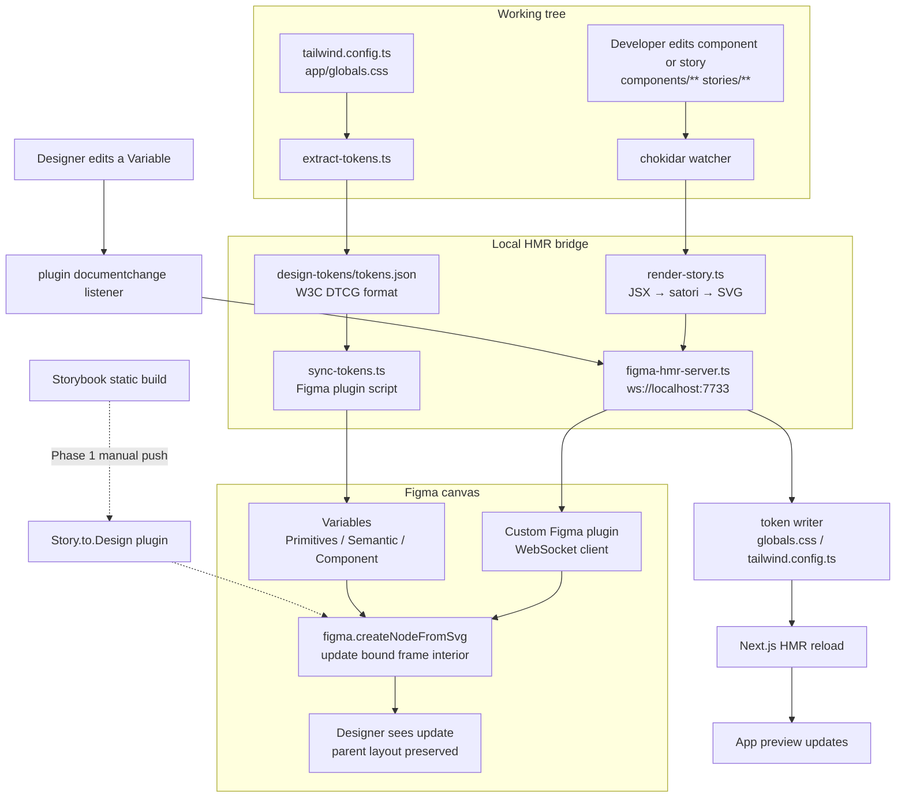

## Context
The iPod project is a visual-first product that lives and dies by how closely the rendered component matches the designer's intent. Today that intent is negotiated over screenshots and rebuilt by hand: there is no Storybook, no canonical Figma file, no design-token authority between code and Figma, and no live feedback loop between the working tree and the design canvas. Each new iPod revision preset, each new finish, each wheel detail has to be mentally diffed against reference images and approximated in code, while any design review happens in a parallel Figma file that drifts out of date the moment an engineer merges a change.

The ask is to turn Figma into a live dev mode for the project. When the engineer saves a file, the Figma frame should update with vector children the designer can select, inspect, and edit. When the designer adjusts a token in Figma, the working tree should receive that change as a file edit. Tokens are parametric, stories are canonical, and the bridge is vector-first so nothing is ever rasterized at the expense of selectable layers.

This is a non-trivial pipeline because no off-the-shelf tool exposes a Storybook-as-source / Figma-as-live-view experience with round-trip tokens. Storybook Connect, `@storybook/addon-designs`, and Story.to.Design each cover one slice; Code Connect covers another. Stitching them together into the experience the product needs is the job of this change, and doing it well requires being honest about which parts are off-the-shelf, which parts we must own, and which parts of the existing component set fundamentally cannot live in a vector pipeline.

## Goals
- Turn every in-scope iPod 2D component into a first-class Storybook story with explicit per-variant args, CSF3 types, and satori-compatibility metadata.
- Establish one canonical Figma file whose Page structure mirrors the Storybook navigation so that designers, engineers, and tooling all resolve the same hierarchy to the same frames.
- Deliver phase-1 value on day one: a single command pushes current stories into Figma as editable vector frames, and Storybook's docs panel shows the target Figma frame inline.
- Make design tokens parametric: one source of truth in code, imported into Figma as Variables across light and dark modes, with deprecation-before-deletion rename safety.
- Deliver phase-2 live updates: saving a component file re-renders its bound Figma frame within one second, preserving the designer's layout context.
- Deliver phase-3 round-trip for tokens only: a Figma Variable edit becomes a code edit the same way a Chrome DevTools inspector edit can be saved back via Workspaces.
- Fail safely: the bridge never corrupts a Figma frame's parent, layout, constraints, or auto-layout settings; errors surface in the plugin UI and the last good render is retained.
- Keep the maintenance tax bounded with a component scaffolder that stamps out story, Code Connect binding, and token audit entry in one shot.

## Non-Goals
- Full bidirectional geometry round-trip. Figma → code is scoped to token edits only. Moving a rectangle by 4 pixels in Figma does not become a code change; it remains a local Figma edit.
- Bringing the `@react-three/fiber` 3D iPod view into Figma. Three.js cannot be serialized to SVG without rasterization, which violates the vector-first rule. The 3D view stays in the app and is called out as "Not in Figma" on the Figma file cover.
- Supporting satori-incompatible CSS features in the live loop. `backdrop-filter`, `mix-blend-mode`, SVG filters, and animated states are explicitly excluded. Per-story `compat` metadata declares whether a component is `satori`, `raster`, or `exclude`.
- Hosting Storybook publicly. The Storybook build is local and produces `storybook-static/` for tooling; public hosting (Chromatic, Vercel) is a future concern and not required for the bridge to work.
- Deleting Figma nodes on rename. Renames in code mark Figma Variables deprecated, not deleted; actual deletion is a manual, explicit operation.
- Supporting multiple canonical Figma files. There is exactly one, recorded in `docs/figma/file-manifest.md`. Branching is handled via Figma's own branching feature, not by duplicating files.

## Decisions

### D1. Storybook 8 over Ladle, Histoire, or Playroom
Storybook has the largest Figma-adjacent ecosystem: `@storybook/addon-designs`, Story.to.Design, Storybook Connect, Chromatic, and Code Connect all assume Storybook semantics. Ladle and Playroom are faster to boot but have no equivalent Figma story. Histoire is Vue-first. The user's explicit requirement is a Figma-integrated experience, which makes the ecosystem the tie-breaker. Storybook wins.

### D2. satori for JSX → SVG over html2canvas or dom-to-svg
satori is the only library that takes JSX + a Tailwind resolver and emits real SVG with text as vector nodes rather than rasterized glyphs. html2canvas rasterizes everything. dom-to-svg requires a live browser DOM, which disqualifies it from a headless HMR pipeline. satori runs in Node and is Vercel-maintained, so long-term support is stable enough to bet on. The downside is a real CSS gap — no `backdrop-filter`, no `mix-blend-mode`, limited filter support, no animations — and that gap is made explicit in the `compat` metadata on every story.

### D3. A custom Figma plugin over extending Story.to.Design or Storybook Connect
Story.to.Design performs exactly the one-shot vector export we want for phase 1, and phase 1 will use it directly. But it offers no WebSocket, no HMR, no round-trip, and is closed-source commercial tooling we cannot extend. Phase 2 and beyond require a plugin we own, hosted under `figma/plugin/`, written in plain TypeScript against `@figma/plugin-typings`. A Figma plugin is not exotic — it's a `manifest.json`, a `code.ts` on the plugin side, and a `ui.html` iframe. The upfront cost is justified by permanent control over the loop.

### D4. Vectors over rasterized snapshots
The user's ask was explicit: SVGs and vectors, not pixels. Vectors survive zoom, give the designer selectable layers, and can be edited in place. Rasters cannot be redesigned. The tradeoff is that satori-incompatible components must be excluded from the pipeline rather than silently rasterized as a fallback — a raster fallback would let the satori gap hide forever and the user would end up with half a vector library and no way to tell which half. The spec codifies exclusion over raster-as-fallback.

### D5. Code-authored tokens, Figma as live view
Chrome DevTools has a one-way authority model: the browser is a live view, edits are ephemeral until saved back to a workspace file. The token pipeline mirrors this. `tailwind.config.ts` and `app/globals.css` are the source of truth, `extract-tokens.ts` derives a W3C DTCG JSON file, and Figma receives Variables from that JSON. A designer editing a Variable does not become the new source of truth — it produces a file edit, which then becomes the new source of truth once committed. This avoids the worst failure mode in bidirectional token systems, which is "Figma is source for some tokens and code is source for others and nobody knows which."

### D6. Vector scope is 2D only, 3D is explicitly out
The 3D iPod view uses `@react-three/fiber` and Three.js. Three.js scenes cannot be serialized to SVG without baking a raster snapshot, which would violate D4. Rather than carve out a special raster-only exception for the 3D view, the spec excludes it from the Figma pipeline entirely and documents that exclusion on the Figma file cover and in the Storybook a `Not in Figma` docs page. Designers get explicit closure on where the boundary is instead of discovering it by surprise.

### D7. Phased delivery with independent value at each phase
Phase 1 (Storybook + Story.to.Design + tokens + Code Connect) ships value on its own. If phase 2 proves too fragile, phase 1 remains operational and the project still has a working design bridge. Phase 2 (HMR live loop) is additive and can be disabled without regressing phase 1. Phase 3 (token round-trip) is additive on phase 2 and likewise can be disabled without regressing earlier phases. Each phase has its own CI checks and its own runbook, so any phase can be turned off independently.

### D8. Idempotent pushes with stable IDs
Every Figma write path — story push, token sync, HMR update — must be idempotent and must preserve Figma node and Variable IDs. If IDs churn on every push, Code Connect mappings, designer comment threads, and component instance references all detach, and the bridge becomes worse than useless. Stability is enforced by storing the story id in `setPluginData` on the frame and looking it up on every subsequent push rather than recreating nodes.

## Alternatives Considered

### A1. Storybook Connect as the primary bridge
Storybook Connect is the official Figma plugin from Chromatic. It embeds a live Storybook iframe inside a Figma component instance. It works, but it gives iframe embeds rather than vectors — designers cannot select individual layers or edit shapes, and the experience is "see a screenshot of the running component", which is exactly what we already get from a browser screenshot. Rejected because it fails D4 (vectors over rasters).

### A2. html-to-design or any DOM-walking approach
html-to-design walks a live browser DOM and emits Figma nodes. It supports more CSS than satori because it reads computed styles. The problem is that it needs a live browser running alongside the HMR pipeline, adding significant headless-Chromium overhead and making CI integration brittle. It also produces extremely noisy Figma output — each `
` becomes a frame, each span a text node, with no opinionation about which levels are meaningful. Rejected because the satori JSX-based approach produces cleaner, more designer-useful output with less infrastructure.

### A3. Pure Code Connect + Figma-authored components
Authoring components directly in Figma and mapping them to code via Code Connect is the path Figma itself recommends. It makes the designer happy because they live in Figma, but it inverts the source of truth — the code side becomes a downstream artifact of Figma, which is wrong for a project where the rendered output is the product. Rejected because the iPod project is code-first and always will be.

### A4. One giant single-phase delivery
A single change that tries to ship Storybook, Story.to.Design, tokens, Code Connect, HMR, and round-trip all at once. Rejected because any single-phase failure breaks everything and because the user explicitly asked for phasing in path C. Smaller, independently valuable phases are the right answer for a bridge that touches this many moving parts.

## Architecture

### 1. The story is the canonical unit
Everything in this pipeline keys off a Storybook story id. A story id is a stable, filesystem-derived string like `ipod-classic--default` that uniquely identifies a component plus its args. It appears in:
- the Figma frame's plugin data (`setPluginData('storyId', ...)`),
- the Code Connect binding,
- the HMR WebSocket messages,
- the satori render cache key,
- the `@storybook/addon-designs` link metadata.

Because the story id is stable, the same story always resolves to the same Figma frame across pushes and HMR updates. The story is what lets the engineer, the designer, and the tooling agree on "the same thing."

### 2. Tokens are parametric, not baked
Tokens live in `tailwind.config.ts` and `app/globals.css`. `scripts/extract-tokens.ts` reads both and emits `design-tokens/tokens.json` in W3C DTCG format. The JSON has three collections:
- **Primitives** — raw values (`color.blue.500`, `space.4`)
- **Semantic** — aliases that reference primitives (`surface.primary`, `border.muted`)
- **Component** — iPod-specific application tokens (`wheel.plastic.sheen`, `screen.glass.tint`)

`tools/figma/sync-tokens.ts` is a Figma plugin-side script that imports the JSON as Variables. Collections become Variable collections. Semantic tokens become aliases of primitives using Figma's variable-reference capability. Light and dark modes are populated from `:root` and `[data-theme='dark']` selectors respectively. Renames mark the old Variable deprecated; only `--delete-orphans` actually deletes.

### 3. The satori renderer is a pure function
`scripts/render-story.ts` takes a story id, loads the story module, instantiates the component with its args, and passes the resulting React tree into satori along with the project's Tailwind theme. Output is an SVG string. The function is pure: same story id and same args produce byte-identical SVG, which makes caching and change detection trivial. The cache key is a hash of the story id plus a hash of the component file contents.

### 4. The HMR server is a thin router
`scripts/figma-hmr-server.ts` is a small WebSocket server on port 7733. It has three message types:
- `story-updated` — emitted after a successful satori render, payload is `{ storyId, svg, renderedAt }`
- `story-error` — emitted on render failure, payload is `{ storyId, error }`; the server does not retry automatically
- `token-changed` — emitted by the Figma plugin when a Variable is edited; payload is `{ collection, variableName, modeId, newValue }`; the server routes this to the token writer

The server owns the chokidar watcher that observes `components/**` and `stories/**` and triggers renders on save with a 300ms debounce per story id. It does not own any Figma state; all Figma state lives on the plugin side.

### 5. The custom Figma plugin owns the Figma-side state
`figma/plugin/` contains a standard Figma plugin: `manifest.json`, `code.ts` (runs in the Figma sandbox), and `ui.html` (the plugin UI iframe). The plugin:
- connects to `ws://localhost:7733` when the user clicks `Connect`
- on `story-updated`, finds the frame whose `storyId` plugin data matches and replaces its children with `figma.createNodeFromSvg(svg)`, preserving the frame's own position, constraints, auto-layout, and parent
- on `story-error`, displays the error in the UI without touching any frame
- listens for `documentchange` events filtered to `Primitives` and `Semantic` Variable collections, and emits `token-changed` for each one
- maintains a small in-memory undo stack of the last ten story updates so any frame can be restored via a UI button if a render introduces visible regressions

### 6. Phase 1 uses Story.to.Design; the custom plugin is phase 2 and 3
Phase 1's push path does not require the custom plugin. Story.to.Design provides a one-shot "export all stories to Figma" flow that produces the same vector frames we would produce ourselves. That gives the project a real Figma file on day one while the custom plugin is being built. Once phase 2 lands, the custom plugin takes over the ongoing update path, and Story.to.Design is retained as a disaster-recovery re-bootstrapping tool if the Figma file is ever lost or corrupted.

### 7. Graceful failure is part of the contract
Every bridge failure mode has a defined behavior:
- WebSocket disconnected → plugin shows disconnected state, disables push, never modifies frames
- satori throws on a story → server emits `story-error`, plugin shows the error, last good render is retained, no frame is modified
- Token writer conflict (same token edited in code and Figma within the same debounce window) → Figma edit wins, the file write includes a `[figma-hmr]` blame marker so the author can audit after the fact
- Code Connect out of sync with the story manifest → CI fails, not runtime

The contract is that the bridge never leaves a frame in a half-updated state and never silently drops an update.

## Risks and Trade-offs

- **Satori CSS gap.** Components using `backdrop-filter`, `mix-blend-mode`, SVG filters, or animations will render incorrectly or throw. The click wheel is the hardest case — it uses gradients, inset shadows, and realistic sheen that may or may not round-trip. Mitigation: a satori compatibility audit is the first deliverable in Phase 1, and every story carries a `compat` flag. Stories marked `raster` flow through Story.to.Design's raster path in Phase 1 and are excluded from the HMR loop entirely. Stories marked `exclude` are documented on the Figma cover and never appear in Figma.

- **Figma Plugin API performance.** Large `createNodeFromSvg()` calls on complex stories can take 200-500ms inside the Figma sandbox. Rapid HMR saves could queue up. Mitigation: 300ms debounce per story id on the server side, drop intermediate updates if a newer one arrives during the debounce window, display queue depth and last render time in the plugin UI so designers can see when the bridge is saturating.

- **FIGMA_TOKEN leakage.** A personal access token that can write to the canonical design file is a credential worth protecting. Mitigation: `.env.local` is already gitignored, documentation in `ENGINEERING_SETUP.md` walks engineers through creating a token with minimal scopes, and a pre-commit hook greps for the `figd_[A-Za-z0-9_-]+` pattern and blocks any commit containing it.

- **Code Connect drift.** If a story is added but the `.figma.tsx` mapping is not, Figma Dev Mode will show stale component props. Mitigation: a CI check enumerates story ids and `.figma.tsx` ids and fails if the sets do not match. The component scaffolder CLI generates both in one shot so drift is unlikely to originate from human error.

- **Token rename collisions.** A rename in code without running `tokens:extract` leaves Figma pointing at the old name, which gets marked deprecated and, on a later `--delete-orphans` run, actually removed. Mitigation: `tokens:extract` runs in lint-staged pre-commit so renames can never merge without a corresponding token JSON update. The deprecate-before-delete workflow is a two-step process requiring explicit human intent.

- **Designer trust erosion.** If the live bridge ever corrupts a Figma frame's layout or parent links, designers will disable it and the whole investment becomes shelfware. Mitigation: the failure contract above, plus an undo restore button in the plugin that snapshots every frame before update and can roll back the last ten pushes. Fail-safe behavior is enforced by requirement, not best effort.

- **Three.js components invisible in Figma.** The 3D iPod view is visually important in the app but fundamentally absent from Figma. Mitigation: an explicit "Not in Figma" callout on the Figma file cover and a Storybook docs page listing out-of-scope components. Designers know from day one what the bridge does not do.

- **Maintenance tax per new component.** Each new component now owes a story, a satori compatibility audit, a `.figma.tsx` mapping, and a token coverage check. Mitigation: `bun run scaffold:component` stamps out all four in one command, and CI enforces the invariants so missing pieces fail the build rather than rot silently.

## Migration Plan
This change is additive — none of the existing iPod components change shape. Migration is about introducing new artifacts and processes rather than rewriting existing ones.

1. Introduce Storybook with the in-scope story list; existing components continue to work in the app without modification.
2. Set up the canonical Figma file in parallel; the old hand-built Figma file (if any) is preserved as `-legacy` and eventually archived.
3. Phase 1 push lands; designers can use the new Figma file in place of the old one for in-scope components.
4. Token extract lands; tokens flow one-way into Figma; existing hand-authored Variables are migrated by a one-time script and then Figma-authored tokens stop being allowed.
5. Phase 2 HMR lands behind a `FIGMA_HMR=1` env flag; engineers opt in individually until the bridge proves stable.
6. Phase 3 round-trip lands behind the same flag; token round-trip is validated on low-risk tokens (e.g., a test token) before touching real design tokens.
7. Rollback: each phase can be disabled without affecting earlier phases. If phase 3 is turned off, phase 2 keeps working. If phase 2 is turned off, phase 1's Story.to.Design export path keeps working. If phase 1 is turned off entirely, the repo loses the Figma bridge but the app is unaffected.

## Delivery Order
1. Component audit, canonical Figma file decision, tooling cost documentation.
2. Storybook bootstrap with Tailwind and theme parity.
3. Story coverage for all in-scope components, including the composition story for the full Now Playing surface.
4. Phase 1 off-the-shelf push via Story.to.Design, with stable node ID recording.
5. Design token extract, W3C DTCG JSON, Figma Variable sync with multi-mode support.
6. Code Connect mapping wiring and CI parity check.
7. Phase 2 HMR server, satori renderer, chokidar watcher, custom Figma plugin, single-command `bun run figma:dev` entry point.
8. Phase 3 token round-trip with debouncing and blame markers.
9. Component scaffolder CLI, validation pass, openspec strict validation, documentation runbook.

## Open Questions
- Which Figma plan does the canonical file need? Variables with multi-mode support require a Professional or higher plan on the current Figma pricing, and Dev Mode with Code Connect requires a paid seat. Confirmed pricing is the first docs deliverable in Phase 1 so there are no surprises mid-implementation.
- Is Story.to.Design's pricing acceptable for the project, or should Phase 1 instead use a custom push script built directly on the Figma REST API? The custom script adds one more thing to own but removes a vendor dependency from Phase 1. Decision deferred until the pricing review lands.
- Where should the canonical Figma file live in terms of ownership? A personal account, a project-wide team, or a dedicated organization. Affects invite workflow and auditability. Decision deferred to the Figma file manifest step in Phase 1.
- Do we want Chromatic for visual regression on Storybook? It is an obvious next step after Storybook exists, but it is explicitly out of scope for this change. Revisit in a follow-up change once Phase 1 is stable.
