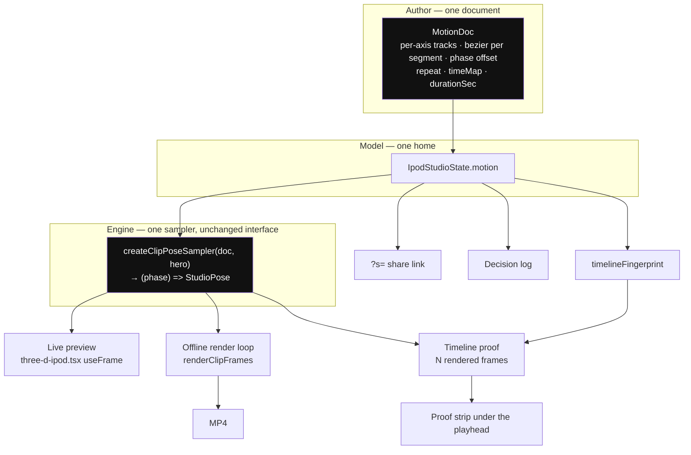

# Design: Motion as an authored document

## Context

The request is creator control over motion: custom beziers, authored spin counts, a robotic ↔
organic dial, and an export preview that shows the export. The constraint is that `/3d` already
has a working, parity-tested motion path — one sampler interface serving both the live preview
and the offline render loop — and that path must not be forked to add authoring to it.

So the shape of the work is not "add a curve editor beside the preset picker." It is: replace
the *closed* half of the motion vocabulary (hardcoded generators, named-only easings, derived
cycle counts) with an *open* document, keep the sampler interface unchanged, and give that
document a home in the model so every other system that already projects the model — share
links, persistence, decision log, export fingerprint — picks it up without new wiring.



The three boxes that already exist and are not being rebuilt: `createClipPoseSampler`
(`lib/studio-clip.ts:55`), the `UnitBezier` solver pinned to `@theatre/core` by
`lib/theatre/theatre-parity.test.ts`, and the proof cache. Everything else is either new or a
narrowing that gets removed.

## Decisions

### D1 — Open the easing type at the single point where it narrows

`PresetKeyframe.easing: EasingName` (`lib/theatre/motion-presets.ts:41`) becomes
`Ease = EasingName | CubicBezierHandles`. Nothing downstream needs to change:
`buildTrack` already calls `easingHandles(kf.easing ?? DEFAULT_EASING)`
(`build-state.ts:69`), which already passes a tuple straight through (`easings.ts:57`).

Named curves stay in `EASINGS` and stay first-class — they are the *vocabulary*, and a named
curve round-trips to a tuple and back. Custom curves are stored as tuples. The UI shows the
name when the tuple matches a named curve exactly, and `Custom` otherwise.

Handle values outside `[0,1]` on the Y axis are legal and produce overshoot — already shipped
and proven by `easeInOutBack: [0.68, -0.6, 0.32, 1.6]`. X handles are clamped to `[0,1]`
because the solver inverts x→t over that domain (`unit-bezier.ts:53`); an out-of-range x makes
the curve non-monotonic in time and the Newton solve ill-conditioned.

*Alternative rejected:* a spring/physics model (stiffness, damping, mass). Springs feel more
"organic" per unit of tuning, but they are not keyframes — they cannot be sampled from a
position without integrating from a start state, which breaks the deterministic
`(phase) => Pose` contract the export loop and the proof cache both depend on. A spring can be
*baked* to a bezier-keyframed track later as an authoring aid; it cannot be the storage format.

### D2 — `repeat` is authored; cycle length is the readout; `speed` is retired

Today: `cycles = max(1, round(durationSec × speed / naturalCycleSeconds))`. Three inputs
collapse into one integer through a `round()`, so the mapping is not injective and the `speed`
control has dead zones — on a 6s-cycle move in a 5s clip, `speed` 0.5, 0.75 and 1 all yield
`1×`.

After: the user owns `repeat: number` (whole cycles across the clip, `0` = held) and
`durationSec`. `cycleSeconds = durationSec / repeat` is derived and displayed. "Spin three
times in six seconds" is two direct edits.

`repeat` stays a whole number by default because the seam guarantee depends on it — an integer
cycle count is what makes `pose(end) === pose(start)` and gives a loop with no first/last-frame
pop (`studio-camera.ts:141-147`). Fractional `repeat` is permitted but flagged in the readout
as `open` rather than `seamless`, because a non-loopable clip is a legitimate thing to author
(the one-shot `dolly-out-reveal` card already is one) and the surface should say which it is
rather than forbid it.

Migration: a stored `speed` decodes as `repeat = max(1, round(durationSec × speed / cycleSeconds))`
— the value that was actually being flown — then `speed` is dropped. One-way, in the existing
`healSlice` path (`portable-state.ts:69`).

### D3 — Port the procedural moves to documents, but rule on the port by measurement

The five procedural moves are sin/cos. A cubic bezier segment is not a sine, so a keyframed
port is an *approximation*, and how good it is is a fact to be measured, not an intention to
be stated. Per repo law: never nudge a measured value to make a check pass — change the check
or rule the case and say so with its reading.

The procedure, in order:

1. Port each move to a `MotionDoc` with quarter keyframes and `easeInOutSine` — the recipe
   `halo-sweep` already uses and which was tuned against `pendulum`.
2. Measure, per move, the maximum deviation between the ported doc and the generator across
   ≥1000 uniformly sampled phases, per axis, in native units (degrees for azimuth/elevation,
   world units for reach/target).
3. Record the readings in `tasks.md` §2. They are then never re-derived.
4. Rule per move against a stated perceptual floor. The floor is **0.25°** for angles and
   **0.01 units** for reach — below the export fingerprint's own pose quantization
   (`ANGLE_PRECISION = 0.1°`, `DISTANCE_PRECISION = 1e-3`, `export-fingerprint.ts:76-77`) by a
   margin, so a passing port cannot even change a cache key. A move that misses the floor gets
   more keyframes; if it still misses, it **keeps its generator** and the catalogue carries
   both kinds. `turntable` is exactly representable (linear `360 * t`, two keyframes, `linear`
   ease) and is the control case that proves the harness.
5. `poseForMove` and `MOVE_CYCLE_SECONDS` are deleted only after every move has a ruling.

The gate is a test, not a note: a parity test that fails on any move exceeding its recorded
floor.

*Why bother:* it is what makes the presets "come from the system." A ported Orbit is an
editable object — the user opens it, drags the azimuth curve, and saves a variant. A generated
Orbit is a black box forever. This is the whole difference between picking motion and authoring
it.

### D4 — Per-axis tracks with a phase offset is the robotic ↔ organic dial

Robotic and organic are not two presets; they are two regions of the same parameter space, and
three parameters put the whole space in reach:

| | robotic | organic |
|---|---|---|
| easing | `linear`, `easeInOutExpo` (hold-then-snap) | `easeInOutSine`, `ease` |
| axis phase | all axes at offset `0` — they arrive together | axes offset (e.g. elevation `+0.15`) — they arrive apart |
| keyframe rhythm | evenly spaced | uneven, weighted toward a beat |

`MotionTrack.phase: number` shifts a single axis's sampling position within the cycle. It is
the cheapest possible organic knob: one number per axis, no new interpolation, and the seam
guarantee survives because a phase shift of a loop that closes at zero still closes at zero.

Two named starting points ship as *documents*, not as modes: `Robotic` (linear, zero phase
offsets, even keyframes) and `Organic` (sine, staggered phases, uneven rhythm). Both are
openable and editable like any other. The dial is not a toggle; the toggle is a pair of
bookmarks in a continuous space.

### D5 — Two fingerprints, because there are two questions

`proofFingerprint` (anchor) is unchanged and still excludes motion. Its exclusion is correct
and its reasoning is already on the record (`export-fingerprint.ts:16-19`): every move starts
at the hero pose, so motion cannot change frame 0, and including it would re-render
byte-identical frames while the user browses moves.

`timelineFingerprint` is new: the proof inputs **plus** a canonical motion-doc hash, plus the
sample positions. It keys a set of N frames rather than one.

`exportFingerprint` (provenance) keeps its role and swaps its motion fields
(`move`/`loop`/`speed`/`durationSec`) for the motion doc identity.

Sample count: **5** by default (0, ¼, ½, ¾, and just-shy-of-1). Five frames at ~115ms of screen
bake plus a render each is a sub-second warm — comparable to what the existing speculative
scheduler already spends on neighbour warming — and five positions is enough to show a
turnaround and a seam. It is a value in the doc, not a constant, so a long clip can ask for
more.

The strip renders *under* the existing playhead scrubber, aligned to it, so scrubbing to a mark
and looking at the strip are the same gesture. Frames arrive ambiently and show `computing…`
until filled — the existing proof panel's contract (`ipod-3d-export-proof-panel.tsx:17`),
reused rather than re-invented.

### D6 — `hold` becomes `repeat: 0`, not a third branch

`loop === "hold"` is currently a bypass in three places: the preview pins the anchor
(`three-d-ipod.tsx:1906`), the render loop pins the hero (`:2328`), and the dock disables the
move picker and speed stops (`ipod-3d-export-dock.tsx:249, :272`). It is not a time map at all
— it is amplitude zero.

With `repeat: 0` the sampler returns the hero for every phase by the ordinary path, all three
branches delete, and `LoopStyle` narrows to the two things it actually names: `loop` and
`boomerang`. The dock stops needing a `hold` concept; the readout says `held` when `repeat` is
`0` because that is what the number means.

Boomerang's turnaround easing moves into the document too. Today it is a hardcoded smootherstep
(`easeInOut` at `studio-camera.ts:69`, applied in `pingPong` at `:96`) — a second, unrelated
easing implementation whose feel cannot be authored and which differs from the bezier easing
every keyframe uses. It becomes `timeMap: { kind: "boomerang", turnaround: Ease }`, defaulting
to a bezier that matches the current smootherstep within the D3 floor (measured, recorded).

### D7 — Motion lives in `IpodStudioState`, and everything else is a projection

```ts
interface MotionState {
  /** Catalogue id, or the id of a user-saved document. */
  docId: string;
  /** Sparse per-track overrides on top of the catalogue doc; absent = pristine. */
  overrides?: MotionOverrides;
  repeat: number;
  durationSec: number;
  timeMap: TimeMap;
  /** Playhead position over the whole clip, [0,1). Transient but modelled. */
  playhead: number;
}
```

Doc-by-**id plus sparse overrides**, not doc-by-value. This is the same ruling
`add-finish-rig-pairing` reached for rigs and the same one `update-studio-theme-authoring` is
open on: by value forks the truth (a catalogue improvement never reaches a saved look); by name
alone loses the tuning (the defect that change exists to fix); name plus sparse overrides keeps
both. A user-saved document gets its own id and is stored whole.

`playhead` is transient in the sense that it should not ride a share link — but it is modelled
rather than local, because the export needs it, the proof strip needs it, and every previous
"just keep it local" call in this codebase produced a second owner. It is excluded at the
codec boundary exactly as `isNowPlayingEditable` already is (`portable-state.ts:147`), not by
keeping it out of the model.

Consequences that need no new code: motion persists across reload, travels in `?s=` links,
appears in the decision log's fold, and enters the export snapshot — because all four are
projections of `IpodWorkbenchModel`.

### D8 — The authoring surface is built once, as the inspector's Camera part

`refactor-3d-control-surface-to-inspector` (0/18, blocked on `adopt-studio-control-language`)
will rebuild the right and left rails and dissolve the eight cockpit files. A motion panel
built into today's `ipod-3d-export-dock.tsx` would be rewritten by that change.

So: the motion inspector ships here as **one self-contained component** taking an explicit
props contract and owning no layout — a panel body, not a rail. This change mounts it in the
export dock's Preview section (where the transport already lives, so nothing moves except what
this change adds); the inspector change re-parents it under the Camera part and deletes the
mount, not the component.

It is built with `components/ui/studio-controls.tsx` primitives from the start
(`StudioButton`/`Segment`/`Field`/`Row`, radii from `CONTROL_RADIUS`), so it is born compliant
with `adopt-studio-control-language` and adds nothing to that change's 30/17/40 count.

The curve editor itself is direct manipulation: the two handles are draggable, the numbers move
as you drag, and the readout shows the tuple. Labelled density — every track row is a noun and
a value (`Azimuth ±17°`), 24px rows, 11px chrome type.

**This is the pixel-moving part of the change and it gates on the owner's visual review before
it hardens.** State the deltas and stop.

### D9 — What this change deliberately does not do

- **The 2D pipeline** (`components/ipod/ipod-classic.tsx` GIF/marquee) is untouched, same
  boundary `add-3d-export-screen-animation` drew.
- **The screen's own animation** — marquee scroll and progress advance inside the clip — is
  `add-3d-export-screen-animation` (7/16). Motion authoring drives the *camera*; that change
  drives the *screen*. They meet at clip-`t` and nowhere else, and both already read the same
  `i / total`.
- **The duplicate model fold.** See §Findings F3. Real, but a different change.
- **Lighting animation.** The doc format is per-prop and would extend to rig properties
  cleanly, but `add-finish-rig-pairing` owns the lighting registry and is blocked on colour
  fidelity. Keyframing light is a follow-on, and the format is being designed not to preclude
  it: `MotionDoc.tracks` is keyed by string, not by a camera-prop union.

## Findings — redundancy and things thought in seclusion

Recorded here because they were measured while designing this change. Only F1 and F2 are fixed
by it; F3–F5 are named so they stop being rediscovered.

**F1 — Two cycle-count functions, identical math.** `cyclesForDuration(move, …)`
(`lib/studio-camera.ts:151`) and `clipCyclesForDuration(clip, …)` (`lib/studio-clip.ts:82`)
compute the same expression, one keyed by `CameraMove` and one by `StudioClip`. And
`MOVE_CYCLE_SECONDS` is copied into every procedural clip's `naturalCycleSeconds` at
`studio-clip-presets.ts:20`. *Fixed here:* both die with D2, since `repeat` is authored.

**F2 — Two easing implementations with different feel.** `easeInOut` (smootherstep,
`studio-camera.ts:69`) shapes the boomerang turnaround; `UnitBezier` shapes every keyframe
segment. So a boomerang's turnaround feel is un-authorable *and* differs from every other
curve in the product. *Fixed here:* D6 folds the turnaround into the document as a bezier.

**F3 — Two folds of one model, on two routes.** `ipodCentralMachine` (`lib/xstate/central-machine.ts`,
461 lines) is mounted app-wide at `app/layout.tsx:126` and drives the 2D workbench, the floating
panels and the command palette. `/3d` runs its own `useReducer(ipodWorkbenchReducer)`
(`ipod-3d-stage.tsx:112`). Both fold the same `IpodWorkbenchModel` through `normalizeModel`;
neither knows about the other. They do not currently conflict because they sit on different
routes — but `add-customizer-decision-log` wraps the *reducer*, so as specified it would give
`/3d` a decision log and leave `/` without one. Worth resolving before that change ships, and
it is not this change's job.

**F4 — The central machine is a reducer wearing a state-machine costume.** It declares
`initial: "idle"` with a single state `idle: {}` and ~50 flat top-level `on:` handlers
(`central-machine.ts:98`, `:437-439`). No state means no guards, no transitions, no invariants
— the thing XState is for. It is not wrong, but it is not buying anything either, and it is the
reason a reader looking for "the big state tree" finds a flat list.

**F5 — Two export lifecycles.** `central-machine` carries `exportStatus`/`exportProgress`/`exportError`
(`:92-94`) read by the 2D workbench (`ipod-classic-workbench.tsx:137-139`); `/3d` uses the
separate `exportMachine` (`ipod-3d-stage.tsx:153`), which actually has states. One export, two
lifecycle models, split by route.

**F6 — `hold` disables controls that would still be meaningful.** The dock dims the move picker
and the speed stops under `hold` (`ipod-3d-export-dock.tsx:249, :272`), so a user who wants to
compose a move, hold to check the framing, and resume loses their selection state visually. D6
makes this moot — with `repeat: 0` the doc is still selected, it just is not repeating.
