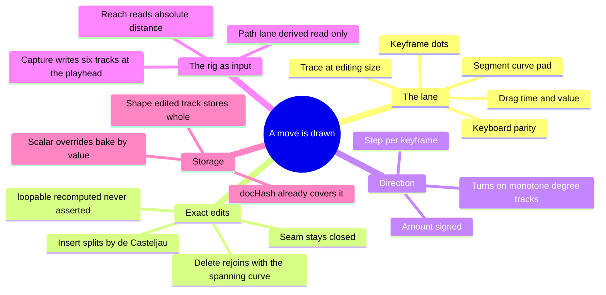

# Design — add-motion-shape-authoring

## Context

The motion document format was built for this and then not used for it. `MotionKeyframe` is
`{ at: number, value: number, easing?: Ease, hold?: boolean }` with `at` a free number, and
`MotionTrack.keyframes` is a plain array. Every capability this change ships is expressible in
that format today; what is missing is a surface that writes it and an override shape that can
carry the result.

The one real constraint is the override shape. `TrackEdit = { gain, phase, curve }` is three
scalars over a base track, chosen so a tuned catalogue move stays a *reference* to a catalogue
document plus a sparse diff — the identity-plus-overrides ruling from
`add-motion-authoring-system` D-shelf. Three scalars cannot describe a track with a different
number of keyframes. So this change either widens the diff or changes what a shape-edited track
stores, and D3 rules which.

## Decisions

### D1 — The trace is the editor

`ipod-3d-motion-trace.tsx` samples a document into a normalised polyline in a unit viewBox with
a non-scaling stroke, already serving a 32px picker card and a 16px shelf row. The lane is that
same component at a third size with an interaction layer over it.

The alternative — a purpose-built graph editor beside the read-only trace — puts two components
in the repo that both answer "what shape does this track draw", and they will disagree the first
time one of them changes its sampling count. The trace's own doc-comment already makes this
argument about baked thumbnails; the same argument applies to a second vector path.

**Consequence, and it is the point:** the picture in the picker and the thing you drag are
literally the same code, so a move cannot look one way in the catalogue and edit another.

### D2 — A path is a view, and a view is never stored

`azimuth`, `elevation`, `reach` around `targetX/Y/Z` is spherical coordinates about a movable
origin. Given a target and a camera position, the three are determined; given the three, the
position is determined. The map is a bijection. There is therefore no camera route through space
that the existing tracks cannot express, and a stored spline would be a second encoding of a
path the tracks already hold — two truths, and `CLAUDE.md`'s **Update In Place** says which one
that makes a defect.

So the Path lane **renders** and does not **edit**. It draws the plan view (looking down: the
horizontal plane the camera navigates in), because elevation already owns a lane and stacking a
second projection buys a dimension the user can already read.

**Why not make it draggable, given the inverse exists?** Because dragging a point in space writes
three tracks at one instant, and the tracks are independent *on purpose* — their independence is
what `doc.ts` (1) names as the difference between mechanical and organic motion. A spatial drag
would force a shared keyframe grid at every edited position and quietly undo that. The gesture
that authors in space is **Capture** (D5), which writes all six tracks at one instant *because
the user asked for exactly that*, once, at a position they chose.

### D3 — A shape-edited track stores whole; an untouched one stays a reference

A track override becomes a union:

- **scaled** — `{ gain, phase, curve }` over the catalogue base. What every existing override is.
- **defined** — a whole `MotionTrack`. What a track becomes the first time its keyframes move.

A track promotes from scaled to defined on the first insert, delete, keyframe drag, or
segment-scoped curve edit, and never demotes automatically. Untouched tracks are not stored at
all, so a document with one hand-drawn azimuth still travels as `turntable` plus one track.

**Why not widen the scalar diff to a keyframe patch list?** Because the patch would have to
describe insertions and deletions against a base that can itself change when the catalogue is
re-tuned, and a diff whose base moves is a diff that silently means something else. A definition
cannot rot. This is the same reasoning that made a shelf entry store its document whole.

**Migration.** Every stored `{ gain, phase, curve }` continues to load as scaled. Nothing is
converted on read. Conversion happens only at the moment of the first shape edit, through
`applyTrackEdit(base, edit)` — the function that already computes exactly that track. The test
asserts the **converted values** sample identically to the scaled track at 64 phases, because a
migration test that only asserts "does not throw" has already passed on an inert migration in
this repo once.

### D4 — Direction is a sign; turns are a count; one control per track

`gain` becomes signed on `[−2, 2]`. A negative gain mirrors the track about the hero, which is
what "the other way" means for a sway, a dolly and a turn alike. There is no `reverse: boolean` —
a boolean beside a magnitude is two spellings of one number, and the surface already has to show
the number.

A track additionally shows **Turns** instead of **Amount** when both hold:

1. its unit is `deg`, and
2. it is **monotone across the cycle** — it never reverses.

Monotonicity is the structural test, not a threshold: a turn goes one way, a sway comes back.
A monotone degree track with a span under 180° keeps **Amount**, because "turns" is the wrong
noun for a drift. Turns writes `span = turns × 360` across the track and preserves the segment
curves, so `−1` is a reversed turntable and `2` is two revolutions in one cycle with the same
easing character.

### D5 — Capture is the only gesture where the camera is an input

`Capture` reads the live rig pose, subtracts the hero pose the document is expressed against,
and writes one keyframe per track at the playhead's phase — replacing any keyframe within snap
distance rather than stacking a second one at nearly the same time.

It is deterministic in the sense the law requires: it reads state, not a clock, and the value it
writes is a stored number thereafter. Nothing about the resulting document depends on when
capture happened.

Capture is what makes "custom path" a five-second loop: orbit, capture, scrub, orbit, capture.
Four captures is a route no combination of gain and phase over a baked sine can produce.

### D6 — The seam stays closed by construction, and `loopable` is recomputed

While a document is loopable, a track's first and last keyframes are **pinned in time** at `0`
and `1` and **linked in value** — dragging either drags both. A cycle that does not close pops
at the seam, once per repeat, and the pop is the most visible defect the motion system can ship.

`loopable` is then **recomputed after every shape edit** from whether every track closes within
epsilon, never left as an asserted boolean. Breaking the seam deliberately is possible — unlink
the seam pair — and the document immediately reads as not seamless in the shelf row that already
prints that word.

### D7 — Insertion is exact, and exactness is measured

Double-clicking a lane at time `tx` inserts a keyframe that **does not change the sampled
motion**. An insert that re-shapes the curve makes the lane untrustworthy: the user would learn
that adding a control point costs them the move they had.

Mechanism, entirely on existing parts:

1. The segment's easing resolves to handles via `easingHandles()` — a named curve and a tuple
   are the same value here, as `doc.ts` established.
2. `UnitBezier` (`lib/theatre/unit-bezier.ts`, pinned to `@theatre/core` by the parity test)
   solves the bezier parameter `u` for the normalised x within the segment. No second solver.
3. De Casteljau subdivision at `u` yields the left and right control polygons in `(x, y)`.
4. Each half renormalises to its own unit box: left by `(xs, ys)`, right by `(1−xs, 1−ys)`.
5. The new keyframe takes `at = t0 + (t1−t0)·xs` and `value = v0 + (v1−v0)·ys`.

Three degenerate cases, all exact rather than approximate:

- `ys ≈ 0` or `ys ≈ 1` — the sub-segment spans zero value, so it samples constant whatever its
  easing is. The half takes `linear` and the result is still exact.
- `xs ≈ 0` or `xs ≈ 1` — the insert lands on an existing keyframe's time. Rejected; a track may
  not hold two keyframes at one time.
- `hold: true` — a stepped segment splits into two stepped segments at the same value. Exact by
  inspection and still tested.

**A named curve splits into two custom tuples**, and the row consequently reads `Mixed`. That is
honest: half of `easeInOut` is not `easeInOut`. The label change is the visible consequence, and
it gates on owner review with everything else that moves a pixel.

The gate is a measurement, not an assertion: sample every track at 256 phases before and after
an insert at each of 9 positions on each of the 5 catalogue documents, and record the worst
absolute deviation. The floor is floating-point, not the 0.25° port floor — this is the same
curve, subdivided, not a re-fit.

### D8 — Nothing downstream changes

- **Format**: unchanged. `at` was always free.
- **Export identity**: `docHash` canonicalises the whole document including every keyframe, so a
  re-shaped move already fingerprints as a different move. No `FINGERPRINT_VERSION` bump.
- **Sampler**: `createMotionSampler` reads keyframes; it does not care how many there are.
- **Trace**: normalises by *sampled* extent, so a re-shaped track draws inside its own frame with
  no change.
- **Proof cache**: keyed on the document, which now differs. The strip re-warms and is correct.

The whole change is a surface, an override union, and one pure subdivision function.

## Findings — recorded, not folded in

- **There is no edit history.** Escape cancels an in-flight drag by restoring the pre-drag
  document, which is cheap and local. A real undo stack spans the whole model and belongs to the
  model, not to this panel. Building one here would put a second history in the repo the first
  time the model gets its own.
- **The hero pose is read from the stage.** Capture needs whatever the stage already resolves as
  the hero framing. If that turns out to be reachable only through a prop chain, thread the prop
  rather than re-deriving the hero — a second hero derivation is a second truth about where the
  move is expressed from.
- **Lighting tracks remain unbuilt and unblocked.** The format admits them, the lane is
  string-keyed through `TRACK_META`, and nothing in this change narrows either.
