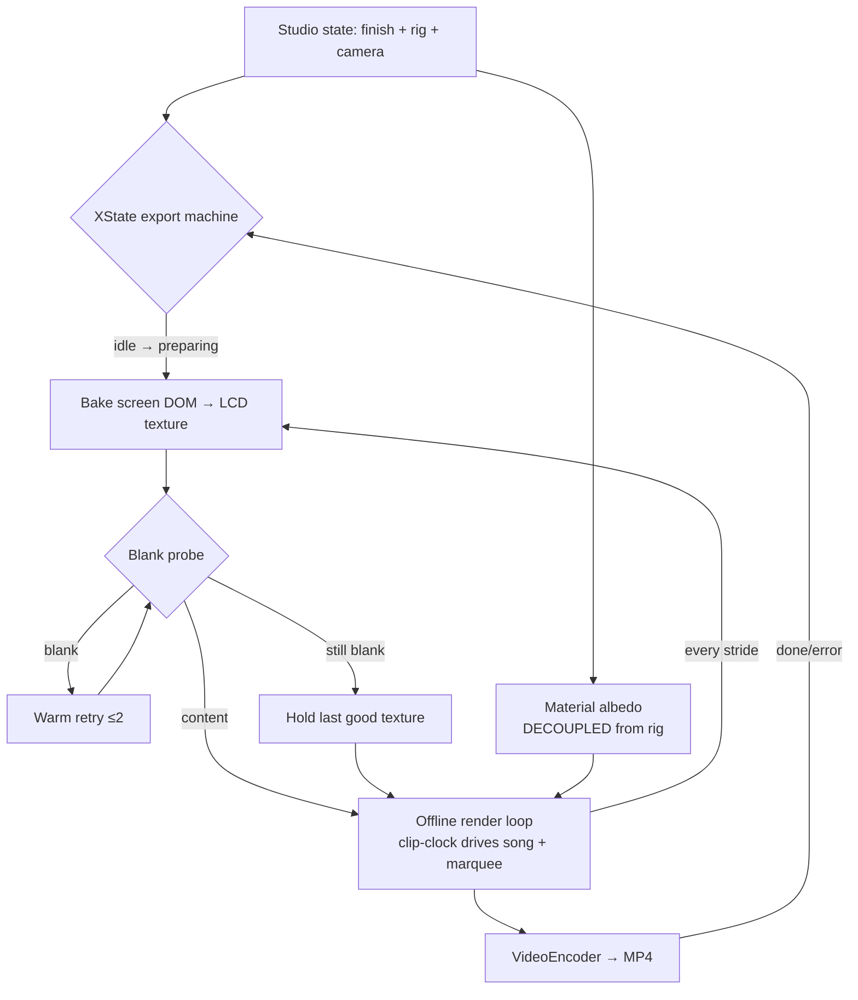

# Update /3d: Export Reliability + Authentic iPod Look

## Why

Two compounding failures made the /3d studio's flagship feature — exporting a
"Now Playing" product clip — unusable, and the render's material/lighting model
drifted away from the real iPod Classic:

1. **Exports produced a "dead iPod OS"** — on long clips (~40s+) the exported
   video's screen went blank mid-song (status bar + progress bar intact,
   artwork/title/artist gone). Root-caused live in this session: Chromium's
   foreignObject SVG rasterizer (html-to-image's engine) intermittently paints
   an empty content layer when a rasterization call lands after ~300ms of
   main-thread/GPU-saturating offline render work. Measured: 94–113 of 120
   re-bakes blank on a 60s export; 0 of 120 at 20s (tight bake cadence); forcing
   the 60s bake stride onto a 20s clip reproduced 25/32 blanks — the bake
   *interval* is the trigger. One immediate "warm" retry repaired 94/94 blanks.
   **Fixed in this change** (`lib/screen-bake-guard.ts` + retry policy in
   `bakeNodeOnto`), verified 0/120 blanks at 60s.
2. **The /3d page itself went blank during e2e/dev exports** — Playwright
   streams trace artifacts into `test-results/` *inside* the repo, feeding
   Next's dev watcher an endless Fast Refresh rebuild loop (~400ms cadence)
   until the dev server 500s (`SyntaxError: Unexpected end of JSON input`,
   page `/3d`) and the React tree unmounts. **Fixed in this change**
   (Playwright `outputDir` moved to the OS temp dir).

Beyond the bug, the user (staff growth product designer, digital-twin fidelity
phase) requires the render to read instantly as *the real thing*: authentic
classic iPod finishes (the metallic anodized-aluminum range that existed across
git history), deterministic lighting that never masquerades as a material
change, no cartoon-ish black outlines in the realistic render, a real-feeling
battery glyph, OKLCH-grounded color derivation, and a state architecture
(XState central machine, decoupled toggles, infinite history tree) that makes
every look reproducible and trackable.

## Mermaid (M01 — flowchart: export + look pipeline)

## What Changes

### Landed with this proposal (bug fixes, no approval gate needed)
- **Blank-bake guard**: `lib/screen-bake-guard.ts` — luminance-variance blank
  probe + warm-retry policy (unit-tested, 11 tests), wired into `bakeNodeOnto`
  in `components/three/three-d-ipod.tsx`; on persistent blank the export holds
  the last good texture instead of ever swapping in a dead screen.
- **Playwright artifacts out of the watched tree**: `playwright.config.ts`
  `outputDir` → OS tmp, killing the dev rebuild-loop/500/blank-page failure.

### Spec'd for follow-up sessions (this proposal)
- **3d-export-reliability**: XState central export machine (port + finish
  `lib/xstate/central-machine.ts` from `feat/architecture-evolution`); song
  clock always cycles the full specified clip duration (like the marquee);
  e2e guards for continuity, blank-screen and multi-export sessions.
- **3d-authentic-finish**: default COMBINATIONS become the authentic iPod
  lineup (Silver/Black 6G·7G, White/Black 5G, U2, (PRODUCT) RED, Charcoal —
  data already in `scripts/color-manifest.json`); full metallic
  anodized-aluminum material range restored (incl. constants from
  `feature/ipod-3d-focus` and `origin/moonbit-version:ipod/color.mbt`);
  Edges color constrained to the case color family (no white edges on black
  bodies); black outline removed from the realistic render and reintroduced
  as a separate decoupled **Cartoon (cel-shade) toggle**; OKLCH-based shade
  derivation.
- **3d-lighting-determinism**: lighting decoupled from material albedo —
  lights-off (technical flat) must show true surface colors (today the steel
  back flips gray→black because metalness 1.0 + dead env = black); rim/key
  lights that outline the device contours ("detail light"); oval front
  softbox as the principal face reflection; dramatic high-contrast dark rig
  for black devices; color-purity guard (no unwanted hue transformations from
  warm/cool lights on neutral surfaces).
- **3d-screen-fidelity**: battery glyph gets the authentic 3D gradient
  treatment; audit that every color cockpit control drives its surface.
- **3d-state-history**: append-only branching history tree of studio
  dispatches (undo-tree/provenance, persisted, simple).

### Branch consolidation (pre-implementation step)
- `feat/3d-owned-finish` (this branch, 20 ahead) → merge to `main`.
- `feat/architecture-evolution` (2 ahead / 8 behind): cherry-pick the XState
  machine, UnoCSS config and export-progress overlay; resolve conflicts in
  favor of the newer export pipeline on main.
- `feat/classic-museum-fidelity`, `feature/ipod-3d-focus`, `wip/kumu-ui`:
  already fully contained in main — delete branch pointers only.
- `origin/moonbit-version`: **no shared git history** (ReScript/Vite
  experiment) — never merge; port its silver-assembly material constants as
  data.

## Impact

- Affected specs: 3d-export-reliability, 3d-authentic-finish,
  3d-lighting-determinism, 3d-screen-fidelity, 3d-state-history (all new).
- Affected code: `components/three/three-d-ipod.tsx`,
  `components/ipod/scenes/*` (color/lighting/export cockpits, stage),
  `lib/` (screen-bake-guard ✅, studio-lighting-config, studio-owned-finish,
  color-manifest, xstate/), `playwright.config.ts` ✅, tests.
- No breaking changes to routes or persisted state; combination presets are
  replaced (visual change users will notice and asked for).
