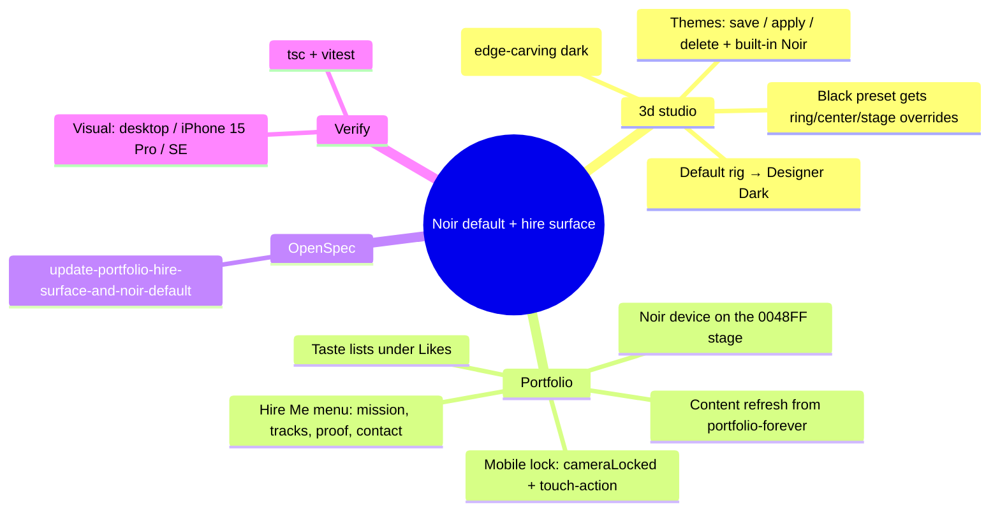

# Noir Default + Portfolio Hire Surface (2026-06-10)

## Context

Make the saved "Designer Dark black" studio look (extracted verbatim from Chrome
localStorage: case `#1b1818`, wheel `#313030`, center `#141212`, back/edge
`#cfd3d7`, bezel `#0a0a0a`, stage `#0048ff`, rig "Designer Dark") the factory
default across `/3d` and `/portfolio`, add savable themes + a stronger
edge-highlighting dark rig, and refresh `/portfolio` with the
`stussysenik/portfolio-forever` hiring-proof content (HIRE.md manifest, updated
CV, hiring tracks/pillars) — recruiter-ready, mobile-first, lockable wheel.

Key forensic finding: `deriveWheelColors("#1b1818")` yields ring `#242020`, but
the saved wheel is `#313030` — the canonical look carries an explicit wheel
override; derivation alone cannot reproduce it.

## Tasks

- [ ] A1 `lib/ipod-classic-presets.ts` — optional `defaultRingColor`/`defaultCenterColor`; black preset → ring `#313030`, center `#141212`, backdrop `#0048FF`
- [ ] A2 `lib/ipod-state/model.ts` — honor preset wheel overrides; default rig → `DESIGNER_DARK_RIG`
- [ ] A3 `lib/studio-lighting-config.ts` — `EDGE_NOIR_RIG` (powerful dark, edges drawn); sanitize fallback → Designer Dark
- [ ] A4 `lib/studio-themes.ts` — theme record, localStorage persistence, built-in "Noir"
- [ ] A5 `ipod-3d-color-cockpit.tsx` — black finish = saved look; Themes section (save current, apply, delete)
- [ ] B1 `lib/portfolio/data.ts` — role, bios, languages, award, works sync, writings, taste lists, hire data
- [ ] B2 `lib/portfolio/os.ts` — Hire Me + Taste screens
- [ ] B3 `portfolio-screen.tsx` — hire/taste/track/pillar renderers
- [ ] B4 `ipod-portfolio-stage.tsx` — noir device on `#0048FF` stage, Designer Dark lighting, lock toggle, mobile gesture guard
- [ ] B5 `app/portfolio/page.tsx` — metadata + stage color
- [ ] C1 OpenSpec change `update-portfolio-hire-surface-and-noir-default` + validate --strict
- [ ] C2 Verify: tsc, vitest, visual at 1440px / 393px (15 Pro) / 375px (SE)

## Review

(to be filled after verification)
