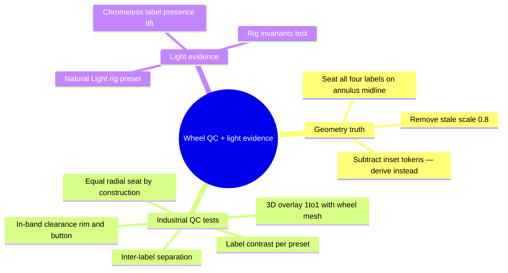

# Wheel Label QC + Natural Light Template (2026-06-13)

## Context

The mm-derivation pass landed the machined face (Ø38.0 wheel, 30.4mm seat) but
`ipod-click-wheel.tsx` still carries `transform: scale(0.8)` — a stale
compensation from the old oversized 272px wheel token (battery commit cb6241c;
0.8 × 272 ≈ the new mm-true 212.9). Today it double-shrinks the rendered wheel
to a Ø30.4mm equivalent and drags MENU/⏮/⏭/⏯ toward the center hub — confirmed
in SCR-20260613-deiq.png. On top of that, lopsided CSS paddings seat the four
labels at three different radial distances (≈23 / 30 / 37px from the rim), an
asymmetry any perspective exposes. Labels on the black device also sink into
the dark rigs, and there is no natural-light rig template for clear product
exports.

User constraints: CNC realism — spacing accounted for, nothing floats;
symmetry must survive perspective; headless verification only (math + tests);
MENU must stay linked (verified: wired in workbench, 3D stage, portfolio);
truth-preserving fixes only — new presentation ideas (stand/wall placement,
material types) are separate additive changes, not this pass.

## Tasks

- [ ] 1. `lib/ipod-classic-presets.ts`: export `wheelLabelSeatPx` (annulus mid-band
      seat, derived from size/centerSize); subtract `menuTopInset`/`sideInset`/
      `bottomInset` tokens from `WheelPresetTokens` + all presets
- [ ] 2. `components/ipod/controls/ipod-click-wheel.tsx`: remove `scale(0.8)`;
      center-anchor all four labels on the derived seat with symmetric hit padding;
      lift label presence in chromeless (3D) mode
- [ ] 3. QC tests in `lib/ipod-classic-presets.test.ts`: seat symmetry, in-band
      clearances, inter-label separation, overlay 1:1, label/ring contrast
- [ ] 4. `lib/studio-lighting-config.ts`: `NATURAL_LIGHT_RIG` + `RIG_PRESETS` entry —
      bright daylight front fill so dark wheels keep label legibility, warm stage
- [ ] 5. New `lib/studio-lighting-config.test.ts`: preset ids unique, sanitize
      round-trip, light-evidence QC (front fill energy, ambient floor)
- [ ] 6. Verify: vitest unit project, type-check, lint

## Follow-ups (separate changes, by design)

- Product-placement display poses (Float / Stand / Wall lean) as its own
  OpenSpec change — additive layer over the stable 3D stage.
- User-facing material/finish types (gloss piano, matte, brushed) building on
  `studio-owned-finish.ts` invariants.

## Review

(pending)
