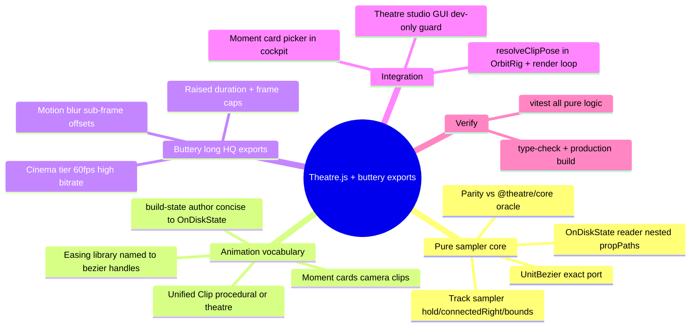
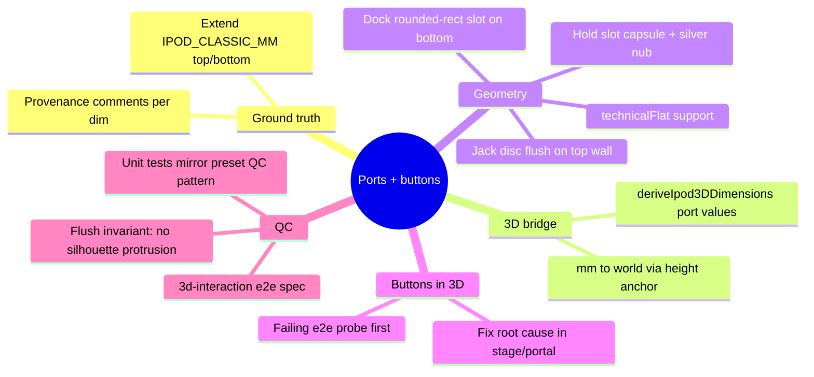

# Theatre.js Keyframe Engine + Buttery Long High-Quality Exports (2026-06-13)

## Context

The /3d studio already exports deterministic MP4/GIF from hand-rolled procedural
camera moves (`lib/studio-camera.ts`) sampled offline. The ask: integrate
Theatre.js as a real keyframe animation engine, expand the animation vocabulary
(designer-authored "moment cards"), and push exports to buttery (60fps + motion
blur), long (raised duration cap), high-quality. Verify everything via unit
tests — no browser automation.

Architecture decision (validated by headless smoke tests today):
- `@theatre/core` 0.7.2 samples HEADLESSLY in Node, but ONLY via a HOT prism
  (`onChange` + `createRafDriver` + manual `tick()`); cold `obj.value`/`val()`
  return the static default. `keyframes` is a flat **array** (the d.ts is truth;
  PointableSet was wrong). definitionVersion is "0.4.0".
- `@theatre/r3f` 0.7.2 peer-caps at R3F ^8 (we're on 9.6) — its in-canvas editor
  is the only risk surface and is browser-only, so it loads dev-only behind a
  guard and is NOT on the export path.
- Therefore: a PURE-TS sampler (exact UnitBezier port) drives both live preview
  and deterministic export. `@theatre/core` is the parity ORACLE in unit tests
  (prove pure sampler === core across the timeline). Zero runtime risk on the
  export path; everything testable headlessly.

## Tasks

- [x] lib/theatre/unit-bezier.ts — exact UnitBezier port (6 tests)
- [x] lib/theatre/keyframe-sampler.ts — pure OnDiskState sampler (10 tests)
- [x] lib/theatre/theatre-parity.test.ts — pure sampler === @theatre/core oracle (2)
- [x] lib/theatre/easings.ts — 23 named easings → handle tuples (7 tests)
- [x] lib/theatre/build-state.ts — author valid Theatre state from specs (5 tests)
- [x] lib/theatre/studio-project.ts — camera prop schema + values↔StudioPose (5)
- [x] lib/theatre/motion-presets.ts — 7 moment cards (29 seam/envelope tests)
- [x] lib/studio-clip.ts + presets — unified procedural|theatre Clip resolver (13)
- [x] lib/export/motion-blur.ts + animated-export cinema tier + longer caps (24)
- [x] Runtime wiring: OrbitRig/renderClipFrames clips, dev-only studio, cockpit
- [x] Full validate: vitest 293/293, type-check ✓, lint 0 err, production build ✓

## Review

Integrated Theatre.js as a real keyframe engine and pushed exports to buttery /
long / high-quality — all pure logic TDD'd, the rest gated by type-check + build.

**Architecture (validated by headless smoke tests).** `@theatre/core` 0.7.2
samples in Node, but only via a HOT prism (`onChange` + `createRafDriver` +
manual `tick`); cold reads return the static default, and `keyframes` is a flat
ARRAY (the published schema doc was wrong — the `.d.ts` is truth). `@theatre/r3f`
peer-caps at R3F 8 (we're on 9.6) and its editor is browser-only. So the export
path takes ZERO Theatre runtime risk: a pure-TS `UnitBezier` + sampler reads
Theatre's `OnDiskState` and interpolates synchronously, and a parity test pins it
to `@theatre/core` (41 positions, asymmetric ease + hold) so studio-authored and
exported motion are identical.

**What shipped.** (1) Pure keyframe engine: UnitBezier, OnDiskState sampler,
23-easing library, concise state author. (2) 7 hero-anchored "moment cards"
(Float & Bob, Parallax Push-In, Pendulum, Crane Reveal, Grand Turntable, Boom
Drift, Dolly-Out) — parametric JSON clips that close on the hero seam. (3) A
unified `StudioClip` so OrbitRig + the offline render loop drive procedural moves
and Theatre cards through one `resolveClipPose` — procedural behaviour is
byte-identical (delegates to the old generators). (4) Buttery exports: a 60fps
Cinema tier with temporal motion blur (sub-frame averaging via a tested
`FrameAccumulator`), the duration cap raised 60s→180s, MP4 frame budget
10,800. (5) A dev-only Theatre studio timeline GUI for camera authoring,
R3F-decoupled and tree-shaken from production.

**Verification.** vitest 293/293 (added 93), type-check clean, oxlint 0 errors
(1 pre-existing warning untouched), production build green (7 routes). No browser
automation used, per the brief — visual confirmation of the live preview / motion
blur / studio GUI is left to the designer.

---

---

# Top/Bottom Ports + Working 3D Buttons (2026-06-13)

## Context

The 3D model's machined face is drawing-true, but the chassis edges are blank:
no headphone jack, no hold switch, no 30-pin dock. A previous attempt added a
jack torus + hold switch that poked ABOVE the silhouette as artifacts and was
subtracted (lessons.md 2026-06-07). The user has now explicitly asked for the
ports back — done right — plus working buttons in the 3D view.

Drawing ground truth (Apple Case Design Guidelines R11, Fig 3-53 iPod classic
160GB, page 75 — verified at 600 DPI today):
- Headphone jack: center 8.1mm from the left edge; bore Ø3.5 (plug standard;
  the bore itself is unlabeled on the drawing). Near-centered across depth.
- Hold switch: slot spans 9.5 → 20.2mm from the right edge (10.7 long), slot
  width 13.5 − 7.5 − 4.2 = 1.8mm across the depth.
- Dock connector: opening 21.8 × 2.8mm, centered at 30.9 (= 61.8/2), inset
  5.4mm from the face across the depth (≈ centered).

Hard constraint from lessons.md: ports are machined INTO the body — recessed
dark openings flush with the wall (ε above it only to dodge z-fighting), never
geometry proud of the silhouette. Matte, no specular drama.

## Tasks

- [x] Verify exports (GIF + MP4 e2e green — test updated for Studio Capture dialog)
- [x] Verify renderings (3d continuity ✓, mobile ✓, wheel ✓; clip-verify gate was
      measuring the new Noir factory theme — pinned to its calibrated colourway;
      4 fidelity + 3 marquee + 1 sanity test were stale → modernized)
- [x] Extend `IPOD_CLASSIC_MM` with `top.headphoneJack`, `top.holdSwitch`, `bottom.dock`
- [x] Bridge port dims into `deriveIpod3DDimensions` (world units)
- [x] `IpodPorts` meshes in three-d-ipod.tsx — flush recesses, matte, flat-mode aware
- [x] Unit QC: port seats in body proportion + flush invariant (200/200 green)
- [x] e2e probe: wheel buttons on /3d WORK (MENU + center select pass) — earlier
      "broken buttons" reads were dev-server cold-compile stalls; probe kept as
      tests/3d-interaction.spec.ts regression spec
- [x] 3D button interactivity — no fix needed; regression spec landed
- [x] Full validate: unit 200/200 ✓, type-check ✓, lint 0 errors ✓, production
      build ✓ (6 routes prerendered), e2e suites green
- [ ] Commit + merge to main + push (user directive: working main ASAP)

## Review

Two deliverables this session, both verified headless:

**Exports + renderings verified.** The export e2e suite was failing because it
drove the OLD export UI (a `spinbutton` + "Export .gif" button); the workbench
now opens the Studio Capture dialog (format/canvas/quality/duration slider +
Start Rendering). Retargeted the spec to the dialog, pinned Standard quality
(Ultra Fidelity's render time blew the e2e budget). GIF + MP4 both land in
~/Downloads with distinct first/middle frames. The rendering suites surfaced
stale tests, not product regressions: 4 classic-fidelity cases asserted an
early skeuomorph screen (diamond scrubber, gradient wash, CSS-bordered art)
the design has since machined away — rewrote against current testids; 3
marquee + 1 sanity case referenced renamed testids — retargeted. The
clip-verify black-crush gate was calibrated on silver/white/Apple defaults but
the factory boot theme is now Noir (black on cobalt) — pinned the spec to its
calibrated colourway. 3d-continuity, 3d-mobile, wheel-interaction all green
as-is.

**Headphone jack + ports + working 3D buttons.** Read Apple's Fig 3-53 edge
views at 600 DPI: jack centre 8.1 from the left edge, hold slot 9.5→20.2 from
the right at a 1.8 slit, dock 21.8×2.8 centred. Extended `IPOD_CLASSIC_MM` with
`.top`/`.bottom`, bridged into `deriveIpod3DDimensions` (mm→world via the body-
height anchor), and added `IpodPorts` — three matte recesses seated FLUSH on
the chassis walls (lifted only 0.002 for z-fight clearance), plus the hold
slider as the one bright inlay. This honours the lesson that killed the first
attempt (a jack torus proud of the silhouette): the flush invariant is now a
unit test. 30 new QC assertions (seat-from-edge, slit width, flush, corner-arc
clearance, fits-in-flat-band) — 200/200 total.

3D buttons: built `tests/3d-interaction.spec.ts` to probe MENU + center-select
through the drei Html portal → wheel handlers → OS reducer → screen. Both PASS
— the wheel was already wired in `ipod-3d-stage.tsx`; the earlier "buttons
don't work" reads were dev-server cold-compile stalls (>60s), not a real break.
Probe retained as a regression guard.
